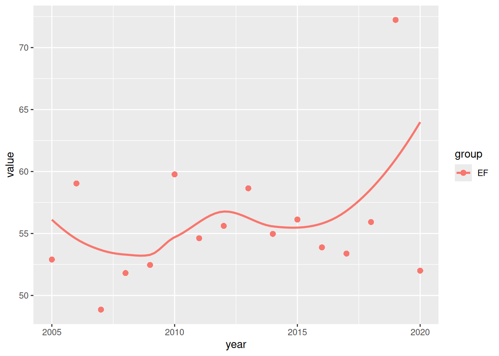
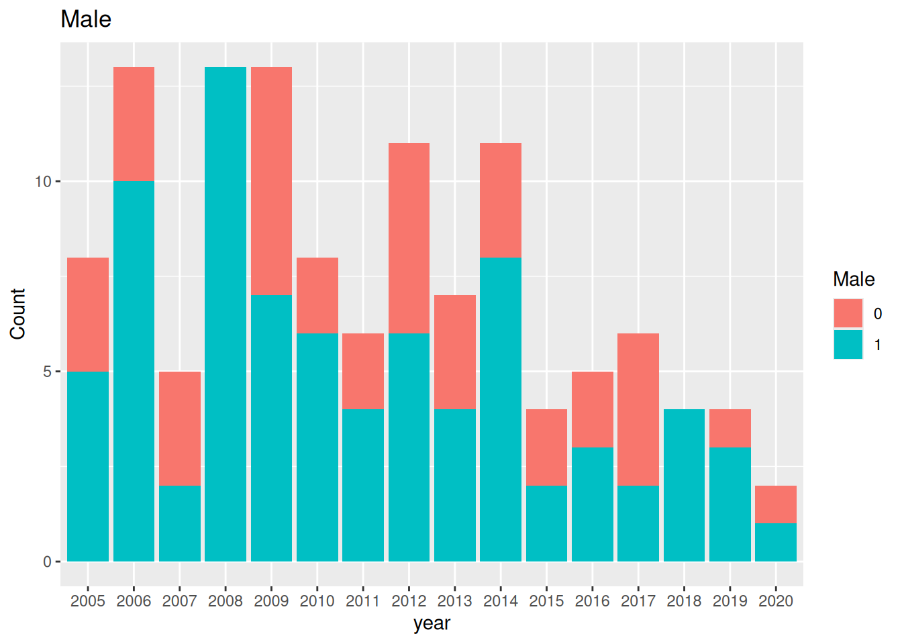
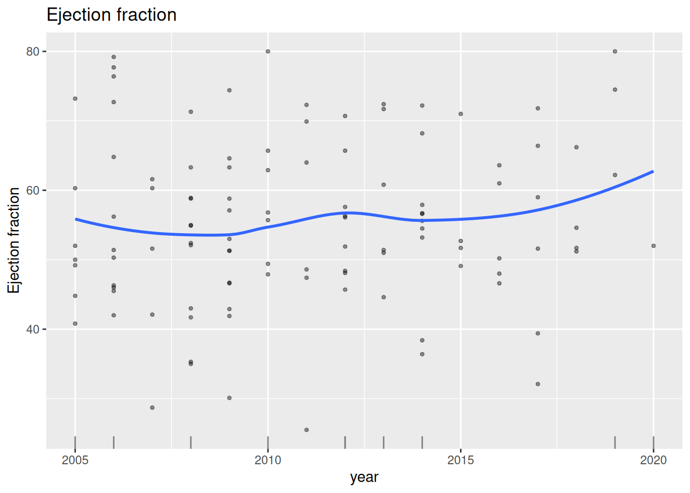

# From SAS descriptive jobs to R

## Who this is for

This guide is for a SAS biostatistician who knows the `tp.dc.*`
templates and wants to run the same descriptive work in an hvtiR study.
“R equivalent” means the same numbers when the method is the same, and
an explicit difference when the R job makes a different choice. It does
not mean translating every SAS statement line by line.

## Install once

Install the hvtiR package set, then check it before starting a study
job:

``` r

hvtiR::install()
hvtiR::status()
```

## The map

| SAS job | R job | template | engine |
|:---|:---|:---|:---|
| `descriptive/dc.tables.ods.sas` (`%desc_tab`) | `dc-tables` | `10_descriptive/dc-tables.qmd` | `hv_tbl_summary()`; `hv_correlation_table()` and `hv_correlation_matrix()` |
| `descriptive/dc.gfup.sas` | `dc-gfup` | `10_descriptive/dc-gfup.qmd` | `proc_means()` |
| `graphs/dp.trends.R` | `dp-trends` | `40_graphs/dp-trends.qmd` | `hv_trends()` |
| `tp.dp.EDA_barplots_scatterplots*.R` | `dp-postage` | `10_descriptive/dp-postage.qmd` | `hv_eda()` |

## Five steps for every job

1.  Scaffold the job. For example,
    `add_job("dc", "cohort", "eda", qualifier = "tables")` writes
    `10_descriptive/cohort-eda-dc-tables.qmd` in a new study.
2.  Work every `EDIT:` marker. The edit guard stops a render while any
    remain.
3.  Render from the study root with
    `quarto render 10_descriptive/cohort-eda-dc-tables.qmd`.
4.  Compare the result with the SAS `.lst`, section by section.
5.  Keep the authored job flat in `10_descriptive/`; its generated
    artifacts are filed beneath `10_descriptive/cohort-eda/`.

## Descriptive tables and correlations: `dc-tables`

The SAS job commonly calls `%desc_tab` once for categorical variables
and once for continuous variables. The R job supplies both sets to one
table. SAS comment banners become the names in `GROUPS`; `by=` and
`byvalue=` become `BY`; and `perctile=15 50 85` becomes
`continuous_stat = "both"` with percentiles 15 and 85. The
`dc.tables.ods_<topic>.sas` correlation variant becomes `CORR` in the
same job.

``` sas
%desc_tab(vartype=category,   varlist=female diabetes nyha_pr);
%desc_tab(vartype=continuous, varlist=age bmi, perctile=15 50 85);
```

``` r

d <- hvtiPlotR::sample_correlation_data(n = 80)
d$female <- rep(0:1, length.out = nrow(d))
groups <- list(
  Demography = c("female"),
  Measurements = c("a1c", "glucose", "creatinine")
)
hvtiRtables::hv_tbl_summary(
  d,
  groups = groups,
  binary = "female",
  continuous = c("a1c", "glucose", "creatinine"),
  continuous_stat = "both",
  percentiles = c(15, 85),
  compare = "none"
)
```

[TABLE]

``` r

hvtiRtables::hv_correlation_table(
  d,
  vars = c("glucose", "creatinine"),
  with = "a1c"
)
#>     variable      label with   method  n    estimate   conf.low   conf.high
#> 1    glucose    glucose  a1c spearman 80  0.73097166  0.6736969  0.77951755
#> 2    glucose    glucose  a1c  pearson 80  0.77903753  0.7304020  0.81981285
#> 3 creatinine creatinine  a1c spearman 80 -0.09521995 -0.2058543  0.01781780
#> 4 creatinine creatinine  a1c  pearson 80 -0.14671889 -0.2553376 -0.03444285
#>        p.value              display
#> 1 3.139833e-16    0.73 (0.67, 0.78)
#> 2 5.611536e-20    0.78 (0.73, 0.82)
#> 3 4.019797e-01  -0.10 (-0.21, 0.02)
#> 4 1.946958e-01 -0.15 (-0.26, -0.03)
```

## Goodness of follow-up: `dc-gfup`

The SAS `proc means` and `proc univariate` calls become `proc_means()`.
The R job reports follow-up distributions overall, by vital status, and
among survivors. It deliberately omits the patient-level listing: a
rendered report should answer the completeness question without exposing
an identifier.

``` sas
proc means data=built n mean std min max;
  class dead;
  var iv_dead iv_fup;
run;
```

``` r

if (requireNamespace("hvtiRutilities", quietly = TRUE)) {
  d <- hvtiRutilities::generate_survival_data(n = 80)
  d$iv_fup <- pmin(d$iv_dead, 0.85 * d$iv_dead)
  hvtiRutilities::proc_means(
    d,
    vars = c("iv_dead", "iv_fup"),
    class = "dead",
    stats = c("n", "nmiss", "mean", "std", "min", "p15", "median", "p85", "max")
  )
}
#>   dead variable                           label  n nmiss     mean      std
#> 1    0  iv_dead Follow-up time to death (years) 34     0 5.758529 3.269897
#> 2    1  iv_dead Follow-up time to death (years) 46     0 4.374130 2.831019
#> 3    0   iv_fup Follow-up time to death (years) 34     0 4.894750 2.779412
#> 4    1   iv_fup Follow-up time to death (years) 46     0 3.718011 2.406366
#>      min   p15  median    p85     max
#> 1 1.0200 2.780 4.94500 9.0200 13.1300
#> 2 0.1700 1.280 4.19500 7.8700 11.6200
#> 3 0.8670 2.363 4.20325 7.6670 11.1605
#> 4 0.1445 1.088 3.56575 6.6895  9.8770
```

## Trends over operation year: `dp-trends`

The shipped `dp-trends` template replaces hand-built annual summaries
and per-series `smooth.spline(df = 6)` calls with `hv_trends()`. Its
smoother is LOESS, not the SAS-era smoothing spline, so compare the old
and new figures by shape rather than pointwise equality.

``` r

fit <- smooth.spline(year, annual_mean, df = 6)
```

``` r

if (requireNamespace("hvtiPlotR", quietly = TRUE)) {
  d <- hvtiPlotR::sample_eda_data(n = 120)
  trend_data <- data.frame(year = d$year, value = d$ef, group = "EF")
  plot(hvtiPlotR::hv_trends(trend_data))
}
#> Warning: 10 of 120 row(s) have missing values in `value`; they will not be
#> drawn.
#> Warning: Removed 10 rows containing non-finite outside the scale range
#> (`stat_smooth()`).
```



## EDA postage stamps: `dp-postage`

The older `Function_DataPlotting()` loops become one `hv_eda()` call per
entry in `VARS`. Character and factor columns produce bars. A numeric
column produces bars only when it has at most six distinct non-missing
values and every value is a non-negative whole number no greater than
six; otherwise it produces a scatter panel. The template lays those
panels out in printable pages.

``` r

for (v in variables) Function_DataPlotting(data, v, "year")
```

``` r

d <- hvtiPlotR::sample_eda_data(n = 120)
variables <- c(male = "Male", ef = "Ejection fraction")
panels <- lapply(names(variables), function(v) {
  plot(hvtiPlotR::hv_eda(d, x_col = "year", y_col = v, y_label = variables[[v]]))
})
panels[[1]]
```



``` r

panels[[2]]
```



## Where the numbers differ

Percentiles use SAS `QNTLDEF=5`, equivalent to R’s `type = 2`;
`proc_means()` and the table engine already make that choice. Pin
`type = 2` in any hand-written
[`quantile()`](https://rdrr.io/r/stats/quantile.html) call. `N` is the
non-missing count, not always the number of rows. Continuous-variable
p-values are non-parametric. Correlation intervals are 68% Fisher
intervals by default. Finally, `%desc_tab` wrote separate categorical
and continuous RTF files; the R job writes one DOCX table.

## What is not ported

The templates do not reproduce RTF output; they produce DOCX and
self-contained HTML instead. They also do not reproduce identified
patient listings. Use the distribution summaries to assess completeness,
then investigate any necessary patient-level records inside the governed
study environment rather than in a portable report.
