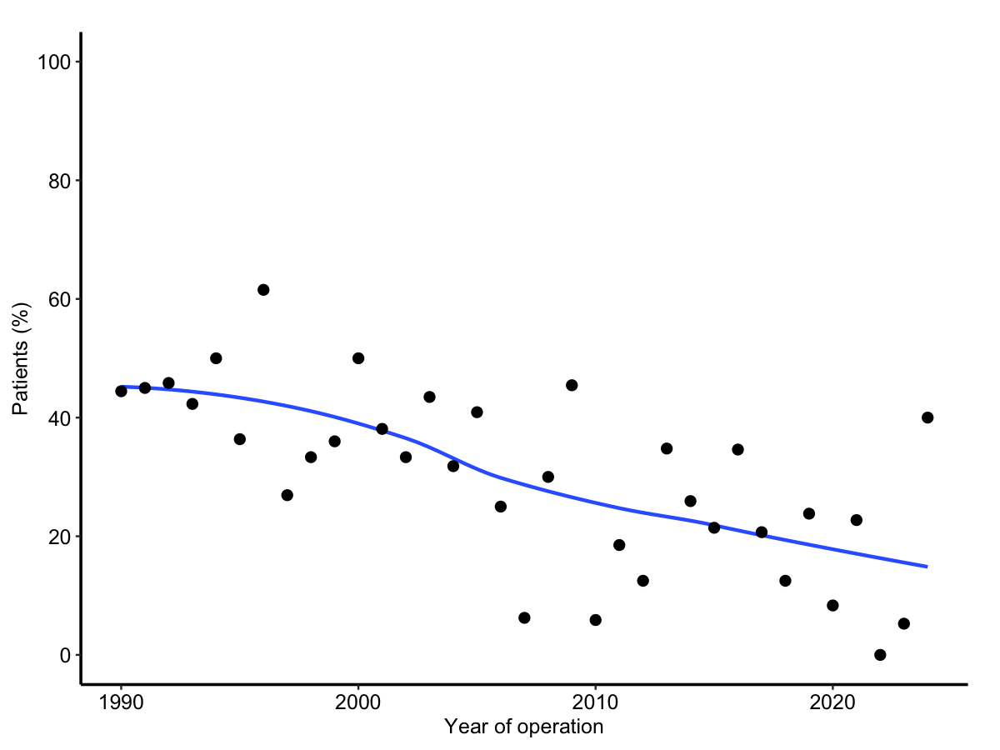
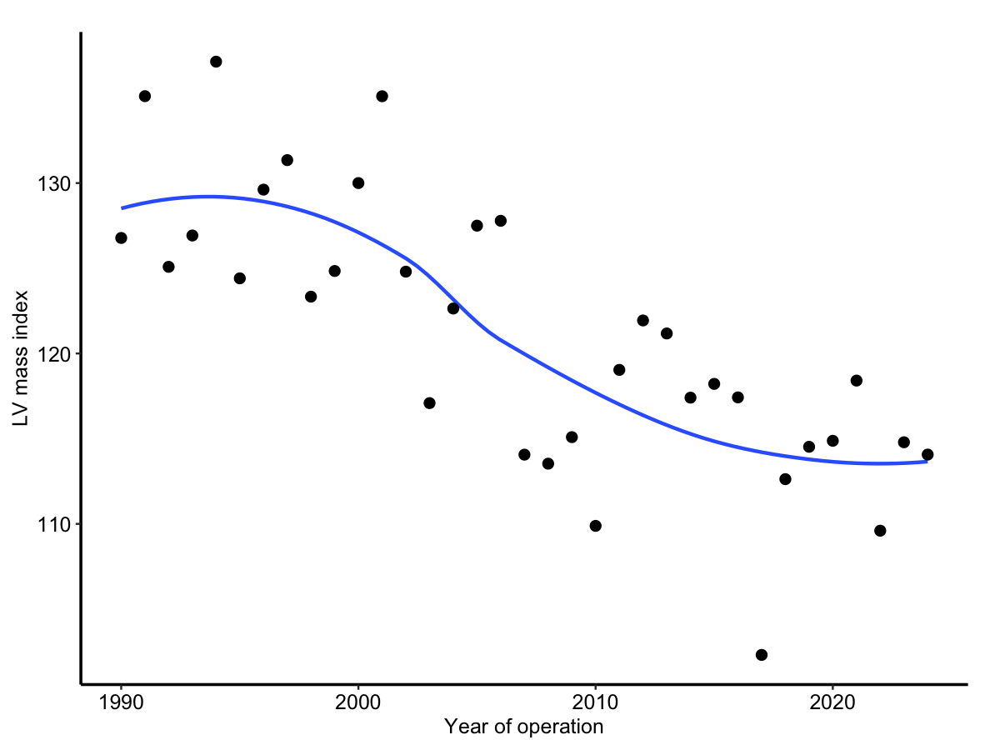
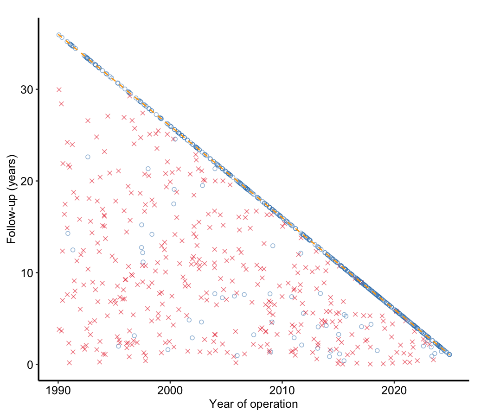
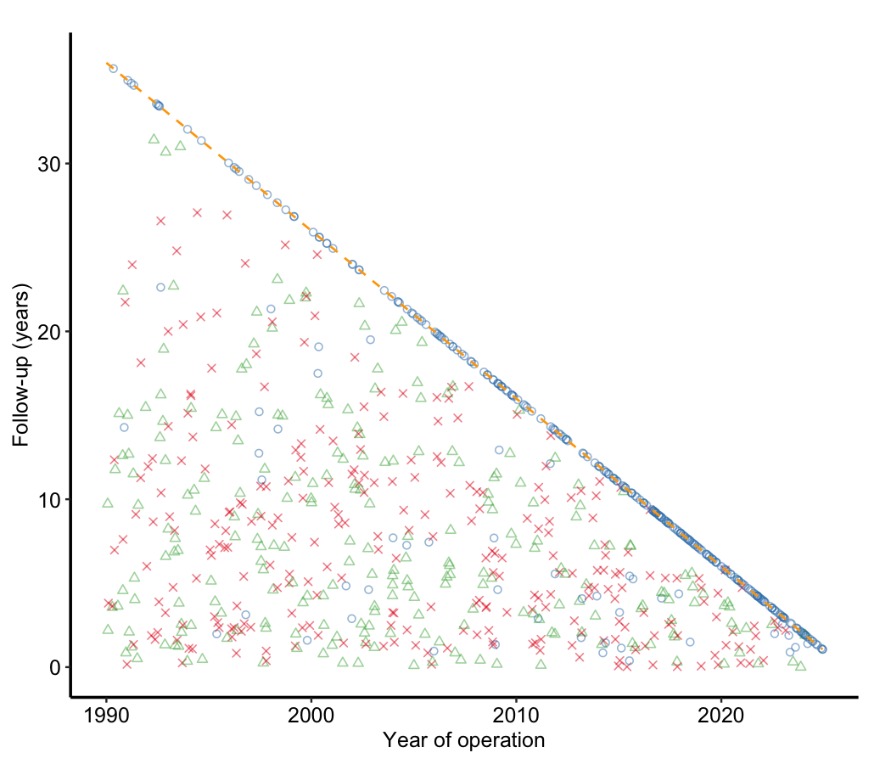
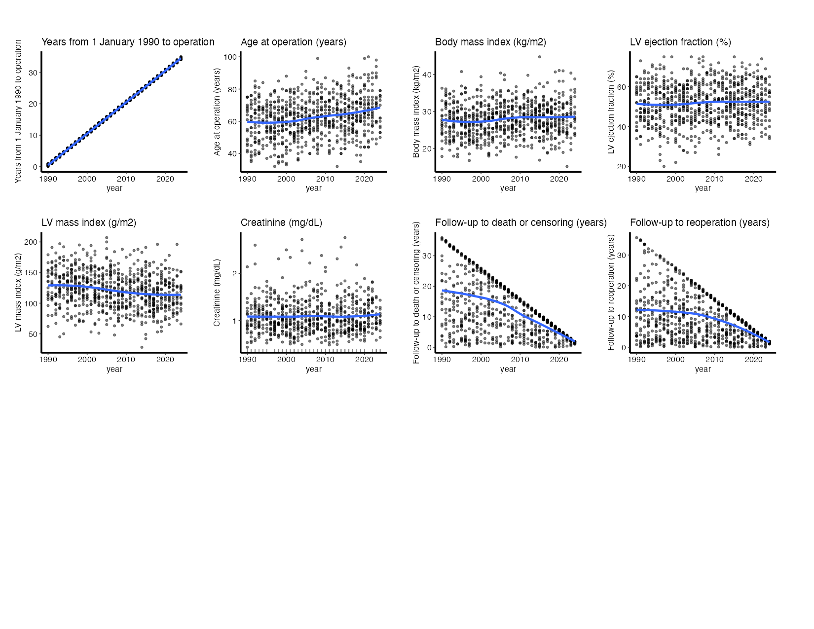
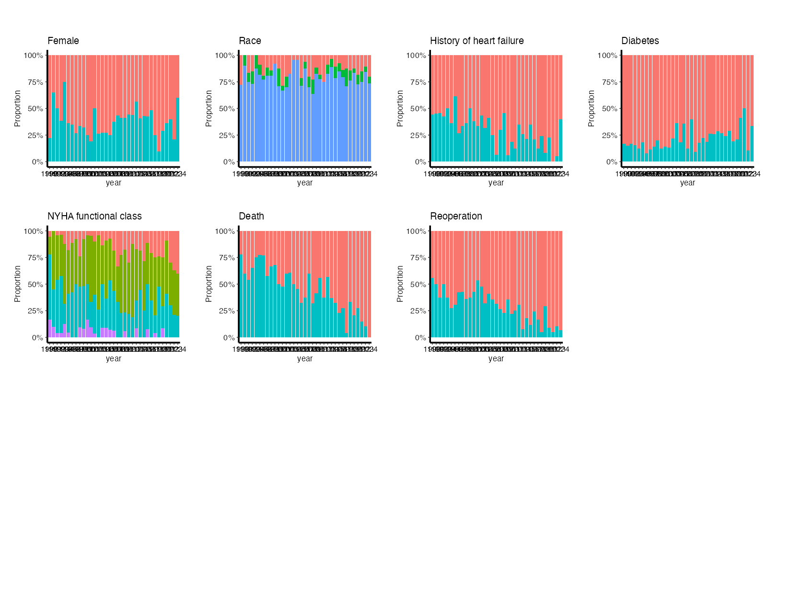

## What you will do

Every descriptive job is the same four steps:

1. **Scaffold** the job from its template: `open_job()` copies it into the study and opens it.
2. **Set the study choices** under each `EDIT:` marker, then delete the marker.
3. **Render**: `render_job()`. While a marker remains, the report carries a DRAFT banner.
4. **Check** what it printed against what you expected.

We do it six times over one synthetic study:

| topic | job | writes |
|---|---|---|
| Tables | `dc-tables` | the CORR Word table |
| Trends | `dp-trends` | trends over operation year |
| Follow-up | `dc-gfup`, `dp-gfup` | interval checks; the follow-up figure |
| EDA plots | `dp-postage`, `dp-eda` | postage stamps; the whole EDA report |

Every number in the study is simulated. No real study, patient or identifier appears anywhere in it.

## Before you start

You need R, the [Quarto CLI](https://quarto.org), and a clone of `hvtiRtemplates`:

```bash
git clone https://github.com/ehrlinger/hvtiRtemplates.git
cd hvtiRtemplates
git checkout feat/dp-eda   # only until PR #155 merges; then stay on main
```

Install the package from the clone, which carries `dp-eda`, and check the rest:

```r
renv::install(".")   # or devtools::install()
packageVersion("hvtiPlotR")       # 2.7.17 or later
packageVersion("hvtiRutilities")  # 1.4.1 or later
quarto::quarto_available()        # TRUE
```

Run everything that follows **from the clone's root**, so `dev/demo/` resolves.

## Build the sample study

```r
source("dev/demo/demo-study.R")
root <- demo_study("~/eda-demo")
```

This builds a study folder with `_study.yml`, a manifest, and an 800-patient cohort registered as its built dataset. It has operations from 1990 to 2024, follow-up closing on 2025-12-31, and labels on every variable.

The cohort has problems planted in it, so the reports have something to find:

- **Heart failure falls** from about 45% of operations to about 14%.
- **LV mass drifts down** over the years.
- **Creatinine is missing** for about 8%.
- **One patient in ten is lost to follow-up early.**
- There is a **patient identifier** and an **operation date**, which the EDA should leave out.

`demo_study()` refuses a folder that already exists. Pick a new name to start again.

## The job loop

```r
job <- open_job("dc", "cohort", "demo", dir = root, qualifier = "tables")
```

- `"dc"` plus `qualifier = "tables"` picks the template `dc-tables`.
- `"cohort"` and `"demo"` are the subject and type. They name the file, `cohort-demo-dc-tables.qmd`, and the folder its output goes to.
- `open_job()` puts the job in the right study folder (`10_descriptive/`), never overwrites an existing job, and opens it in the editor.

Scroll to **Study choices**. Every line to settle is under an `EDIT:` marker, and the comment says why the choice matters.

```r
render_job(job)                # a draft while EDIT: markers remain
render_job(job, final = TRUE)  # stops instead, until every marker is resolved
```

The report is written beside the job: `10_descriptive/cohort-demo-dc-tables.html`.

## Tables: `dc-tables`

```r
job <- open_job("dc", "cohort", "demo", dir = root, qualifier = "tables")
```

In **Study choices**, read the whole cohort and group the rows:

```r
ANALYSIS_SET <- NULL
GROUPS <- list(
  Demography = c("age", "female", "race_grp", "bmi"),
  History    = c("hx_chf", "hx_dm", "nyha_pr"),
  Echo       = c("lvef", "plvmassi"),
  Laboratory = "creat_pr"
)
```

Leave `CONTINUOUS`, `BINARY` and `CATEGORICAL` as `NULL`. The job classifies each variable from the data. Then delete the `EDIT:` markers and render.

::: {.callout-tip title="Expect"}
Age median **63**; female **299 (37%)**; race White **631 (79%)**; creatinine N non-missing **725**, not 800.
The Word file is written to `50_documents/cohort-demo/`.
:::

## Trends: `dp-trends`

```r
job <- open_job("dp", "cohort", "demo", dir = root, qualifier = "trends")
```

The demo's origin year is **1990**. The template's placeholder says 1985, and a wrong origin slides every figure along the x-axis with no other symptom:

```r
d$year <- floor(d$iv_opyrs) + 1990
```

Add a subgroup. Every trend is drawn once per entry, on the same axes:

```r
SUBGROUPS <- list(all = function(d) rep(TRUE, nrow(d)),
                  diabetic = function(d) d$hx_dm == 1)
```

`TRENDS` already names `hx_chf` and `plvmassi`, which the demo has.

## Trends: what you should see

:::: {.columns}
::: {.column width="50%"}

:::
::: {.column width="50%"}

:::
::::

Heart failure goes from **45%** of operations in 1990 to 1994 down to **14%** in 2020 to 2024. LV mass index falls from about 130 to about 115.

## Goodness of follow-up: `dc-gfup`, then `dp-gfup`

```r
job <- open_job("dc", "cohort", "demo", dir = root, qualifier = "gfup")
```
```r
ANALYSIS_SET <- NULL
CHECKS <- list(c("dead", "reop"))   # cross-tab of event coding
```

```r
job <- open_job("dp", "cohort", "demo", dir = root, qualifier = "gfup")
```
```r
ANALYSIS_SET <- NULL
CLOSE_DATE <- as.Date("2025-12-31")   # NULL: estimated, and the report says so
EVENTS <- list(reop = list(event = "reop", time = "iv_reop", death = "dead",
                           death_time = "iv_dead", label = "Reoperation"))
```

`ORIGIN_YEAR` stays 1990, and `PANELS` already names `dead` and `iv_dead`.

::: {.callout-tip title="Expect from dc-gfup"}
**364** deaths, **436** censored, no missing, negative or zero intervals.
:::

## Goodness of follow-up: what you should see

:::: {.columns}
::: {.column width="50%"}

:::
::: {.column width="50%"}

:::
::::

The dashed diagonal is the follow-up the close date allows. Red crosses (deaths) belong below it. The **blue circles scattered below the line** are the patients lost to follow-up early, and they are the ones to explain before any time-related analysis.

## EDA plots: `dp-postage`

```r
job <- open_job("dp", "cohort", "demo", dir = root, qualifier = "postage")
```
```r
ANALYSIS_SET <- NULL
```

That is the only choice to change. `VARIABLES <- NULL` draws every column except:

- `X_VAR`, here `year`;
- anything in `EXCLUDE`;
- anything that looks like an **identifier or a date**. The report lists those.

`SECTIONS` picks any of `"continuous"`, `"percent"` and `"count"`. Percent and count bin the year the same way, so their bars line up.

::: {.callout-note}
The identifier rule catches `patient_id` but not a name with no separator, such as `ccfid`. A fix is in progress. Until it lands, put such a column in `EXCLUDE`.
:::

## The whole report: `dp-eda`

```r
job <- open_job("dp", "cohort", "demo", dir = root, qualifier = "eda")
```
```r
ANALYSIS_SET <- NULL
CLOSE_DATE <- as.Date("2025-12-31")
EVENTS <- list(reop = list(event = "reop", time = "iv_reop", death = "dead",
                           death_time = "iv_dead", label = "Reoperation"))
```

One render gives:

1. an **overview** of every column: its type, label and share missing;
2. **goodness of follow-up**, with `dc-gfup`'s tables for each death panel;
3. **continuous** variables;
4. **categorical** variables as **percentages**;
5. the same categorical variables as **counts**.

Each section calls the same function as its standalone job, with the same arguments, so a section *is* that job's figure. A test checks the pages are byte-identical to `dp-postage`'s.

## `dp-eda`: what you should see

:::: {.columns}
::: {.column width="50%"}

:::
::: {.column width="50%"}

:::
::::

The report prints **Continuous variables (8)**, **Categorical variables, percent (7)** and **Categorical variables, counts (7)**, and it lists **patient_id, op_date** as left out.

## Check your output

The reference set is in `dev/demo/reference/`: the figures on these slides, and the numbers your reports should print.

```{r}
#| eval: true
#| echo: false
knitr::kable(utils::read.csv("reference/key-numbers.csv", check.names = FALSE),
             col.names = c("report", "quantity", "expected"))
```

The data are simulated from a fixed seed, and R draws the same values on every platform, so **the numbers must match exactly**. Figures should look the same. Small differences in font or antialiasing between machines are not a problem.

## Fell behind? Catch up

Each job, scaffolded with the choices on these slides already applied:

```r
demo_job(root, "dp-eda")      # any of the six names on slide 1
render_job(file.path(root, "10_descriptive", "cohort-demo-dp-eda.qmd"), final = TRUE)
```

All six at once, into a fresh study:

```bash
Rscript dev/demo/descriptives-demo.R ~/eda-demo-all
```

## Still to come

- **House palette**: event red, censored blue, missing light grey, otherwise ColorBrewer Set1. This needs the next hvtiPlotR release. Today the EDA pages use ggplot's default colours.
- **Shorter labels that stay distinct**, with a study abbreviation list. This needs the next hvtiRutilities release.
- **The identifier rule** for names such as `ccfid`.
- **Acceptance**: Lauren checks `dp-eda` on a real study against the SAS EDA output.
