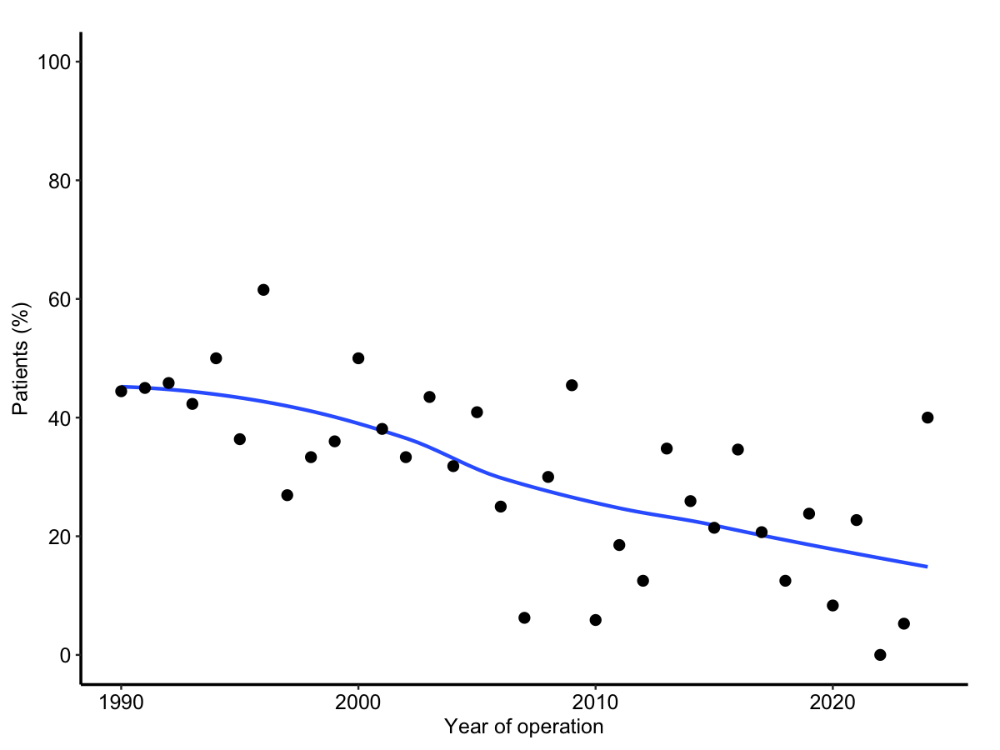
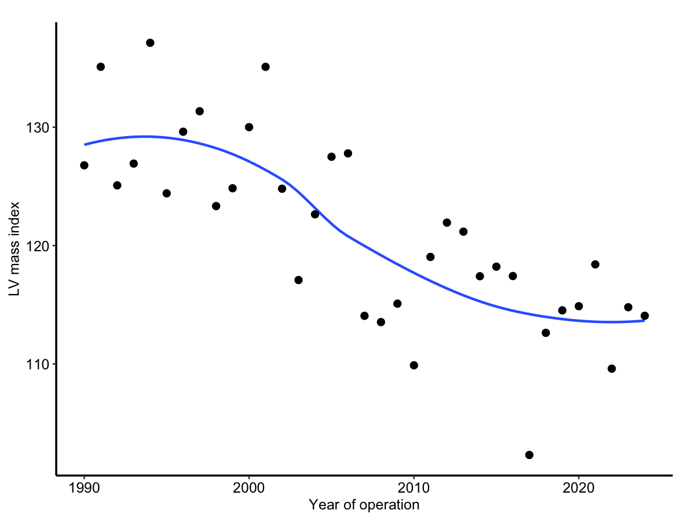
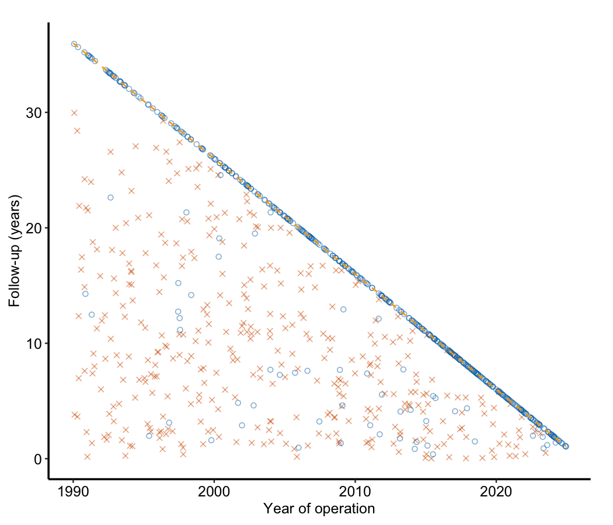
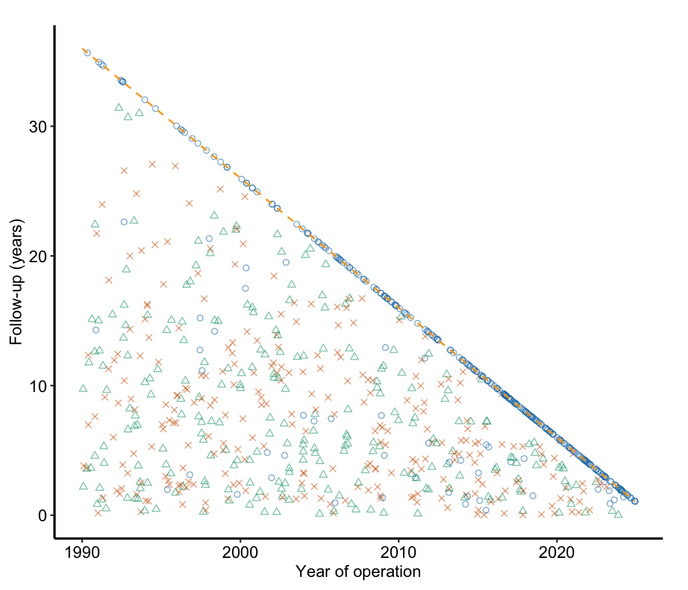
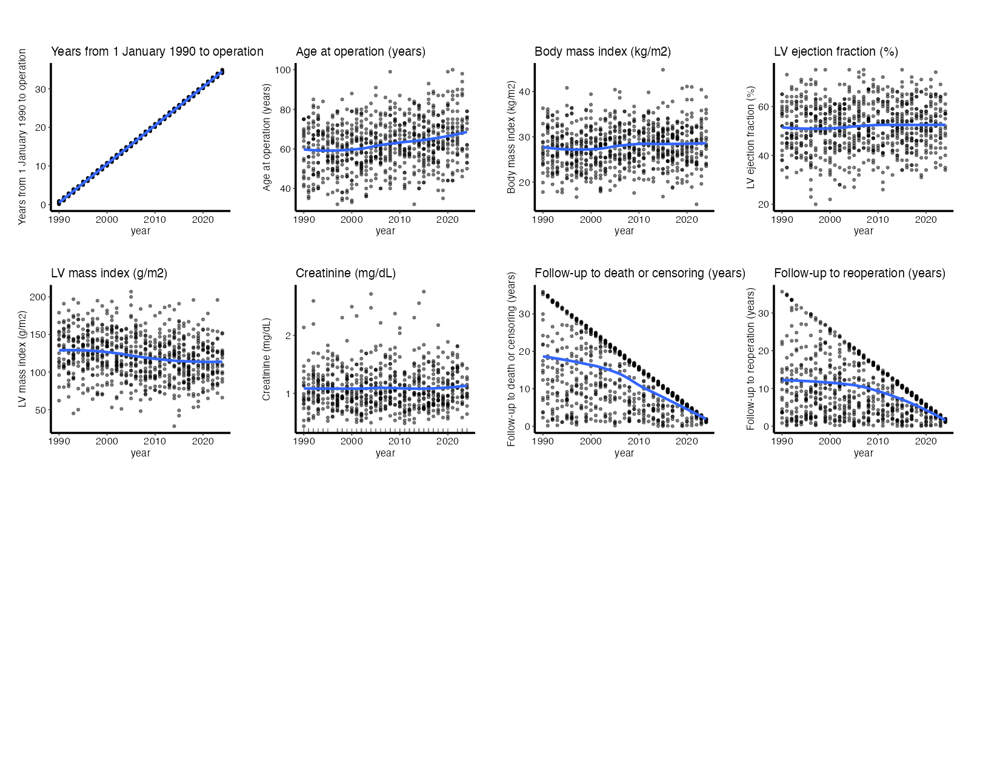
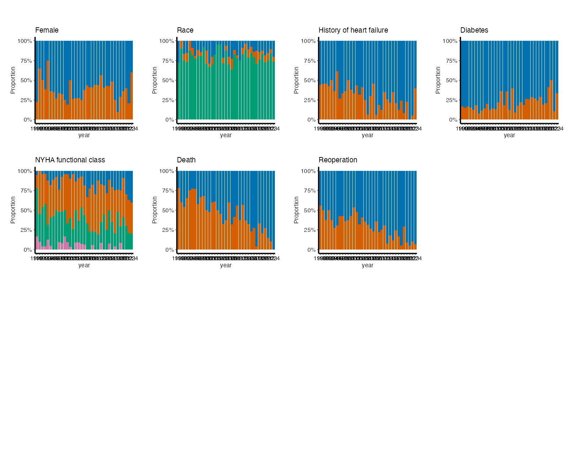

## Every descriptive job is the same four steps

1. **Scaffold** the job from its template: `open_job()` copies it into the study and opens it.
2. **Set the study choices** under each `EDIT:` marker, then delete the marker.
3. **Render**: `render_job()`. While a marker remains, the report carries a DRAFT banner.
4. **Check** what it printed against what you expected.

## We set up, run six jobs in four chapters, then check the output

| chapter | jobs | what they write |
|---|---|---|
| Tables | `dc-tables` | the CORR Word table |
| Trends | `dp-trends` | trends by year |
| Goodness of follow-up | `dc-gfup`, `dp-gfup` | interval checks, a figure |
| EDA plots | `dp-postage`, `dp-eda` | the EDA report |

# Set up

## Clone the package and check its partners

You need R, the [Quarto CLI](https://quarto.org), and a clone of `hvtiRtemplates`:

```bash
git clone https://github.com/ehrlinger/hvtiRtemplates.git
cd hvtiRtemplates
git checkout feat/dp-eda   # only until PR #155 merges; then stay on main
```

Install the package from the clone, which carries `dp-eda`, and check the rest:

```r
renv::install(".")   # or devtools::install()
packageVersion("hvtiPlotR")       # 2.7.17 or later
packageVersion("hvtiRutilities")  # 1.4.1 or later
quarto::quarto_available()        # TRUE
```

Run everything that follows **from the clone's root**, so `dev/demo/` resolves.

## Build the sample study

```r
source("dev/demo/demo-study.R")
root <- demo_study("~/eda-demo")
```

This builds a study folder with `_study.yml`, a manifest, and an 800-patient cohort registered as its built dataset. It has operations from 1990 to 2024, follow-up closing on 2025-12-31, and labels on every variable.

Every number in the study is simulated; no real patient appears. `demo_study()` refuses a folder that already exists, so pick a new name to start again.

## The demo cohort has five problems planted for the reports to find

- **Heart failure falls** from about 45% of operations to about 14%.
- **LV mass drifts down** over the years.
- **Creatinine is missing** for about 8%.
- **One patient in ten is lost to follow-up early.**
- There is a **patient identifier** and an **operation date**, which the EDA should leave out.

## One loop runs every job: open, edit, render

```r
job <- open_job("dc", "cohort", "demo", dir = root, qualifier = "tables")
```

- `"dc"` plus `qualifier = "tables"` picks the template `dc-tables`.
- `"cohort"` and `"demo"` are the subject and type. They name the file, `cohort-demo-dc-tables.qmd`, and the folder its output goes to.
- `open_job()` puts the job in `10_descriptive/`, never overwrites an existing job, and opens it in the editor.

Scroll to **Study choices**. Every line to settle is under an `EDIT:` marker, and the comment says why the choice matters.

## Render a draft, then the final report

```r
render_job(job)                # a draft while EDIT: markers remain
render_job(job, final = TRUE)  # stops instead, until every marker is resolved
```

The report is written beside the job: `10_descriptive/cohort-demo-dc-tables.html`.

# Tables

## Scaffold `dc-tables` and group its rows

```r
job <- open_job("dc", "cohort", "demo", dir = root, qualifier = "tables")
```

In **Study choices**, read the whole cohort and group the rows:

```r
ANALYSIS_SET <- NULL
GROUPS <- list(
  Demography = c("age", "female", "race_grp", "bmi"),
  History    = c("hx_chf", "hx_dm", "nyha_pr"),
  Echo       = c("lvef", "plvmassi"),
  Laboratory = "creat_pr"
)
```

Leave `CONTINUOUS`, `BINARY` and `CATEGORICAL` as `NULL`. The job classifies each variable from the data. Then delete the `EDIT:` markers and render.

## `dc-tables` should report 725 creatinine values, not 800

::: {.callout-tip title="Expect from dc-tables"}
Age median **63**; female **299 (37%)**; race White **631 (79%)**; creatinine N non-missing **725**, not 800.
The Word file is written to `50_documents/cohort-demo/`.
:::

# Trends

## Set `dp-trends` to the demo's origin year, 1990

```r
job <- open_job("dp", "cohort", "demo", dir = root, qualifier = "trends")
```

The template's placeholder says 1985. A wrong origin slides every figure along the x-axis with no other symptom:

```r
d$year <- floor(d$iv_opyrs) + 1990
```

Add a subgroup. Every trend is drawn once per entry, on the same axes:

```r
SUBGROUPS <- list(all = function(d) rep(TRUE, nrow(d)),
                  diabetic = function(d) d$hx_dm == 1)
```

`TRENDS` already names `hx_chf` and `plvmassi`, which the demo has.

## `dp-trends`: heart failure falls from 45% to 14%, and LV mass index falls too

Each panel plots one variable by year of operation, with a smooth trend.

:::: {.columns}
::: {.column width="50%"}

:::
::: {.column width="50%"}

:::
::::

# Goodness of follow-up

## Scaffold `dc-gfup` to check the event coding

```r
job <- open_job("dc", "cohort", "demo", dir = root, qualifier = "gfup")
```
```r
ANALYSIS_SET <- NULL
CHECKS <- list(c("dead", "reop"))   # cross-tab of event coding
```

::: {.callout-tip title="Expect from dc-gfup"}
**364** deaths, **436** censored, no missing, negative or zero intervals.
:::

## Scaffold `dp-gfup` with the close date and a reoperation event

```r
job <- open_job("dp", "cohort", "demo", dir = root, qualifier = "gfup")
```
```r
ANALYSIS_SET <- NULL
CLOSE_DATE <- as.Date("2025-12-31")   # NULL: estimated, and the report says so
EVENTS <- list(reop = list(event = "reop", time = "iv_reop", death = "dead",
                           death_time = "iv_dead", label = "Reoperation"))
```

`ORIGIN_YEAR` stays 1990, and `PANELS` already names `dead` and `iv_dead`.

## `dp-gfup`: blue circles below the diagonal are patients lost to follow-up early

Each point is a patient. The dashed diagonal is the most follow-up the close date allows; vermillion crosses (deaths) belong below it.

:::: {.columns}
::: {.column width="50%"}

:::
::: {.column width="50%"}

:::
::::

# EDA plots

## `dp-postage` needs one choice: the analysis set

```r
job <- open_job("dp", "cohort", "demo", dir = root, qualifier = "postage")
```
```r
ANALYSIS_SET <- NULL
```

`VARIABLES <- NULL` draws every column except:

- `X_VAR`, here `year`;
- anything in `EXCLUDE`;
- anything that looks like an **identifier or a date**. The report lists those.

`SECTIONS` picks any of `"continuous"`, `"percent"` and `"count"`. Percent and count bin the year the same way, so their bars line up.

## The identifier rule leaves out ID-like columns unless you name them

::: {.callout-note}
The identifier rule catches `patient_id`, names with no separator such as `ccfid` and `patientid`, and any name holding `mrn`. Name a column in `VARIABLES` to draw it anyway.
:::

## `dp-eda` writes the five-section EDA report in one render

```r
job <- open_job("dp", "cohort", "demo", dir = root, qualifier = "eda")
```
```r
ANALYSIS_SET <- NULL
CLOSE_DATE <- as.Date("2025-12-31")
EVENTS <- list(reop = list(event = "reop", time = "iv_reop", death = "dead",
                           death_time = "iv_dead", label = "Reoperation"))
```

1. an **overview** of every column but the identifiers: type, label, share missing;
2. **goodness of follow-up**, with `dc-gfup`'s tables per death panel;
3. **continuous** variables;
4. **categorical** variables as **percentages**;
5. the same categorical variables as **counts**.

## Each `dp-eda` section is its standalone job's figure

Each section calls the same function as its standalone job, with the same arguments, so a section *is* that job's figure. A test checks the pages are byte-identical to `dp-postage`'s.

## `dp-eda` draws 8 continuous and 7 categorical variables, leaving out patient_id and op_date

Each panel is one variable by year of operation. Percent panels stack each level's share in blue, vermillion, green and on; missing is light gray.

:::: {.columns}
::: {.column width="50%"}

:::
::: {.column width="50%"}

:::
::::

# Check your work

## Your numbers must match the reference exactly

The reference set is in `dev/demo/reference/`: the figures on these slides, and the numbers your reports should print.

The data are simulated from a fixed seed, and R draws the same values on every platform, so **the numbers must match exactly**. Figures should look the same. Small differences in font or antialiasing between machines are not a problem.

```{r}
#| eval: true
#| echo: false
key <- utils::read.csv("reference/key-numbers.csv", check.names = FALSE)
key$report <- sprintf("`%s`", key$report)
key_table <- function(reports) {
  knitr::kable(key[key$report %in% sprintf("`%s`", reports), ], row.names = FALSE,
               col.names = c("report", "quantity", "expected"))
}
```

## Expected numbers: the study and Tables

```{r}
#| eval: true
#| echo: false
key_table(c("all", "dc-tables"))
```

## Expected numbers: Trends

```{r}
#| eval: true
#| echo: false
key_table("dp-trends")
```

## Expected numbers: Goodness of follow-up

```{r}
#| eval: true
#| echo: false
key_table(c("dc-gfup", "dp-gfup"))
```

## Expected numbers: EDA plots

```{r}
#| eval: true
#| echo: false
key_table("dp-eda")
```

## Fell behind? Catch up with `demo_job()`

Each job, scaffolded with the choices on these slides already applied:

```r
demo_job(root, "dp-eda")   # or dc-tables, dp-trends, dc-gfup, dp-gfup, dp-postage
render_job(file.path(root, "10_descriptive", "cohort-demo-dp-eda.qmd"), final = TRUE)
```

All six at once, into a fresh study:

```bash
Rscript dev/demo/descriptives-demo.R ~/eda-demo-all
```

## Two pieces are still to come

- **Shorter labels that stay distinct**, with a study abbreviation list. This needs the next hvtiRutilities release.
- **Acceptance**: Lauren checks `dp-eda` on a real study against the SAS EDA output.
