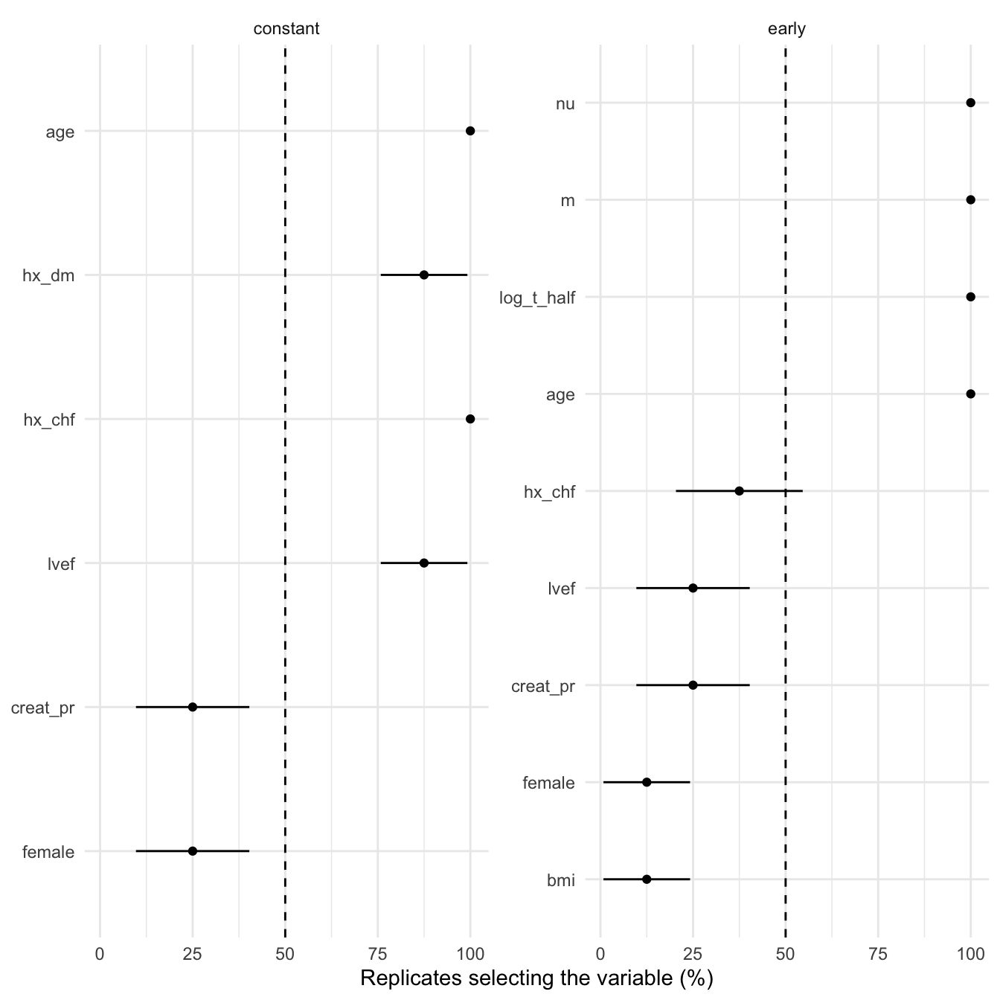

# Bootstrap variable selection

# Bootstrap variable selection

Replaces `analyses/<job>.sas`: paste its `%hazboot` call here — the
candidate pool, which phases carried candidates, the entry and stay
levels, and `resampl=`.

This job **does not fit the final model**. It screens. The companion
`hm` job fits the multivariable model.

⚠️ `bh` and `hm` are **parallel analyses, not a pipeline.** `%hazboot`
and `%model` were parallel in SAS and these jobs reproduce that. Do not
describe this job’s retained set as what `hm` fits, and do not write a
handoff file for it — an earlier study report did both, and nothing read
the file. A reader who believes the claim will assume the `hm` model was
screened for reliability first. It was not.

Code

``` r
# The study root is the nearest directory above this file holding _study.yml,
# so the job renders the same from the Render button, quarto render, or
# render_job(), at any depth, with no path in this document to edit.
.in <- knitr::current_input(dir = TRUE)
.root <- hvtiRtemplates:::.find_study_root(if (is.null(.in)) getwd() else dirname(.in))
.provenance_data <- list()
.provenance_artifacts <- list()
suppressPackageStartupMessages({
  library(TemporalHazard)
  library(hvtiRbootstrap)
  library(hvtiRutilities)
  library(ggplot2)
})

# The reporting layer below -- boot_validate() and everything after it -- landed
# in 0.1.2. Without this check a study on 0.1.1 gets "could not find function
# boot_provenance" from the middle of a render: the symbol is named, the reason
# is not, and the fix is not guessable from the message.

# The floor is 0.9.0 rather than 0.1.2, and the extra distance is deliberate.
# 0.1.2 splits a term into phase and variable by stripping the phase label
# whether or not a separator follows it, so a term named `earlyage` reports its
# variable as `age`: a real name, matching no concept, quietly absent from every
# grouped table below. 0.9.0 leaves such a term whole. A frequency that is merely
# WRONG is worse here than a function that is missing, because nothing downstream
# can see it.
if (utils::packageVersion("hvtiRbootstrap") < "0.9.0") {
  stop("This report needs hvtiRbootstrap >= 0.9.0; ",
       utils::packageVersion("hvtiRbootstrap"), " is installed. The reporting ",
       "layer exists from 0.1.2, but 0.1.x mis-splits a term whose phase label ",
       "is not followed by a separator, and reports the wrong variable name ",
       "without erroring.\nUpdate it, then re-render.", call. = FALSE)
}
```

Code

``` r
# The markers in this file name work a study author still has to do, and
# README.md says a job that still contains one has not been finished. This
# chunk is what makes that TRUE rather than merely stated.
#
# Without it an unedited job renders green over a meaningless analysis. In THIS
# file the danger is that EXPECT_CHUNKS and EXPECT_BOOT still hold the template's
# numbers, so the completeness check compares the run against a denominator
# nobody chose -- and passes, reporting frequencies over the wrong base.
#
# knitr::current_input() is NULL outside a render -- a study author stepping
# through chunks in RStudio -- and there is no file to scan then, so this is a
# no-op in that case. Same handling as the `set` guard below, for the same
# reason.
#
# The token is BUILT, not written literally, and that is not stylistic. Quarto
# knits through an intermediate and current_input() returns THAT file, so the
# scan reads a copy of this chunk along with everything else: a literal
# grep("<token>", .src) here matches its own source line, and the guard then
# fires on every render, finished or not. Measured, not theorised -- a probe
# found three markers in a file containing two. A guard that cries wolf on a
# finished job is a guard that gets deleted, which returns us to issue #27.
.tok <- paste0("ED", "IT", ":")
.cur <- knitr::current_input()
if (!is.null(.cur)) {
  .src  <- readLines(.cur, warn = FALSE)
  .hits <- grep(.tok, .src, fixed = TRUE)
  if (length(.hits)) {
    # Report the marker TEXT. Line numbers here are the intermediate's, not
    # this .qmd's, so they need not match what the author sees in an editor.
    .msg <- paste0(
      length(.hits), " unresolved ", .tok, " marker(s) remain in this job:\n",
      paste0("  - ", trimws(substr(.src[.hits], 1L, 96L)), collapse = "\n"),
      "\nA job that still contains one has not been finished. Work each ",
      "marker and delete it."
    )
    # A job renders as a draft by default, so an author can iterate on a
    # working report and remove markers as they go. HVTI_TEMPLATE_STRICT
    # turns the draft into a stop for a final render. Only unset, 0, false
    # and no mean "not strict": an unrecognized value stops on purpose, so a
    # mistyped switch is seen rather than quietly ignored, which is the safe
    # direction to be wrong in.
    if (tolower(Sys.getenv("HVTI_TEMPLATE_STRICT")) %in% c("", "0", "false", "no")) {
      # The banner is not optional. A draft render that looks like a finished
      # one is the same defect with an extra step: the warning scrolls past in
      # a log, while the .html is the artifact that gets sent to someone.
      warning(.msg, "\nRendering as a draft; the banner goes when the last marker does. ",
              "Set HVTI_TEMPLATE_STRICT to 1, true or yes to make this stop.", call. = FALSE)
      cat("\n::: {.callout-important title=\"DRAFT -- this job is unfinished\"}\n")
      cat("Unresolved markers remain. **The numbers below are not",
          "a result.**\n\n```\n", .msg, "\n```\n", sep = "")
      cat(":::\n\n")
    } else {
      stop(.msg, "\nThis render stops because HVTI_TEMPLATE_STRICT is '",
           Sys.getenv("HVTI_TEMPLATE_STRICT"), "'. Unset it, or set it to 0, false ",
           "or no, to render a draft instead.", call. = FALSE)
    }
  }
}
```

Code

``` r
# unnumbered: a callout, printed only when part of the job is left out
# To render a job you have not finished, leave a chunk out with the chunk
# option skip, giving the reason in quotes, or call hvtiRtemplates::stop_here()
# in a chunk to leave out everything below it. A draft lists each one here; a
# final render refuses them, as it refuses an EDIT marker. ?stop_here has more.
hvtiRtemplates:::.guard_partial(knitr::current_input())
```

Code

``` r
SUBJECT <- "dead"
TYPE    <- "boot"

# `add_job()` writes SUBJECT/TYPE from the same values it put in this file's
# name, but a hand-edited declaration can drift from it afterward. set_path()
# below resolves from the declarations, not the filename, so a drifted
# declaration would silently write into ANOTHER set's artifact directory --
# exactly the collision the (subject, type) key exists to prevent, re-entered
# through the body instead of the name.
#
# knitr::current_input() is NULL outside a render (a study author running
# chunks interactively in RStudio), and there is no filename to check against
# yet, so this is a no-op in that case rather than a spurious error.
.current <- knitr::current_input()
if (!is.null(.current)) {
  # The name is template first, <prefix>[.<qualifier>].<subject>.<type>, or
  # <subject>-<type>-<prefix>[-<qualifier>] for a job scaffolded before
  # 2026-10. .job_name_fields() reads subject and type from either, whatever
  # the extension: Quarto knits through an intermediate, so
  # `knitr::current_input()` names the `.rmarkdown` file here, not the `.qmd`.
  .fields <- hvtiRtemplates:::.job_name_fields(.current)
  .name_subject <- if (length(.fields) >= 1L) .fields[[1L]] else NA_character_
  .name_type     <- if (length(.fields) >= 2L) .fields[[2L]] else NA_character_
  if (!identical(.name_subject, SUBJECT) || !identical(.name_type, TYPE)) {
    stop("This file is named '", .current, "' (subject '", .name_subject, "', type '",
         .name_type, "'), but declares SUBJECT = \"", SUBJECT, "\", TYPE = \"", TYPE,
         "\". Fix the declaration or the filename before rendering.", call. = FALSE)
  }
}

# Resolve a path inside this set's artifact directory. `kind` is the artifact
# folder -- "estimates" for serialized results, "graphs" for figures. The set
# directory sits one layer under the kind and never two, which is the whole
# layout rule.
#
# Created on first use rather than up front, so a job that writes nothing leaves
# no empty directories behind.
set_path <- function(kind, file) {
  d <- file.path(hvtiRutilities::study_dir(kind, .root),
                 paste0(SUBJECT, "-", TYPE))
  if (!dir.exists(d)) dir.create(d, recursive = TRUE)
  file.path(d, file)
}

# Saves a figure as <name>.png and <name>.pdf in this set's graphs/ folder (or `kind`'s),
# under the SAVE_FIGURES and FIGURES study choices.
save_figure <- function(plot, name, width = 6, height = 4, kind = "graphs", linked = FALSE) {
  hvtiRtemplates:::.save_figure(plot, set_path(kind, paste0(name, ".png")), width, height,
                                SAVE_FIGURES, FIGURES, linked)
}

# The screen this job reports on was run by a companion script, which wrote its
# chunks into this set's `estimates` directory. Reading them through set_path()
# is what keeps a screen filed against the set whose candidates it screened.
```

## Study choices

Edit these values for this study before rendering.

Code

``` r
# Demo: what this run was LAUNCHED as, not what happens to be on disk.
#
# Nothing in a chunk knows how many siblings it was launched alongside, so these
# two numbers are the only thing that can tell a partial pool from a complete
# one. Without them a render at hour eight of a twelve-hour run produces a
# report that is wrong in no visible way: every health check passes, every
# frequency is honestly computed, and only the denominator is not the intended
# one.
#
# For a single unchunked run, set EXPECT_CHUNKS to 1.
EXPECT_CHUNKS <- 4L    # Demo: four chunks, side by side
EXPECT_BOOT   <- 8L    # Demo: two replicates each

# Demo: the file-name prefix your runner wrote its chunks under. It must match
# the runner exactly: boot_chunk_files() quotes this literally and a prefix that
# does not match finds nothing, while a prefix that matches TOO MUCH pools
# chunks from another run -- and no downstream check can see that.
BOOT_PREFIX <- "bh"

# Demo: the bag's recorded selection is used; set any of these only to confirm
# it. NULL takes the value the bootstrap runner used.
WHERE <- NULL
ID <- NULL
KEY <- NULL

# Demo: from YOUR .sas %hazboot call. The two studies this template was
# extracted from disagree -- 500/0.07/0.05 and 1000/0.12/0.1 -- so there is no
# default here to fall back on. Read them off the call and paste it above.
#
# RETAIN_PCT is the reliability cutoff this report calls "retained". It is a
# reporting decision, not something the run recorded: the entry and stay levels
# above governed each replicate's stepwise fit, and neither of them says how
# often a variable must survive to be worth carrying forward.
RETAIN_PCT <- 50

# Demo: how a term's name splits into phase and variable. Terms are named
# `<phase>.<variable>`, so one variable offered to two phases is two independent
# screening decisions and must not be pooled into one row.
#
# boot_frequencies() and boot_concepts() also accept PHASE_OF = NULL, for a
# single-phase screen, and that is what lets one reporting code path serve the
# forthcoming bl, br and bc templates. This template is not that case: it
# reports a multiphase hazard screen, and every table and the figure below
# assume a phase column throughout. PHASE_OF must name a real rule here.
PHASE_OF <- function(term) sub("[.].*$", "", term)

# Concept groups to report.
CLUSTERS <- list(
  early.Age      = "early.age",
  constant.Heart = c("constant.hx_chf", "constant.lvef")
)

# Correlation cutoff for near-duplicate candidates.
COLLINEAR_R <- 0.99

# Each figure is saved to graphs/ as a PNG (for Word) and a PDF (for the publisher).
# SAVE_FIGURES <- FALSE saves neither; FIGURES keeps only the figures whose names
# start with one of its entries, e.g. FIGURES <- c("hp-survival"). The names are the
# file names, listed for each template in the templates README.
SAVE_FIGURES <- TRUE
FIGURES <- NULL
```

## The screen

Code

``` r
# Settings for this section are in Study choices.
```

### The runner

The screen is run by its own job, `bh.<subject>.<type>.runner.R`, which
`add_job()` writes beside this file. Run it first: it reads its rows
with `hvtiRtemplates::read_job_data()`, screens, and saves the bag with
the selection that call records. This report only reads the bag. It
prints that selection, and stops on a bag that carries none. **A bag
written before the data contract carries none: rerun its runner.**

Code

``` r
# The screen is not run here. It is read.
#
# hzr_bootstrap() writes nothing until its final replicate and a full screen is
# days of compute, so a run that dies near the end leaves nothing at all. The
# companion runner exists to convert one all-or-nothing multi-day call into N
# independently restartable ones. That file boundary is a DURABILITY boundary,
# not tidiness, which is why this report reads chunks rather than producing
# them.
.boot_dir <- dirname(set_path("estimates", "."))
.chunk_files <- boot_chunk_files(.boot_dir, prefix = BOOT_PREFIX)
.single_file <- set_path("estimates", paste0(BOOT_PREFIX, ".rds"))

if (length(.chunk_files)) {
  # Pooling is checked, not assumed: boot_pool_chunks() refuses chunks that
  # disagree on the dataset checksum, the entry/stay levels, the base
  # parameters, the usable candidate counts, the engine version or the step
  # cap, and refuses two chunks sharing a seed. Every one of those failures is
  # silent on its own -- it shows up as a slightly different frequency, never
  # as an error -- which is why the refusal belongs here rather than in a note.
  .cfg <- study_config(start = .root)
  .chunk_reads <- lapply(.chunk_files, hvtiRtemplates:::.read_bootstrap_artifact,
                         role = "bootstrap-chunk", cfg = .cfg)
  bag <- boot_pool_chunks(lapply(.chunk_reads, `[[`, "value"))
  .chunk_lineage <- lapply(.chunk_reads, `[[`, "lineage")
  .combined <- hvtiRtemplates:::.combine_handoff_lineage(.chunk_lineage)
  .bootstrap_lineage <- .combined
  .provenance_data <- .combined$data
  .provenance_artifacts <- c(.combined$artifacts, lapply(.chunk_reads, `[[`, "record"))
} else if (file.exists(.single_file)) {
  .cfg <- study_config(start = .root)
  .bag_read <- hvtiRtemplates:::.read_bootstrap_artifact(
    .single_file, "bootstrap-bag", .cfg
  )
  bag <- .bag_read$value
  .provenance_data <- .bag_read$lineage$data
  .provenance_artifacts <- c(.bag_read$lineage$artifacts, list(.bag_read$record))
  .bootstrap_lineage <- .bag_read$lineage
} else {
  stop("No bootstrap output found. This screen is a long job -- days, not ",
       "minutes -- and is run from a companion script rather than inside this ",
       "render, because the run writes nothing until its final replicate.\n",
       "Run your chunks first, then render this report.", call. = FALSE)
}
```

Code

``` r
# This report reads a bag, not data. The runner recorded which rows it
# screened, and that selection travels in the bag's lineage. A setting in Study
# choices that differs from the runner's stops here. So does a bag with no
# single selection: one written before the data contract, or one pooled from
# chunks that were run on different rows.
.bag_files <- basename(if (length(.chunk_files)) .chunk_files else .single_file)
.bag_name <- if (length(.chunk_files)) {
  paste0("the bootstrap bag pooled from ", length(.chunk_files), " chunks, ", .bag_files[[1L]], " to ",
         .bag_files[[length(.bag_files)]])
} else {
  paste("the bootstrap bag", .bag_files)
}
.sel <- hvtiRtemplates:::.read_upstream_job_data(
  .cfg, .bootstrap_lineage, list(where = WHERE, id = ID, key = KEY), read = FALSE, source = .bag_name,
  rerun = paste("Rerun the bootstrap runner, bh.<subject>.<type>.runner.R, as add_job() now writes it: it records",
                "the selection. Then render this report again.")
)$selection
knitr::kable(data.frame(step = c("ID", "KEY", "WHERE", "Rows"),
                        value = c(.sel$id, paste(.sel$key, collapse = ", "),
                                  if (length(.sel$where_shown)) paste(.sel$where_shown, collapse = "; ") else "none",
                                  .sel$rows)),
             col.names = c("Data", ""))
# The contract: runners read their data with hvtiRtemplates::read_job_data(), whose
# selection travels in the bag's lineage.

# A bag holds replicates and settings, never the rows the screen resampled. A
# hazard bag is a list its runner writes by hand, so every file is searched:
# a field, or a formula saved with its environment, can hold the runner's data.
.bags <- if (length(.chunk_files)) lapply(.chunk_reads, `[[`, "value") else list(bag)
for (.i in seq_along(.bags)) {
  hvtiRtemplates:::.check_bag_identifiers(.bags[[.i]], .sel$id, paste("The bootstrap bag", .bag_files[[.i]]))
}
```

| Data  |                  |
|:------|:-----------------|
| ID    | patient_id       |
| KEY   | patient_id       |
| WHERE | !is.na(creat_pr) |
| Rows  | 725              |

Table 1: The data the bootstrap runner read

Code

``` r
# A callout, not a table cell. A provisional report that cannot say so is the
# failure being prevented, and it must survive someone receiving the .html
# without knowing when it was made -- which a number buried in a provenance
# table does not.
.shortfall <- boot_shortfall(bag, EXPECT_CHUNKS, EXPECT_BOOT)
if (!is.null(.shortfall)) {
  cat("\n::: {.callout-warning title=\"Provisional -- this pool is incomplete\"}\n")
  cat(.shortfall, "\n", sep = "")
  cat(":::\n\n")
}
```

## Provenance

Code

``` r
# The runner is a job of its own, edited by the study, so the fields this report
# reads are a contract between two files that no shared function enforces.
# Stated here, and checked, because the alternative is a report that indexes a
# field the runner stopped writing and renders `NULL` into a provenance table as
# though it were an answer.
#
# A pooled run has already had most of these checked by boot_pool_chunks(),
# which refuses chunks that disagree. A SINGLE unchunked run has not: nothing
# ran between the runner and here. This is the only check that covers both.

# Shapes, not merely names. Checking presence is what let a length-2 `requested`
# reach a table that cannot recycle it against a length-13 item column -- the
# render-blocker that shipped in three releases and was fixed in 1.0.17. Every
# failure is reported at once, because an author fixing a runner wants the whole
# list rather than one field per re-render.
boot_validate(bag)
```

Code

``` r
# CPU cost, NOT wall clock. boot_pool_chunks() SUMS elapsed across chunks, so on
# a chunked run this is total compute; chunks run in parallel finish in a
# fraction of it. Reported in hours because the minutes figure reads as a
# wall-clock number and is off by the chunk count.

# The digest travels WITH its algorithm. An md5 and a sha256 of the same file
# are different strings, and of different files may not be, so a bare digest
# recorded without its algorithm is not evidence of anything.

# A version string alone cannot say which codebase ran: one real package version
# existed as two, one with a selection criterion and one without, and the
# selection criterion is precisely what decides what a screen selects.

# Summarized, not listed: at 25 chunks the joined seed string is a single
# 270-character cell that wrecks the table. Every seed is in the table below.

# `requested` and `usable` are per PHASE, not scalars: a multiphase screen
# offers its candidate pool to each phase separately, and a real bag carries
# c(early = 230, late = 230). data.frame() does not recycle a length-2 value
# against a length-13 item column -- it errors -- so this table could not build
# on ANY multiphase bag, which is every hazard bag. Found by the first real
# render, against the study this template was written from.
#
# Collapsed to one labeled string per row rather than summed: the pool is
# OFFERED to each phase, so 230 and 230 is one pool seen twice, not 460
# candidates. Falls back to a bare value when a single-phase run makes it
# length 1, and to unlabeled values if a future runner drops the names.
provenance <- boot_provenance(bag)
provenance
```

                         item
    1       Replicates pooled
    2           Chunks pooled
    3   Entry level (slentry)
    4     Stay level (slstay)
    5      Candidates offered
    6       Candidates usable
    7           Rows screened
    8  Replicates that fitted
    9  Replicates that failed
    10     CPU hours (summed)
    11         Fitting engine
    12       Dataset checksum
    13                  Seeds
                                                                         value
    1                                                                        8
    2                                                                        4
    3                                                                      0.1
    4                                                                     0.05
    5                                                      early 7, constant 7
    6                                                      early 7, constant 7
    7                                                                      725
    8                                                                        8
    9                                                                        0
    10                                                                     0.1
    11                                                          version:1.2.12
    12 sha256:ecad1d83bedca5d692b6314a2fca905e9716c8424d2ae8ff1643774eaee02baa
    13                                               4 distinct (listed below)

Code

``` r
# Every seed, so that a rerun is reproducible and a duplicate is visible. Two
# chunks sharing a seed contain literally the SAME replicates: pooling them
# counts each twice and reports a Monte-Carlo error smaller than the run
# actually has. boot_pool_chunks() refuses that outright, so a pooled run cannot
# reach here with a duplicate -- this table is what lets you check a single run,
# and what lets a reader reproduce either.
#
# `seeds` is created by boot_pool_chunks(); a SINGLE unchunked run never went
# through it and carries only the scalar `seed` its runner wrote. Falling back
# is not defensive padding -- without it the one case this table exists to
# serve is the one case it cannot render.
boot_seeds(bag)
```

      chunk     seed
    1     1 20260101
    2     2 20260102
    3     3 20260103
    4     4 20260104

Table 2: The seed of each bootstrap chunk, for a reproducible rerun

## Candidates that were never screened

Code

``` r
# A candidate the screen never saw cannot appear at any frequency, so its
# absence from the table below is indistinguishable from never having been
# selected. That is the reason this section exists at all.
dropped <- boot_dropped(bag)
if (!nrow(dropped)) {
  cat("Every candidate offered was screened.\n")
} else {
  as.data.frame(table(phase = dropped$phase, reason = dropped$reason))
}
```

    Every candidate offered was screened.

Code

``` r
if (nrow(dropped)) {
  dropped
}
```

## Did the screen actually run?

⚠️ **A screen that selected nothing is a failure, not a finding.** It is
the signature of a formula that did not survive the per-replicate
rewrite: the refit errors, the error is caught, the step reports nothing
accepted, and the screen halts having selected nothing — with no warning
and `n_failed = 0`. The summary then reads as a table of perfectly
reliable variables.

Code

``` r
# Demo: the candidate pool, written LITERALLY in your runner's formula.
#
# Not in a variable, not via as.formula() or reformulate(). hzr_bootstrap() and
# hzr_stepwise() rewrite the stored formula per replicate, and a symbol standing
# where the formula should be does not survive that rewrite. See the health
# check below for what the failure looks like -- it does not error.
# Still bound here, and not only for this chunk: `cluster-matrix` below pivots
# these same replicates into the wide matrix boot_clusters() wants. Dropping the
# binding when this body moved into the package would fail 250 lines away,
# naming `reps` and nothing about the cause.
reps <- bag$boot$replicates

health <- boot_health(bag)
health
```

                                    check   value   ok note
    1              Replicates that fitted       8 TRUE <NA>
    2              Replicates that failed       0   NA <NA>
    3   Distinct candidates ever selected      15 TRUE <NA>
    4 SD of the first free base parameter 3.37873 TRUE <NA>

Code

``` r
# The refusals below select their check by NAME, so a rename upstream would
# make both `%in%` tests FALSE and silently delete the guards rather than
# break them. Checked here so that drift stops the render instead of quietly
# passing a failed screen.
.want <- c("Distinct candidates ever selected", "SD of the first free base parameter")
if (!all(.want %in% health$check)) {
  stop("boot_health() no longer reports the check(s): ",
       paste(setdiff(.want, health$check), collapse = ", "),
       ".\nThe refusals below match on that name, so they would silently stop ",
       "firing. Update them to the new name in hvtiRbootstrap.", call. = FALSE)
}

# boot_health() REPORTS; it does not refuse. Both rows below are failures whose
# reports read as healthy -- a screen that selected nothing has n_failed = 0,
# and a bootstrap that refit nothing has n_success = 500 -- so a table cell is
# not enough. The refusal stays in the template, where the render stops.
.failed <- health$check[!is.na(health$ok) & !health$ok]

if (.want[[1L]] %in% .failed) {
  stop("The screen selected NOTHING: no parameter outside the base model ",
       "appears in any replicate. That is a failed screen, not a null result, ",
       "and it is what a formula held in a variable looks like from here -- ",
       "n_failed is ", bag$boot$n_failed, ", because the refit error was ",
       "caught and the step simply accepted nothing.\nWrite the model formula ",
       "literally at the call site in your runner and rerun.", call. = FALSE)
}

if (.want[[2L]] %in% .failed) {
  stop("The first free base parameter has SD exactly 0 across ", bag$n_boot,
       " replicates, so every replicate returned the SAME fit. A bootstrap ",
       "built on the vector interface does that: it refits nothing and reports ",
       "n_success = ", bag$boot$n_success, " with no warning.\nThe frequencies ",
       "below would all be 100% and mean nothing.", call. = FALSE)
}
```

## What a selection frequency is, and what it is not

A selection frequency is an estimate, not a count of something fixed,
and it carries Monte-Carlo error of roughly `sqrt(p(1-p)/n_boot)`. At
`p = 0.5` over 500 replicates that is about **2.2 percentage points**,
so a variable sitting within a few points of the retention threshold can
fall on either side of it on resampling noise alone.

- **Agreement on the retention decision matters more than agreement on
  the frequency.** Which side of the threshold a variable falls on is
  the decision this job exists to support.
- **A near-threshold variable is not a weak risk factor.** It is a
  variable whose selection is unstable, which is a different claim.

Code

``` r
# Settings for this section are in Study choices.
```

Code

``` r
# mc_error is the per-variable Monte-Carlo error described above; near_threshold
# flags a variable within two Monte-Carlo errors of RETAIN_PCT, whose retention
# would not survive a rerun with different seeds.
freq <- boot_frequencies(bag, phase = PHASE_OF, threshold = RETAIN_PCT)
freq[, c("phase", "variable", "n", "pct", "mc_error", "near_threshold")]
```

          phase   variable n   pct mc_error near_threshold
    1  constant        age 8 100.0  0.00000          FALSE
    2  constant     hx_chf 8 100.0  0.00000          FALSE
    3  constant      hx_dm 7  87.5 11.69268          FALSE
    4  constant       lvef 7  87.5 11.69268          FALSE
    5  constant   creat_pr 2  25.0 15.30931           TRUE
    6  constant     female 2  25.0 15.30931           TRUE
    7     early        age 8 100.0  0.00000          FALSE
    8     early log_t_half 8 100.0  0.00000          FALSE
    9     early          m 8 100.0  0.00000          FALSE
    10    early         nu 8 100.0  0.00000          FALSE
    11    early     hx_chf 3  37.5 17.11633           TRUE
    12    early   creat_pr 2  25.0 15.30931           TRUE
    13    early       lvef 2  25.0 15.30931           TRUE
    14    early        bmi 1  12.5 11.69268          FALSE
    15    early     female 1  12.5 11.69268          FALSE

Code

``` r
# The retained set, by phase. Reported WITH the near-threshold flag rather than
# as a bare list: a variable that cleared the cutoff by less than its own
# Monte-Carlo error cleared it on noise, and a list that does not say so invites
# the reader to treat the two kinds of retention as the same claim.
retained <- freq[freq$retained, , drop = FALSE]
retained[, c("phase", "variable", "n", "pct", "mc_error", "near_threshold")]
```

          phase   variable n   pct mc_error near_threshold
    1  constant        age 8 100.0  0.00000          FALSE
    2  constant     hx_chf 8 100.0  0.00000          FALSE
    3  constant      hx_dm 7  87.5 11.69268          FALSE
    4  constant       lvef 7  87.5 11.69268          FALSE
    7     early        age 8 100.0  0.00000          FALSE
    8     early log_t_half 8 100.0  0.00000          FALSE
    9     early          m 8 100.0  0.00000          FALSE
    10    early         nu 8 100.0  0.00000          FALSE

## Concepts

⚠️ **Do not prune competing transformations from the pool before
screening.** Screen every form; group only when reading, which is what
this section does.

Measured, on the study this template came from: of the 57 forms pruning
removed, **16 correlated at \|r\| \< 0.9** with the form kept and five
below 0.5. `in_zexp` **is** `1/zexp` — r = 0.9997 against the reciprocal
— yet correlates with `zexp` at only **-0.195**, because `zexp` spans
0.038 to 151.9. Over a 4000-fold range a value and its reciprocal are
different information. That study’s published model uses `zexp` and
`in_zexp` in the same phase, **both significant**, a two-parameter
flexible form pruning forbids.

The naming convention tells you two variables are RELATED. Only the data
tells you whether they are REDUNDANT.

Code

``` r
# Demo: the affix vocabulary, if your study's variable names do not follow
# vars.sas conventions. POOL_AFFIXES carries ln_, in_, in2, _pr and a trailing
# 2, the order in which they strip, and the deliberate refusal to reduce agee
# to age. Those are facts about this institution's names, not about statistics,
# which is why they are data you can replace rather than logic you cannot.
#
# The pool grouped here is the set of forms that reached at least one replicate.
# A candidate the screen never saw is in the unscreened table above, not here.
concept <- concept_map(unique(freq$variable), affixes = POOL_AFFIXES,
                       min_stem = POOL_MIN_STEM,
                       plain_suffix = POOL_PLAIN_SUFFIX)
concept
```

         variable    concept representative
    1         age        age           TRUE
    10        bmi        bmi           TRUE
    5    creat_pr   creat_pr           TRUE
    6      female     female           TRUE
    2      hx_chf     hx_chf           TRUE
    3       hx_dm      hx_dm           TRUE
    7  log_t_half log_t_half           TRUE
    4        lvef       lvef           TRUE
    8           m          m           TRUE
    9          nu         nu           TRUE

Code

``` r
# Grouped for READING. Every form keeps its own row and its own frequency --
# nothing is collapsed, summed or dropped -- because the whole argument above is
# that two forms of one concept may carry different information. The concept
# column is a reading aid, not an aggregation.
by_concept <- merge(freq, concept[, c("variable", "concept", "representative")],
                    by = "variable", all.x = TRUE)
by_concept <- by_concept[order(by_concept$phase, by_concept$concept,
                               -by_concept$pct), , drop = FALSE]
rownames(by_concept) <- NULL
by_concept[, c("phase", "concept", "variable", "representative", "pct",
               "mc_error")]
```

          phase    concept   variable representative   pct mc_error
    1  constant        age        age           TRUE 100.0  0.00000
    2  constant   creat_pr   creat_pr           TRUE  25.0 15.30931
    3  constant     female     female           TRUE  25.0 15.30931
    4  constant     hx_chf     hx_chf           TRUE 100.0  0.00000
    5  constant      hx_dm      hx_dm           TRUE  87.5 11.69268
    6  constant       lvef       lvef           TRUE  87.5 11.69268
    7     early        age        age           TRUE 100.0  0.00000
    8     early        bmi        bmi           TRUE  12.5 11.69268
    9     early   creat_pr   creat_pr           TRUE  25.0 15.30931
    10    early     female     female           TRUE  12.5 11.69268
    11    early     hx_chf     hx_chf           TRUE  37.5 17.11633
    12    early log_t_half log_t_half           TRUE 100.0  0.00000
    13    early       lvef       lvef           TRUE  25.0 15.30931
    14    early          m          m           TRUE 100.0  0.00000
    15    early         nu         nu           TRUE 100.0  0.00000

A per-form row answers “how often was *this form* selected”. It cannot
answer “how often was *this concept* selected”, and that is the number a
paper quotes. The gap runs both ways: competing forms split replicates
between them, so the concept reads weaker than any single figure
suggests, or two forms both clear the cutoff and one finding is reported
twice.

Code

``` r
# Nothing above is collapsed -- every form keeps its row and its frequency.
# This is an ADDITIONAL row per concept, not a replacement for them.
#
# Computed from the replicate table, never from the summary. A union across a
# concept's forms cannot be recovered from marginal percentages: two forms at
# 30% each are anywhere between 30% and 60% of replicates, depending entirely
# on how often the same replicate took both, and the summary does not record
# that.
#
# How much the per-form table understates the concept. A large spread is the
# whole reason this table exists; a spread of zero means the concept has one
# form and the two views agree.
#
# This table's at-least-one figure is `pct_any`, not `union_pct`; every value
# is unchanged.
concept_union <- boot_concepts(bag, concept_map = concept[, c("variable", "concept")],
                               phase = PHASE_OF, threshold = RETAIN_PCT)
concept_union[, c("phase", "concept", "n_forms", "pct_any", "best_form_pct",
                  "spread", "retained")]
```

          phase    concept n_forms pct_any best_form_pct spread retained
    1  constant        age       1   100.0         100.0      0     TRUE
    2  constant     hx_chf       1   100.0         100.0      0     TRUE
    3  constant      hx_dm       1    87.5          87.5      0     TRUE
    4  constant       lvef       1    87.5          87.5      0     TRUE
    5  constant   creat_pr       1    25.0          25.0      0    FALSE
    6  constant     female       1    25.0          25.0      0    FALSE
    7     early        age       1   100.0         100.0      0     TRUE
    8     early log_t_half       1   100.0         100.0      0     TRUE
    9     early          m       1   100.0         100.0      0     TRUE
    10    early         nu       1   100.0         100.0      0     TRUE
    11    early     hx_chf       1    37.5          37.5      0    FALSE
    12    early   creat_pr       1    25.0          25.0      0    FALSE
    13    early       lvef       1    25.0          25.0      0    FALSE
    14    early        bmi       1    12.5          12.5      0    FALSE
    15    early     female       1    12.5          12.5      0    FALSE

⚠️ **A selection frequency is conditional on the candidate pool**, and
no column here removes that. On the study this template came from,
re-running with 226 candidates instead of 189 moved one variable from
26.6% to 95.2% and another from 93.8% to 20.2% — same data, same seeds.
Quote a reliability figure with the pool it came from.

Code

``` r
# Crowding: a phase that spent several of its slots on forms of ONE concept is
# budget-limited by redundancy, and that is invisible in a coefficient table.
# Grouping is concept_map()'s, so this is a FLOOR -- a concept nobody's affix
# vocabulary reaches is still counted as separate variables.
crowding <- selection_crowding(retained$term, affixes = POOL_AFFIXES,
                               min_stem = POOL_MIN_STEM,
                               plain_suffix = POOL_PLAIN_SUFFIX)
if (!nrow(crowding)) {
  cat("No phase retained more than one form of any concept.\n")
} else {
  crowding
}
```

    No phase retained more than one form of any concept.

## Correlation clusters

Concept grouping above is by NAME, and a naming convention only reaches
what its affix rules can reach. Two further groupings matter, and
neither is derivable from a variable’s name: one by DECLARATION, which
is clinical judgment, and one by the DATA. The SAS job this replaces ran
`%cluster` once per named cluster per phase and covered both.

The three views answer different questions. A name tells you two
variables are related. A declaration tells you a clinician treats them
as one thing — `Renal` is creatinine, GFR and dialysis, which share no
stem and never will. A correlation tells you the pool cannot tell them
apart.

Code

``` r
# boot_clusters() wants one ROW per replicate and one COLUMN per term, with an
# unselected term left NA -- that is how it counts "at least one member". The
# pooled replicates are long, so pivot rather than pass them straight in.
#
# Replicate ids are 1..n_boot across the whole pool: boot_pool_chunks() offsets
# each chunk's ids before stacking, and refuses to pool at all if any chunk's
# ids fall outside its own range. The direct indexing below relies on that.
terms <- sort(unique(reps$parameter))
coefs <- matrix(NA_real_, nrow = bag$n_boot, ncol = length(terms),
                dimnames = list(NULL, terms))
coefs[cbind(reps$replicate, match(reps$parameter, terms))] <- reps$estimate
```

Code

``` r
# Demo: your clusters, one per concept you want reported, and the phase each
# runs against. The SAS job named eight -- Age, Size, BMI, race, GFR, iv_opyrs,
# Renal, blrbn_pr -- and ran each against both the early and constant phases.
# There is no sensible default: which concepts are worth clustering is a
# statement about your candidate pool.
#
# Members are PHASE-QUALIFIED, as `<phase>.<variable>`, because a variable
# offered to two phases is two screening decisions. Naming a term that no
# replicate carries is refused rather than reported as 0%: a typo that grouped
# nothing would otherwise read as a concept nobody selected.

clusters <- boot_clusters(coefs, CLUSTERS)
clusters
```

             cluster n_any pct_any                        members
    1 constant.Heart     8     100 constant.hx_chf, constant.lvef
    2      early.Age     8     100                      early.age

The table above groups by DECLARATION, not by data: `boot_clusters()`
counts replicates retaining any member of a list you wrote, and computes
no correlation at all. The correlation is below, and the two are worth
keeping apart. A declaration says a clinician thinks these are one
thing; a correlation says the pool cannot tell them apart.

Code

``` r
# Demo: the correlation above which two candidates count as indistinguishable.
# 0.99 finds near-duplicates -- a variable and its rescaling, a dummy and its
# complement. Lower it to see the pool's structure rather than only its
# accidents.

# Read to CORRELATE the pool, not to re-run anything. The screen already
# happened; this reads the rows its runner recorded, through the same data
# step, so the correlations describe the rows the frequencies came from and
# not the whole dataset.
.job_data <- hvtiRtemplates::read_job_data(
  .cfg, dataset = .sel$dataset, analysis_set = .sel$analysis_set,
  where = if (length(.sel$where)) lapply(.sel$where, str2lang), id = .sel$id, key = .sel$key
)
d <- .job_data$data
.provenance_data <- c(.provenance_data, list(.job_data$provenance))

# A build that moved since the screen ran would leave these correlations
# describing one dataset and every frequency above describing another, with
# nothing in the report to say so. A warning rather than a stop: the
# frequencies above remain valid, and it is only this table that goes stale.
# The key hash tells changed patients from an unchanged count.
.now <- attr(.job_data$record, "selection")
if ((!is.null(bag$n_rows) && !identical(as.integer(nrow(d)), as.integer(bag$n_rows))) ||
      (!is.null(.sel$key_hash) && !identical(.now$key_hash, .sel$key_hash))) {
  warning("The rows read now are not the rows this screen ran against: ", nrow(d), " rows now, ",
          if (is.null(bag$n_rows)) .sel$rows else bag$n_rows, " then. The correlations below describe TODAY'S ",
          "data, not the data the frequencies above were computed on.", call. = FALSE)
}

collinear <- pool_collinear_pairs(d, pool = unique(freq$variable), threshold = COLLINEAR_R)
if (!nrow(collinear)) {
  cat("No pair of screened candidates correlates at |r| >= ", COLLINEAR_R, ".\n", sep = "")
} else {
  collinear
}
```

    No pair of screened candidates correlates at |r| >= 0.99.

⚠️ **A collinear pair is not a license to prune.** It says two
candidates are indistinguishable *in this cohort at this threshold* — a
statement about the pool, not about the concepts. The no-pruning
argument above stands: the same measurement that found 57 prunable forms
found 16 of them correlating below 0.9.

`pool_collinear_pairs()` sees only NUMERIC, non-constant columns, so
factor-coded binaries are invisible to it for the same reason they were
invisible to the screen. Check the coercion table above before reading
an empty result as an absence of collinearity.

## Figure

Code

``` r
# The error bar is the point of the figure, not decoration. A bare dot plot
# invites the reader to rank variables by a difference of two points, which is
# inside the noise at every frequency near the middle of the range.
.fig <- ggplot(freq, aes(x = stats::reorder(variable, pct), y = pct)) +
  geom_hline(yintercept = RETAIN_PCT, linetype = "dashed") +
  geom_errorbar(aes(ymin = pct - mc_error, ymax = pct + mc_error), width = 0) +
  geom_point() +
  coord_flip() +
  facet_wrap(~phase, scales = "free_y") +
  labs(x = NULL, y = "Replicates selecting the variable (%)") +
  theme_minimal()
save_figure(.fig, "bh-frequencies", height = 7)
.fig
```



Figure 1: Selection frequency by phase, with Monte-Carlo error and the
retention threshold

## Save

Code

``` r
# Written through set_path(), so the screen is filed against the SET whose
# candidates it screened rather than against the endpoint alone.
#
# There is deliberately NO handoff file here -- no selection_bh.csv, no retained
# set written for `hm` to read. `bh` and `hm` are parallel analyses and the
# study report that wrote such a file also claimed `hm` fits what `bh` retained.
# Nothing read the file, and the claim was not true. A file whose existence
# implies a dependency that does not exist is worse than no file.
# NOT `<BOOT_PREFIX>.rds`. An unchunked run's INPUT is exactly that name, so
# writing the report there overwrites the screen it just read -- and this is
# the one job where that is unrecoverable: the input is days of compute that
# `hzr_bootstrap()` produces only on its final replicate. The second render
# then reports no bootstrap output found, having destroyed it on the first.
#
# The suffix alone is not the guard. BOOT_PREFIX is an edit point, so a study
# can set it to anything, including this name. Checked rather than assumed,
# because the failure destroys data instead of erroring.
report_file <- set_path("estimates", "bh-report.rds")
inputs <- normalizePath(c(.single_file, .chunk_files), mustWork = FALSE)
if (normalizePath(report_file, mustWork = FALSE) %in% inputs) {
  stop("This report would be written to ", basename(report_file), ", which is ",
       "the bootstrap output it just read. That file is the screen -- days of ",
       "compute, written only at the final replicate -- and overwriting it ",
       "cannot be undone.\nChange BOOT_PREFIX so the runner's output and this ",
       "report do not collide.", call. = FALSE)
}

report <- list(freq = freq, retained = retained, concept = concept,
               crowding = crowding, clusters = clusters,
               provenance = provenance, retain_pct = RETAIN_PCT,
               expect_chunks = EXPECT_CHUNKS, expect_boot = EXPECT_BOOT)
report <- hvtiRtemplates:::.attach_handoff_lineage(
  report, data = .provenance_data, artifacts = .provenance_artifacts,
  analysis = .bootstrap_lineage$analysis, cohort = .bootstrap_lineage$cohort, selection = .sel
)
saveRDS(report, report_file)
```
