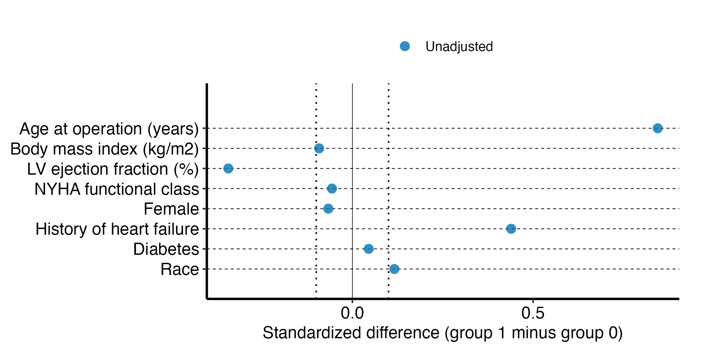

# Standardized differences

# Standardized differences

Replaces `descriptive/dc.stddiff`: say which variant.

A `dc-stddiff` job is the balance table: for each baseline variable, the
standardized difference between two groups, before any adjustment and,
when the study has them, within the propensity-matched set and under
matching weights. It answers whether the groups are comparable, which a
p-value cannot: a p-value shrinks as the cohort grows, while a
standardized difference is in units of standard deviation and means the
same at 200 patients as at 20,000. The formatted table of group
summaries is a `dc-tables` job; this one reports the differences and
nothing else.

The numbers come from `hvtiRpropensity::ps_stddiff()`, a port of the
2019 `%stddiff` macro (Artis, from Yang and Dalton 2012), which handles
Gaussian, skewed or ordinal, binary and categorical variables. It
replaces the 2009 `%std_dif` macro, which handled continuous and binary
variables only. The optional permutation reference is
`ps_stddiff_perm()`, the port of `%stddiffci`.

Code

``` r
# unnumbered: loads packages and checks versions only
# The study root is the nearest directory above this file holding _study.yml,
# so the job renders the same from the Render button, quarto render, or
# render_job(), at any depth, with no path in this document to edit.
.in <- knitr::current_input(dir = TRUE)
.root <- hvtiRtemplates:::.find_study_root(if (is.null(.in)) getwd() else dirname(.in))
.provenance_data <- list()
for (f in list.files(file.path(.root, "R"), pattern = "[.]R$", full.names = TRUE)) source(f)
suppressPackageStartupMessages({
  library(hvtiRutilities)
  library(hvtiRpropensity)
  library(hvtiPlotR)
  library(ggplot2)
})
if (utils::packageVersion("hvtiRpropensity") < "0.1.7") {
  stop("This job needs hvtiRpropensity >= 0.1.7 for ps_stddiff() and ps_stddiff_perm(); ",
       utils::packageVersion("hvtiRpropensity"), " is installed.", call. = FALSE)
}
if (utils::packageVersion("hvtiPlotR") < "2.8.0") {
  stop("This job needs hvtiPlotR >= 2.8.0 for hv_balance() and theme_hv_manuscript(); ",
       utils::packageVersion("hvtiPlotR"), " is installed.", call. = FALSE)
}
```

Code

``` r
# The markers in this file name work a study author still has to do, and a job
# that still contains one has not been finished. This chunk is what makes that
# TRUE rather than merely stated: an unedited job would otherwise render green
# over placeholder columns.
.tok <- paste0("ED", "IT", ":")
.cur <- knitr::current_input()
if (!is.null(.cur)) {
  .src  <- readLines(.cur, warn = FALSE)
  .hits <- grep(.tok, .src, fixed = TRUE)
  if (length(.hits)) {
    .msg <- paste0(
      length(.hits), " unresolved ", .tok, " marker(s) remain in this job:\n",
      paste0("  - ", trimws(substr(.src[.hits], 1L, 96L)), collapse = "\n"),
      "\nA job that still contains one has not been finished. Work each ",
      "marker and delete it."
    )
    if (tolower(Sys.getenv("HVTI_TEMPLATE_STRICT")) %in% c("", "0", "false", "no")) {
      warning(.msg, "\nRendering as a draft; the banner goes when the last marker does. ",
              "Set HVTI_TEMPLATE_STRICT to 1, true or yes to make this stop.", call. = FALSE)
      cat("\n::: {.callout-important title=\"DRAFT -- this job is unfinished\"}\n")
      cat("Unresolved markers remain. **The numbers below are not",
          "a result.**\n\n```\n", .msg, "\n```\n", sep = "")
      cat(":::\n\n")
    } else {
      stop(.msg, "\nThis render stops because HVTI_TEMPLATE_STRICT is '",
           Sys.getenv("HVTI_TEMPLATE_STRICT"), "'. Unset it, or set it to 0, false ",
           "or no, to render a draft instead.", call. = FALSE)
    }
  }
}
```

Code

``` r
# unnumbered: a callout, printed only when part of the job is left out
# To render a job you have not finished, leave a chunk out with the chunk
# option skip, giving the reason in quotes, or call hvtiRtemplates::stop_here()
# in a chunk to leave out everything below it. A draft lists each one here; a
# final render refuses them, as it refuses an EDIT marker. ?stop_here has more.
hvtiRtemplates:::.guard_partial(knitr::current_input())
```

Code

``` r
SUBJECT <- "approach"
TYPE    <- "balance"

.current <- knitr::current_input()
if (!is.null(.current)) {
  .fields <- hvtiRtemplates:::.job_name_fields(.current)
  .name_subject <- if (length(.fields) >= 1L) .fields[[1L]] else NA_character_
  .name_type <- if (length(.fields) >= 2L) .fields[[2L]] else NA_character_
  if (!identical(.name_subject, SUBJECT) || !identical(.name_type, TYPE)) {
    stop("This file is named '", .current, "' (subject '", .name_subject,
         "', type '", .name_type, "'), but declares SUBJECT = \"", SUBJECT,
         "\", TYPE = \"", TYPE, "\". Fix the declaration or the filename before rendering.",
         call. = FALSE)
  }
}

set_path <- function(kind, file) {
  d <- file.path(hvtiRutilities::study_dir(kind, .root),
                 paste0(SUBJECT, "-", TYPE))
  if (!dir.exists(d)) dir.create(d, recursive = TRUE)
  file.path(d, file)
}

# Saves a figure as <name>.png and <name>.pdf in this set's graphs/ folder (or `kind`'s),
# under the SAVE_FIGURES and FIGURES study choices.
save_figure <- function(plot, name, width = 6, height = 4, kind = "graphs", linked = FALSE) {
  hvtiRtemplates:::.save_figure(plot, set_path(kind, paste0(name, ".png")), width, height,
                                SAVE_FIGURES, FIGURES, linked)
}
```

## Study choices

Edit these values for this study before rendering.

Code

``` r
# Demo: the registered dataset this job reads ("built" is the study dataset).
DATASET <- "built"

# Demo: an hvtiRdatabuild analysis set, or NULL to read the whole dataset.
ANALYSIS_SET <- NULL

# Demo: rows to keep, dplyr::filter() style, or NULL to keep every row:
#   WHERE <- quote(age >= 18)
#   WHERE <- rlang::exprs(age >= 18, hx_chf == 1)
WHERE <- NULL

# Demo: the patient identifier. Without "ccfid" the job uses MRN, then eMRN;
# name another column, such as "randid", if the study uses one.
ID <- "patient_id"

# Demo: what makes a row unique; one row per patient unless repeated measures
# add their visit time or date, for example KEY <- c(ID, "iv_echo").
KEY <- ID

# Optional, and needs no edit: NULL reads the cohort alone. To join one
# registered ancillary dataset (echoes, labs), name it in JOIN. The cohort
# above decides the patients, one row each; the joined records of other
# patients are dropped and counted in the data table.
#   JOIN_VARS: the cohort columns each joined row carries; NULL carries all,
#     and a column both datasets have stops, so list only those the job needs.
#   REDUCE: NULL keeps a row per joined record, keyed on that dataset's key;
#     list(rule = "first", by = "echo_date") keeps one row per patient ("last",
#     or "nearest" with to = a cohort date column). WHERE on a joined column
#     filters the records first, so "last" with WHERE echo_type == "TTE"
#     keeps each patient's last TTE. A tie stops: picking one record
#     silently would be a hidden choice; by = c("echo_date", "echo_seq")
#     breaks it. This job models one row per
#     patient, so a JOIN without REDUCE stops here.
#   JOIN_KEY: overrides the joined dataset's registered key.
JOIN <- NULL
JOIN_VARS <- NULL
REDUCE <- NULL
JOIN_KEY <- NULL

# Demo: the column that splits the cohort into the two groups compared (the
# SAS macro's GROUP=). Each difference is group 1 minus group 0, so the sign
# says which group carries more of a variable.
GROUP <- "approach"

# Demo: NULL when GROUP is already coded 0/1 or TRUE/FALSE. Otherwise the value
# of GROUP that is group 1, such as "transcatheter"; the one other value becomes
# group 0. A study with three or more arms compares them a pair at a time, as
# every study that has done this in SAS did: keep one pair with WHERE, for
# example WHERE <- quote(arm %in% c("A", "B")), and scaffold a job per pair.
GROUP_1 <- "transcatheter"

# Demo: the variables, by type. The type chooses the formula, so it is given
# rather than guessed: an NYHA class stored as an integer would otherwise be
# treated as Gaussian. Carry the lists across from the SAS call's GAUSSIAN=,
# NONG_ORD= (skewed or ordinal), BINARY= and CATG= arguments. BINARY columns
# must be coded 0/1 or TRUE/FALSE; CATEGORICAL columns may have any coding.
GAUSSIAN    <- c("age", "bmi", "lvef")
NONG_ORD    <- "nyha_pr"
BINARY      <- c("female", "hx_chf", "hx_dm")
CATEGORICAL <- "race_grp"

# Demo: NULL, or a 0/1 column marking the propensity-matched rows (the SAS
# job's SUBSET=match). Adds the matched comparison.
MATCH <- NULL

# Demo: NULL, or the column of matching weights (the SAS job's WEIGHT=). Adds
# the weighted comparison. Every weight must be positive and finite.
WEIGHT <- NULL

# Demo: the absolute difference above which a variable is called imbalanced.
# 0.10 is the convention (Austin 2009); a protocol may name another.
THRESHOLD <- 0.10

# Demo: 0 skips the permutation reference. A number, such as 1000 (the
# %stddiffci default), adds it for the unadjusted and matched comparisons;
# SEED makes the permutations repeat exactly from render to render.
N_PERM <- 200L
SEED   <- 20261006L

# Each figure is saved to graphs/ as a PNG (for Word) and a PDF (for the publisher).
# SAVE_FIGURES <- FALSE saves neither; FIGURES keeps only the figures whose names
# start with one of its entries, e.g. FIGURES <- c("hp-survival"). The names are the
# file names, listed for each template in the templates README.
SAVE_FIGURES <- TRUE
FIGURES <- NULL
```

## Data

Code

``` r
hvtiRutilities::verify_manifest(file.path(.root, "manifest.yaml"))
.cfg <- study_config(start = .root)
job_data <- hvtiRtemplates::read_job_data(.cfg, dataset = DATASET, analysis_set = ANALYSIS_SET,
                                          where = WHERE, id = ID, key = KEY, join = JOIN, join_vars = JOIN_VARS,
                                          reduce = REDUCE, join_key = JOIN_KEY, one_row_per_patient = TRUE)
d <- job_data$data
.provenance_data <- c(if (exists(".provenance_data")) .provenance_data else list(), list(job_data$provenance),
                      if (!is.null(job_data$provenance_join)) list(job_data$provenance_join))
knitr::kable(job_data$record, col.names = c("Data", ""))
```

| Data                |                                          |
|:--------------------|:-----------------------------------------|
| Source              | dataset `built` (built_20261009.parquet) |
| Rows read           | 800                                      |
| ID                  | `patient_id`                             |
| Identifiers dropped | none                                     |
| Rows kept           | 800 rows on 800 patients                 |

Table 1: The data this job read

Code

``` r
# unnumbered: its child chunk carries its own label and caption
if (!is.null(job_data$attrition)) {
  .fence <- strrep("`", 3)
  cat(knitr::knit_child(text = c(
    paste0(.fence, "{r}"), "#| label: tbl-data-attrition",
    paste0("#| tbl-cap: ", encodeString(paste0("Analysis set `", ANALYSIS_SET, "`: exclusions, in order"), quote = "\"")),
    "knitr::kable(job_data$attrition)", .fence
  ), envir = environment(), quiet = TRUE), sep = "\n")
}
```

Code

``` r
# Every choice is checked against the data before any difference is computed,
# so a misspelled column stops here by name rather than as an error from inside
# ps_stddiff().
.id <- attr(job_data$record, "selection")$id
one_column <- function(x, setting) {
  if (!is.null(x) && !(is.character(x) && length(x) == 1L && !is.na(x))) {
    stop(setting, " must be NULL or a single column name.", call. = FALSE)
  }
}
one_column(GROUP, "GROUP")
if (is.null(GROUP)) stop("GROUP must name the column that splits the two groups.", call. = FALSE)
one_column(MATCH, "MATCH")
one_column(WEIGHT, "WEIGHT")
if (!(is.numeric(THRESHOLD) && length(THRESHOLD) == 1L && !is.na(THRESHOLD) && THRESHOLD > 0)) {
  stop("THRESHOLD must be one positive number, such as 0.10.", call. = FALSE)
}
if (!(is.numeric(N_PERM) && length(N_PERM) == 1L && !is.na(N_PERM) && N_PERM >= 0 && N_PERM == round(N_PERM))) {
  stop("N_PERM must be 0, to skip the permutation reference, or a whole number of permutations.", call. = FALSE)
}
vars <- list(gaussian = GAUSSIAN, nong_ord = NONG_ORD, binary = BINARY, categorical = CATEGORICAL)
all_vars <- unlist(vars, use.names = FALSE)
if (!length(all_vars)) stop("Name at least one variable under GAUSSIAN, NONG_ORD, BINARY or CATEGORICAL.", call. = FALSE)
twice <- unique(all_vars[duplicated(all_vars)])
if (length(twice)) {
  stop("A variable may be listed under one type only: ", paste(twice, collapse = ", "), call. = FALSE)
}
unknown <- setdiff(unique(c(GROUP, MATCH, WEIGHT, all_vars)), names(d))
if (length(unknown)) stop("Unknown column(s): ", paste(unknown, collapse = ", "), call. = FALSE)
# The identifier, the group and the design columns describe how rows were
# chosen or weighted, not the patients, so none of them is a covariate.
design <- intersect(all_vars, c(.id, GROUP, MATCH, WEIGHT))
if (length(design)) {
  stop("Not a covariate, so not compared: ", paste(design, collapse = ", "), call. = FALSE)
}

# ps_stddiff() takes a 0/1 group. When GROUP holds two other values, GROUP_1
# says which is group 1, and the recoded column is what every comparison uses.
group_col <- GROUP
group_names <- c("0" = paste(GROUP, "= 0"), "1" = paste(GROUP, "= 1"))
if (!is.null(GROUP_1)) {
  # Shape first: a vector would reach `||` below as several logicals and stop
  # with R's own length error, which names neither GROUP_1 nor the fix.
  if (length(GROUP_1) != 1L || is.na(GROUP_1)) {
    stop("GROUP_1 must be NULL or one value of ", GROUP, ", such as \"transcatheter\".", call. = FALSE)
  }
  seen <- sort(unique(as.character(d[[GROUP]][!is.na(d[[GROUP]])])))
  if (length(seen) != 2L || !(as.character(GROUP_1) %in% seen)) {
    stop("GROUP_1 must be one of exactly two values of ", GROUP, "; the data hold ",
         length(seen), ": ", paste(utils::head(seen, 10L), collapse = ", "),
         ". With more than two, keep one pair with WHERE and run a job per pair.", call. = FALSE)
  }
  group_col <- ".stddiff_group"
  d[[group_col]] <- as.integer(as.character(d[[GROUP]]) == as.character(GROUP_1))
  group_names <- c("0" = setdiff(seen, as.character(GROUP_1)), "1" = as.character(GROUP_1))
}

# The comparisons. Unadjusted always; Matched and Weighted when the study named
# their columns. A matched row is MATCH == 1, and a missing MATCH is unmatched.
comparisons <- list(Unadjusted = list(data = d, weight = NULL))
if (!is.null(MATCH)) {
  m <- d[[MATCH]]
  if (!(is.logical(m) || (is.numeric(m) && all(m[!is.na(m)] %in% c(0, 1))))) {
    stop("MATCH must be a 0/1 or TRUE/FALSE column; ", MATCH, " is not.", call. = FALSE)
  }
  in_match <- !is.na(m) & m == 1
  if (!any(in_match)) stop("No row has ", MATCH, " == 1, so there is no matched set to compare.", call. = FALSE)
  comparisons$Matched <- list(data = d[in_match, , drop = FALSE], weight = NULL)
}
if (!is.null(WEIGHT)) comparisons$Weighted <- list(data = d, weight = WEIGHT)

run_stddiff <- function(cmp) {
  hvtiRpropensity::ps_stddiff(cmp$data, treatment_col = group_col,
                              gaussian = vars$gaussian, nong_ord = vars$nong_ord,
                              binary = vars$binary, categorical = vars$categorical,
                              weight_col = cmp$weight)
}
results <- lapply(comparisons, run_stddiff)

# One row per variable, a column per comparison. A variable's label, where the
# dataset carries one, is what a reader will recognize.
first <- results[[1L]]$tables$stddiff
balance <- data.frame(variable = first$variable,
                      label = ifelse(is.na(first$label), first$variable, first$label),
                      type = first$type)
for (nm in names(results)) balance[[nm]] <- results[[nm]]$tables$stddiff$stddiff

# The groups each comparison saw. A weighted comparison also reports the sum of
# weights, because that, not the row count, is the size of the weighted groups.
group_counts <- do.call(rbind, lapply(names(comparisons), function(nm) {
  cmp <- comparisons[[nm]]
  g <- cmp$data[[group_col]]
  row <- data.frame(comparison = nm,
                    n0 = sum(!is.na(g) & g == 0), n1 = sum(!is.na(g) & g == 1))
  if (!is.null(WEIGHT)) {
    w <- if (is.null(cmp$weight)) rep(NA_real_, length(g)) else cmp$data[[cmp$weight]]
    row$w0 <- if (is.null(cmp$weight)) NA_real_ else sum(w[!is.na(g) & g == 0])
    row$w1 <- if (is.null(cmp$weight)) NA_real_ else sum(w[!is.na(g) & g == 1])
  }
  row
}))
names(group_counts)[2:3] <- paste("n,", group_names)
if (!is.null(WEIGHT)) names(group_counts)[4:5] <- paste("sum of weights,", group_names)

summary_rows <- data.frame(
  comparison = names(results),
  variables = nrow(balance),
  above = vapply(names(results), function(nm) sum(abs(balance[[nm]]) > THRESHOLD, na.rm = TRUE), integer(1)),
  largest = vapply(names(results), function(nm) {
    x <- abs(balance[[nm]])
    if (all(is.na(x))) NA_real_ else max(x, na.rm = TRUE)
  }, numeric(1)),
  undefined = vapply(names(results), function(nm) sum(is.na(balance[[nm]])), integer(1))
)
names(summary_rows) <- c("comparison", "variables", paste("|d| >", THRESHOLD), "largest |d|", "not defined")

# The permutation reference covers the unweighted comparisons only. A matching
# weight depends on the group, so permuting the groups needs the weights refit
# on every permutation; ps_stddiff_perm() takes a reweight function for that,
# and writing one is the study's propensity model, not this job's.
perm <- list()
if (N_PERM > 0) {
  for (nm in setdiff(names(comparisons), "Weighted")) {
    perm[[nm]] <- hvtiRpropensity::ps_stddiff_perm(
      comparisons[[nm]]$data, treatment_col = group_col,
      gaussian = vars$gaussian, nong_ord = vars$nong_ord,
      binary = vars$binary, categorical = vars$categorical,
      n_perm = as.integer(N_PERM), seed = SEED
    )$tables$stddiff_perm
    perm[[nm]]$label <- ifelse(is.na(perm[[nm]]$label), perm[[nm]]$variable, perm[[nm]]$label)
    perm[[nm]] <- perm[[nm]][c("variable", "label", "type", "observed", "p2_5", "p16", "p50", "p84", "p97_5")]
    names(perm[[nm]]) <- c("variable", "label", "type", "observed", "2.5%", "16%", "50%", "84%", "97.5%")
  }
}
```

## Groups compared

Group 1 is **transcatheter** and group 0 is **surgical**. Every
difference below is group 1 minus group 0, so a positive value means
group 1 has more of the variable: a higher mean, a higher rank, or a
larger proportion at the variable’s last level.

Code

``` r
.kable_na <- options(knitr.kable.NA = "")
knitr::kable(group_counts, row.names = FALSE, digits = 1)
options(.kable_na)
```

| comparison | n, surgical | n, transcatheter |
|:-----------|------------:|-----------------:|
| Unadjusted |         514 |              286 |

Table 2: The two groups, in each comparison

## Standardized differences

Code

``` r
knitr::kable(summary_rows, row.names = FALSE, digits = 3)
```

| comparison | variables | \|d\| \> 0.1 | largest \|d\| | not defined |
|:-----------|----------:|-------------:|--------------:|------------:|
| Unadjusted |         8 |            4 |         0.845 |           0 |

Table 3: Variables above the imbalance threshold, by comparison

Code

``` r
.kable_na <- options(knitr.kable.NA = "")
knitr::kable(balance, row.names = FALSE, digits = 3)
options(.kable_na)
```

| variable | label                    | type        | Unadjusted |
|:---------|:-------------------------|:------------|-----------:|
| age      | Age at operation (years) | gaussian    |      0.845 |
| bmi      | Body mass index (kg/m2)  | gaussian    |     -0.092 |
| lvef     | LV ejection fraction (%) | gaussian    |     -0.343 |
| nyha_pr  | NYHA functional class    | nong_ord    |     -0.056 |
| female   | Female                   | binary      |     -0.066 |
| hx_chf   | History of heart failure | binary      |      0.439 |
| hx_dm    | Diabetes                 | binary      |      0.045 |
| race_grp | Race                     | categorical |      0.116 |

Table 4: Standardized difference of each variable, group 1 minus group 0

The values are proportions of a standard deviation, so 0.10 is a tenth
of one. The SAS output labeled the column `(%)` without multiplying by
100, and these values match it. A Gaussian difference divides by the
square root of the average of the two groups’ variances, not a pooled
variance, so it is not Cohen’s d when the groups differ in size. A
categorical difference with more than two levels is the Mahalanobis form
and is never negative. A blank is a difference that is not defined: a
variable with no spread in either group, or with no values.
`ps_stddiff()`’s help page gives every formula.

## Balance figure

Code

``` r
# The figure keeps the table's units, proportions of a standard deviation, so
# the threshold lines sit at the THRESHOLD the summary table counts against.
long <- do.call(rbind, lapply(names(results), function(nm) {
  data.frame(variable = balance$label, comparison = nm, std_diff = balance[[nm]])
}))
long <- long[!is.na(long$std_diff), , drop = FALSE]
bal <- hvtiPlotR::hv_balance(long, variable_col = "variable", group_col = "comparison",
                             std_diff_col = "std_diff", var_levels = rev(unique(balance$label)),
                             threshold = THRESHOLD)
# The house palette for the comparisons, and a shape each, so the figure still
# reads in grayscale.
.levels <- names(results)
p <- plot(bal) +
  scale_color_manual(values = stats::setNames(hv_palette(length(.levels)), .levels)) +
  scale_shape_manual(values = stats::setNames(c(16, 17, 15)[seq_along(.levels)], .levels)) +
  labs(x = "Standardized difference (group 1 minus group 0)", y = NULL, color = NULL, shape = NULL) +
  theme_hv_manuscript() +
  # The manuscript theme drops the legend; this figure needs it to say which
  # comparison each point is.
  theme(legend.position = "top")
file <- save_figure(p, "dc-stddiff-balance", width = 7, height = max(3, 1.5 + 0.25 * nrow(balance)), linked = TRUE)
# This document sits in descriptive/ and the figure is written to graphs/, so
# the image link is the figure's path relative to this document.
knitr::include_graphics(xfun::relative_path(file, if (!is.null(.in)) dirname(.in) else getwd(), error = FALSE),
                        error = FALSE)
```



Figure 1: Standardized differences, with the imbalance threshold dotted

## Permutation reference

Code

``` r
# unnumbered: each child chunk below carries its own label and caption
if (!length(perm)) {
  cat("Not computed: `N_PERM` is 0. Set it under Study choices to add one.\n")
} else {
  .fence <- strrep("`", 3)
  for (nm in names(perm)) {
    .perm <- perm[[nm]]
    cat(knitr::knit_child(text = c(
      paste0(.fence, "{r}"), paste0("#| label: tbl-perm-", tolower(nm)),
      paste0("#| tbl-cap: ", encodeString(paste0(nm, ": observed difference and the percentiles of ",
                                                 N_PERM, " permutations of the groups"), quote = "\"")),
      "knitr::kable(.perm, row.names = FALSE, digits = 3)", .fence
    ), envir = environment(), quiet = TRUE), sep = "\n")
    cat("\n")
  }
  if (!is.null(WEIGHT)) {
    cat("The weighted comparison has no reference: its weights depend on the groups, so each",
        "permutation needs them refit. See `reweight` in `?ps_stddiff_perm`.\n")
  }
}
```

Code

``` r
knitr::kable(.perm, row.names = FALSE, digits = 3)
```

| variable | label | type | observed | 2.5% | 16% | 50% | 84% | 97.5% |
|:---|:---|:---|---:|---:|---:|---:|---:|---:|
| age | Age at operation (years) | gaussian | 0.845 | -0.136 | -0.066 | 0.002 | 0.075 | 0.140 |
| bmi | Body mass index (kg/m2) | gaussian | -0.092 | -0.149 | -0.085 | -0.007 | 0.079 | 0.141 |
| lvef | LV ejection fraction (%) | gaussian | -0.343 | -0.135 | -0.071 | -0.001 | 0.075 | 0.126 |
| nyha_pr | NYHA functional class | nong_ord | -0.056 | -0.121 | -0.058 | 0.010 | 0.083 | 0.163 |
| female | Female | binary | -0.066 | -0.123 | -0.078 | 0.001 | 0.080 | 0.153 |
| hx_chf | History of heart failure | binary | 0.439 | -0.142 | -0.070 | 0.002 | 0.072 | 0.143 |
| hx_dm | Diabetes | binary | 0.045 | -0.155 | -0.087 | 0.006 | 0.084 | 0.149 |
| race_grp | Race | categorical | 0.116 | 0.026 | 0.048 | 0.082 | 0.145 | 0.188 |

Table 5: Unadjusted: observed difference and the percentiles of 200
permutations of the groups

The percentiles describe the difference label shuffling alone produces,
when group carries no information about a variable. They are **not** a
confidence interval for the observed value, whatever `%stddiffci`’s name
suggests. An observed difference outside the 2.5 to 97.5 range is larger
than chance assignment tends to produce; 16 to 84 is the central 68%.

The treatment effect under matching weights, the SAS `%mw_var` macro, is
`hvtiRpropensity::ps_mw_var()`. It estimates an outcome difference
rather than balance, so it is not part of this job.
