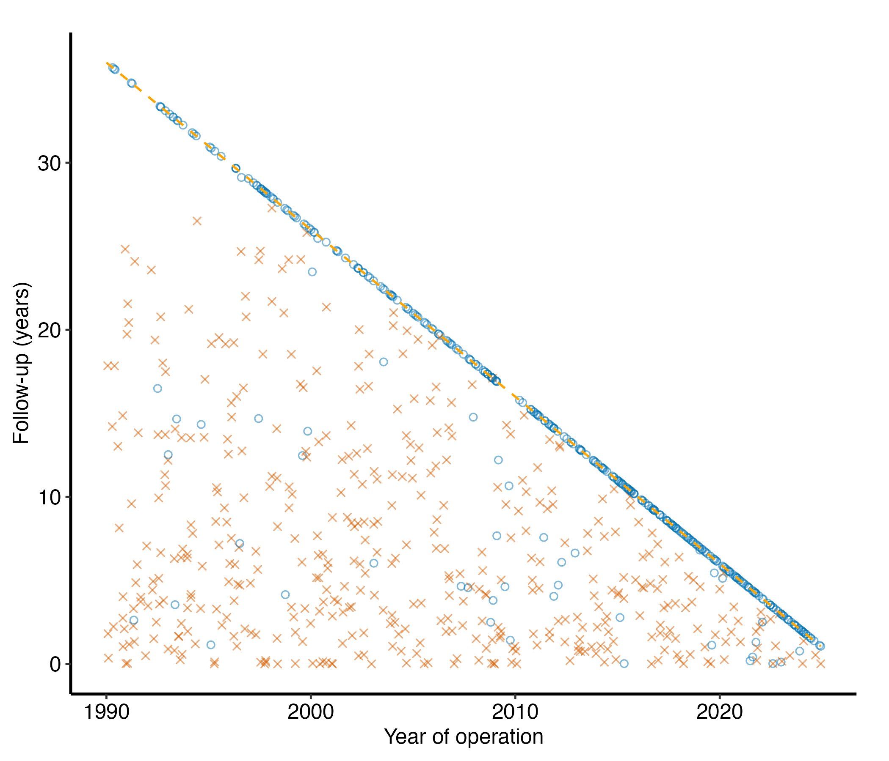
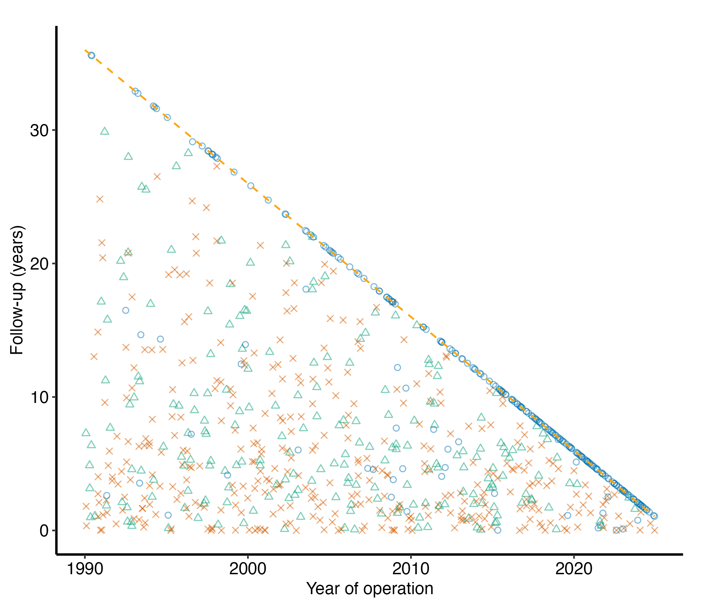
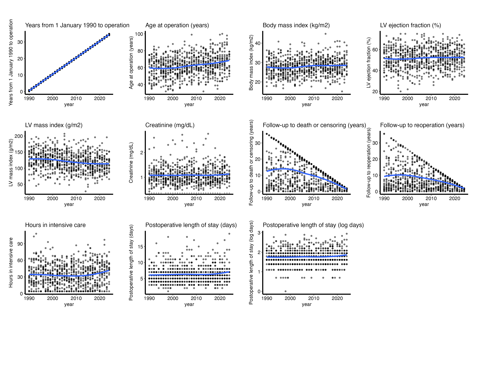
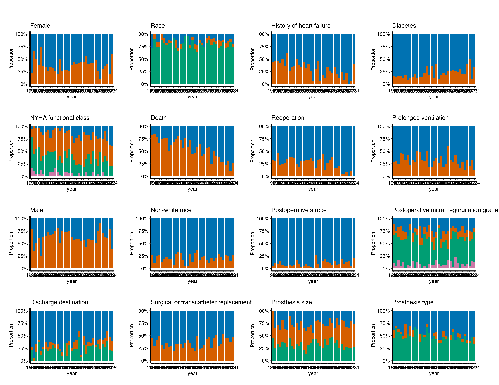
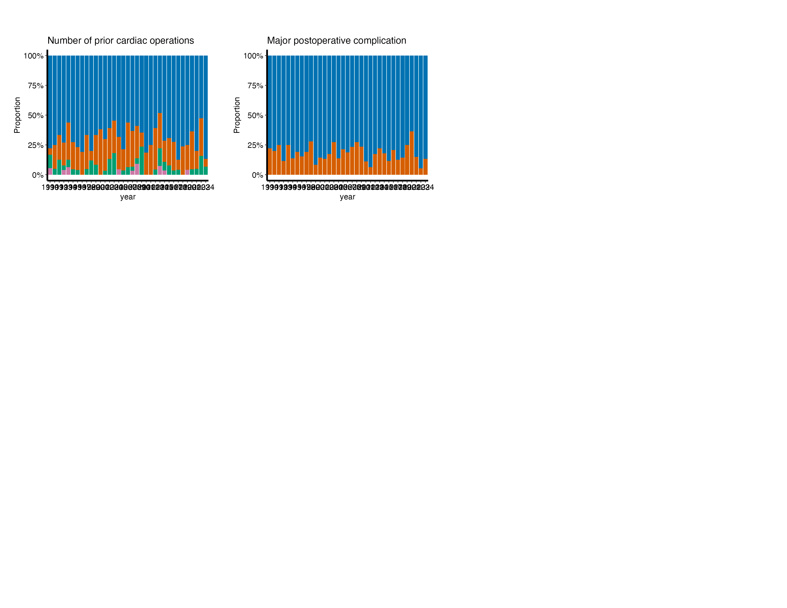
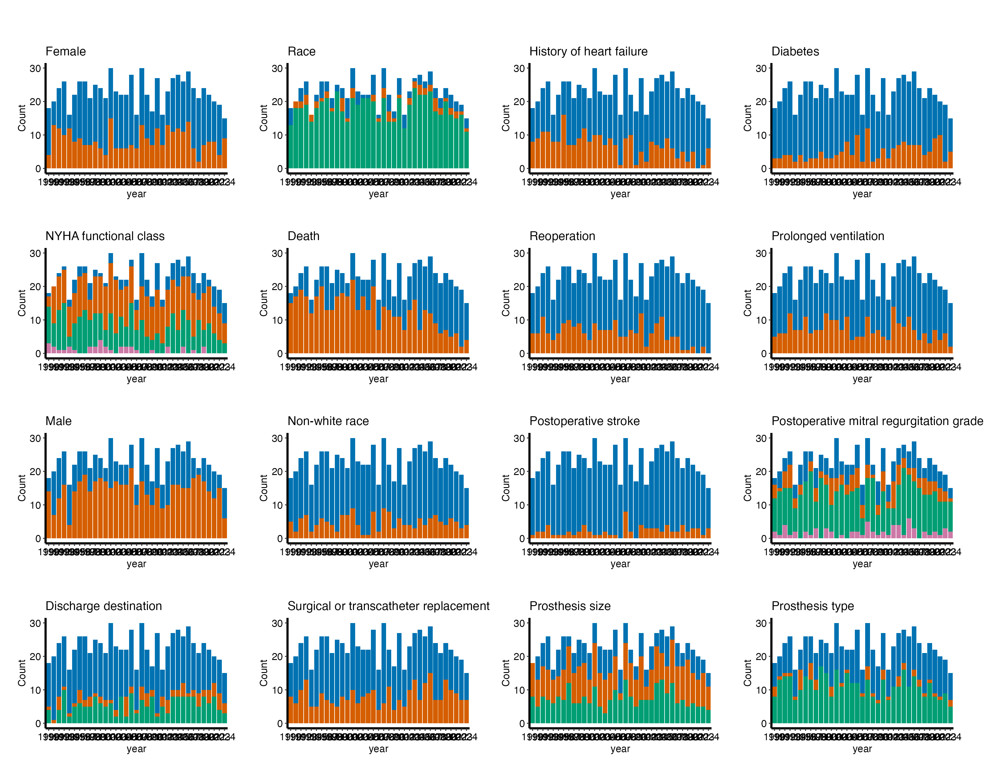
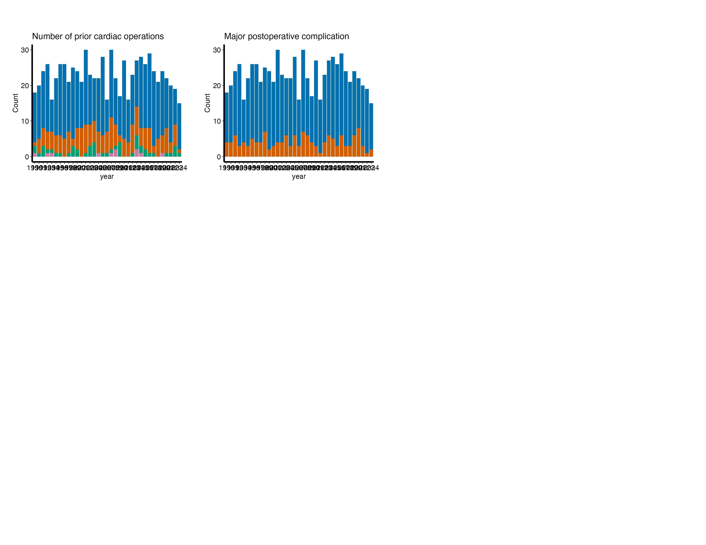

# EDA report

# EDA report

Replaces an older EDA report.

A `dp-eda` job is the whole data-checking report over a new build, in
one render: an overview of every column, goodness of follow-up, then
continuous variables, categorical variables as percentages and
categorical variables as counts, each with its table. It is written for
the biostatistician choosing variables for an analysis set, not for a
manuscript.

Each section draws through a package function. The follow-up section is
`dc-gfup`, a job of its own: its figure
(`hvtiPlotR::hv_followup_panels()`) and its tables
(`hvtiRutilities::followup_check()`). Given the same choices it is the
same figure as the standalone job, so this report and that job cannot
disagree about the data. The other three sections draw their pages
through `hvtiPlotR::hv_eda_pages()`.

Code

``` r
# unnumbered: loads packages and checks versions only
# The study root is the nearest directory above this file holding _study.yml,
# so the job renders the same from the Render button, quarto render, or
# render_job(), at any depth, with no path in this document to edit.
.in <- knitr::current_input(dir = TRUE)
.root <- hvtiRtemplates:::.find_study_root(if (is.null(.in)) getwd() else dirname(.in))
.provenance_data <- list()
for (f in list.files(file.path(.root, "R"), pattern = "[.]R$", full.names = TRUE)) source(f)
suppressPackageStartupMessages({
  library(hvtiRutilities)
  library(hvtiPlotR)
  library(ggplot2)
})
if (utils::packageVersion("hvtiPlotR") < "2.8.0") {
  stop("This job needs hvtiPlotR >= 2.8.0 for hv_eda_pages(), hv_followup_panels() and scale_color_hv(); ",
       utils::packageVersion("hvtiPlotR"), " is installed.", call. = FALSE)
}
if (utils::packageVersion("hvtiRutilities") < "1.4.5") {
  stop("This job needs hvtiRutilities >= 1.4.5 for followup_check()'s 15th and 85th percentiles ",
       "and study_abbreviations(); ",
       utils::packageVersion("hvtiRutilities"), " is installed.", call. = FALSE)
}
if (!requireNamespace("patchwork", quietly = TRUE)) {
  stop("This job needs the patchwork package. Install it, then re-render.", call. = FALSE)
}
```

Code

``` r
.tok <- paste0("ED", "IT", ":")
.cur <- knitr::current_input()
if (!is.null(.cur)) {
  .src <- readLines(.cur, warn = FALSE)
  .hits <- grep(.tok, .src, fixed = TRUE)
  if (length(.hits)) {
    .msg <- paste0(
      length(.hits), " unresolved ", .tok, " marker(s) remain in this job:\n",
      paste0("  - ", trimws(substr(.src[.hits], 1L, 96L)), collapse = "\n"),
      "\nA job that still contains one has not been finished. Work each ",
      "marker and delete it."
    )
    if (tolower(Sys.getenv("HVTI_TEMPLATE_STRICT")) %in% c("", "0", "false", "no")) {
      warning(.msg, "\nRendering as a draft; the banner goes when the last marker does. ",
              "Set HVTI_TEMPLATE_STRICT to 1, true or yes to make this stop.", call. = FALSE)
      cat("\n::: {.callout-important title=\"DRAFT -- this job is unfinished\"}\n")
      cat("Unresolved markers remain. **The numbers below are not",
          "a result.**\n\n```\n", .msg, "\n```\n", sep = "")
      cat(":::\n\n")
    } else {
      stop(.msg, "\nThis render stops because HVTI_TEMPLATE_STRICT is '",
           Sys.getenv("HVTI_TEMPLATE_STRICT"), "'. Unset it, or set it to 0, false ",
           "or no, to render a draft instead.", call. = FALSE)
    }
  }
}
```

Code

``` r
# unnumbered: a callout, printed only when part of the job is left out
# To render a job you have not finished, leave a chunk out with the chunk
# option skip, giving the reason in quotes, or call hvtiRtemplates::stop_here()
# in a chunk to leave out everything below it. A draft lists each one here; a
# final render refuses them, as it refuses an EDIT marker. ?stop_here has more.
hvtiRtemplates:::.guard_partial(knitr::current_input())
```

Code

``` r
SUBJECT <- "cohort"
TYPE    <- "eda"

.current <- knitr::current_input()
if (!is.null(.current)) {
  .fields <- hvtiRtemplates:::.job_name_fields(.current)
  .name_subject <- if (length(.fields) >= 1L) .fields[[1L]] else NA_character_
  .name_type <- if (length(.fields) >= 2L) .fields[[2L]] else NA_character_
  if (!identical(.name_subject, SUBJECT) || !identical(.name_type, TYPE)) {
    stop("This file is named '", .current, "' (subject '", .name_subject,
         "', type '", .name_type, "'), but declares SUBJECT = \"", SUBJECT,
         "\", TYPE = \"", TYPE, "\". Fix the declaration or the filename before rendering.",
         call. = FALSE)
  }
}

set_path <- function(kind, file) {
  d <- file.path(hvtiRutilities::study_dir(kind, .root),
                 paste0(SUBJECT, "-", TYPE))
  if (!dir.exists(d)) dir.create(d, recursive = TRUE)
  file.path(d, file)
}

# Saves a figure as <name>.png and <name>.pdf in this set's graphs/ folder (or `kind`'s),
# under the SAVE_FIGURES and FIGURES study choices.
save_figure <- function(plot, name, width = 6, height = 4, kind = "graphs", linked = FALSE) {
  hvtiRtemplates:::.save_figure(plot, set_path(kind, paste0(name, ".png")), width, height,
                                SAVE_FIGURES, FIGURES, linked)
}
```

## Study choices

Set the values in this chunk before rendering. Left as they are, they
draw the all-deaths follow-up panel and every column of the study
dataset.

Code

``` r
# Demo: the registered dataset this job reads ("built" is the study dataset).
# MIGRATE-BEGIN: dp-eda-data
DATASET <- "built"
# MIGRATE-END: dp-eda-data

# Demo: an hvtiRdatabuild analysis set, or NULL to read the whole dataset.
ANALYSIS_SET <- NULL

# Demo: rows to keep, dplyr::filter() style, or NULL to keep every row:
#   WHERE <- quote(age >= 18)
#   WHERE <- rlang::exprs(age >= 18, hx_chf == 1)
WHERE <- NULL

# Demo: the patient identifier. Without "ccfid" the job uses MRN, then eMRN;
# name another column, such as "randid", if the study uses one.
ID <- "patient_id"

# Demo: what makes a row unique; one row per patient unless repeated measures
# add their visit time or date, for example KEY <- c(ID, "iv_echo").
KEY <- ID

# Optional, and needs no edit: NULL reads the cohort alone. To join one
# registered ancillary dataset (echoes, labs), name it in JOIN. The cohort
# above decides the patients, one row each; the joined records of other
# patients are dropped and counted in the data table.
#   JOIN_VARS: the cohort columns each joined row carries; NULL carries all,
#     and a column both datasets have stops, so list only those the job needs.
#   REDUCE: NULL keeps a row per joined record, keyed on that dataset's key;
#     list(rule = "first", by = "echo_date") keeps one row per patient ("last",
#     or "nearest" with to = a cohort date column). WHERE on a joined column
#     filters the records first, so "last" with WHERE echo_type == "TTE"
#     keeps each patient's last TTE. A tie stops: picking one record
#     silently would be a hidden choice; by = c("echo_date", "echo_seq")
#     breaks it. A job that counts or models
#     patients, one row each, needs REDUCE: NULL would count every record.
#   JOIN_KEY: overrides the joined dataset's registered key.
JOIN <- NULL
JOIN_VARS <- NULL
REDUCE <- NULL
JOIN_KEY <- NULL

# Follow-up. These are dc-gfup's choices, and mean what they mean there.
# Demo: the years-since-origin interval to the operation, and that origin. The
# origin differs between studies, and a wrong one slides every point along the
# x-axis without any other symptom, which is why the operation years are
# checked and printed below.
OPYRS <- "iv_opyrs"
ORIGIN_YEAR <- 1990

# Demo: the close date of follow-up, as.Date("YYYY-MM-DD"). NULL estimates it
# as the latest operation date plus follow-up in the data, which is the date
# follow-up is known to reach, not the date it was closed; the report says
# which one it drew.
CLOSE_DATE <- as.Date("2025-12-31")

# Demo: one entry per death panel. `status` is the 1/0 death indicator and
# `time` its follow-up in years. Each panel also gets dc-gfup's tables, over
# the same two columns. A study that ascertains deaths two ways draws both,
# for example
#   systematic = list(status = "deads", time = "iv_deads", title = "Systematic deaths")
PANELS <- list(
  all = list(status = "dead", time = "iv_dead", title = "All deaths")
)

# Demo: optional event panels, one entry per non-fatal event. `event` and
# `time` are the event's indicator and interval; `death` and `death_time` the
# death it competes with. A flagged event counts only when it comes strictly
# before death, so ties go to death. list() draws none. For example
#   reop = list(event = "ev_reop", time = "iv_reop", death = "dead",
#               death_time = "iv_dead", label = "Reoperation")
EVENTS <- list(reop = list(event = "reop", time = "iv_reop", death = "dead", death_time = "iv_dead", label = "Reoperation"))

# Variables.
# X_VAR is the reference time every panel is drawn against.
# VARIABLES is NULL to draw every column, or the columns to draw, in page
# order. NULL leaves out X_VAR, EXCLUDE and any column that looks like an
# identifier or a date, and the report lists what it left out; name such a
# column here to draw it anyway. The job's ID is never drawn, even when named
# here. A KEY column beside it, such as a visit time, is left out of NULL but
# drawn when named here, as that column's own distribution; a measure's course
# over visits is a spaghetti plot, drawn by hvtiPlotR::hv_spaghetti, not a page here.
# The follow-up columns are drawn too, like any other column.
# A named column that is not in the data stops the render, and the error
# lists every missing name at once.
# SECTIONS is any of "followup", "continuous", "percent" and "count". The
# report keeps this order whatever order they are named in, so the report
# reads the same across studies.
# ALPHA is point transparency, for the follow-up figures and the continuous
# panels: 0.5 lets a dense cohort read as a distribution rather than a blob.
# MIGRATE-BEGIN: dp-eda-variables
X_VAR <- "year"                    # Demo: reference time or year
VARIABLES <- NULL                  # Demo: NULL draws every column, or name them
EXCLUDE <- character(0)
GRID_NCOL <- 4L
GRID_NROW <- 4L
UNIQUE_LIMIT <- 6L
SECTIONS <- c("followup", "continuous", "percent", "count")
ALPHA <- 0.5
# MIGRATE-END: dp-eda-variables

# Demo: NULL draws the house colors through hvtiPlotR::scale_color_hv(): dead
# vermillion, alive blue and a non-fatal event green, all colorblind safe. Name
# all three to choose your own; c(alive = "#377EB8", dead = "#E41A1C",
# event = "#4DAF4A") is ColorBrewer Set1, what these jobs drew before 1.2.3.
COLORS <- NULL

# Demo: the longest label the figure pages and their captions show, in
# characters. Longer labels are shortened so that two labels that differ never
# read the same: a shared heading is abbreviated, then the label is cut and
# marked. Inf shows every label whole. Tables keep full labels, so a reader can
# look up what a shortened one stands for.
LABEL_MAX <- 40

# Demo: this job's own abbreviations, beyond the study's list, as
# c("Phrase" = "Abbrev"); NA drops one the study or group list supplies. NULL
# uses the study's list alone. The study's list is the abbreviations: block in
# _study.yml, over the group default shipped in hvtiRutilities.
ABBREVIATIONS <- NULL

# Each figure is saved to graphs/ as a PNG (for Word) and a PDF (for the publisher).
# SAVE_FIGURES <- FALSE saves neither; FIGURES keeps only the figures whose names
# start with one of its entries, e.g. FIGURES <- c("hp-survival"). The names are the
# file names, listed for each template in the templates README.
SAVE_FIGURES <- TRUE
FIGURES <- NULL
```

## Data

Code

``` r
hvtiRutilities::verify_manifest(file.path(.root, "manifest.yaml"))
.cfg <- study_config(start = .root)
job_data <- hvtiRtemplates::read_job_data(.cfg, dataset = DATASET, analysis_set = ANALYSIS_SET,
                                          where = WHERE, id = ID, key = KEY, join = JOIN, join_vars = JOIN_VARS,
                                          reduce = REDUCE, join_key = JOIN_KEY)
d <- job_data$data
.provenance_data <- c(if (exists(".provenance_data")) .provenance_data else list(), list(job_data$provenance),
                      if (!is.null(job_data$provenance_join)) list(job_data$provenance_join))
knitr::kable(job_data$record, col.names = c("Data", ""))
```

| Data                |                                          |
|:--------------------|:-----------------------------------------|
| Source              | dataset `built` (built_20261009.parquet) |
| Rows read           | 800                                      |
| ID                  | `patient_id`                             |
| Identifiers dropped | none                                     |
| Rows kept           | 800 rows on 800 patients                 |

Table 1: The data this job read

Code

``` r
# unnumbered: its child chunk carries its own label and caption
if (!is.null(job_data$attrition)) {
  .fence <- strrep("`", 3)
  cat(knitr::knit_child(text = c(
    paste0(.fence, "{r}"), "#| label: tbl-data-attrition",
    paste0("#| tbl-cap: ", encodeString(paste0("Analysis set `", ANALYSIS_SET, "`: exclusions, in order"), quote = "\"")),
    "knitr::kable(job_data$attrition)", .fence
  ), envir = environment(), quiet = TRUE), sep = "\n")
}
```

Code

``` r
# unnumbered: checks the choices and defines helpers only; its tables and figures are child chunks elsewhere
# The follow-up choices are checked by hv_followup_panels() below; these
# check the variable choices.
column_names <- function(x) is.character(x) && !anyNA(x) && all(nzchar(x)) && !anyDuplicated(x)
if (!column_names(X_VAR) || length(X_VAR) != 1L) stop("X_VAR must name one column.", call. = FALSE)
if (!is.null(VARIABLES) && (!column_names(VARIABLES) || !length(VARIABLES))) {
  stop("VARIABLES must be NULL or name distinct columns.", call. = FALSE)
}
if (!column_names(EXCLUDE)) stop("EXCLUDE must name distinct columns.", call. = FALSE)
positive_whole <- function(x) is.numeric(x) && length(x) == 1L && !is.na(x) && is.finite(x) && x > 0 && x == floor(x)
for (value in list(GRID_NCOL, GRID_NROW, UNIQUE_LIMIT)) {
  if (!positive_whole(value)) stop("Grid dimensions and UNIQUE_LIMIT must be positive whole numbers.", call. = FALSE)
}
all_sections <- c("followup", "continuous", "percent", "count")
if (!column_names(SECTIONS) || !length(SECTIONS) || !all(SECTIONS %in% all_sections)) {
  stop("SECTIONS must be one or more of \"followup\", \"continuous\", \"percent\" and \"count\".", call. = FALSE)
}
if (!is.numeric(ALPHA) || length(ALPHA) != 1L || is.na(ALPHA) || ALPHA < 0 || ALPHA > 1) {
  stop("ALPHA must be one number from 0 to 1.", call. = FALSE)
}
if (!is.numeric(LABEL_MAX) || length(LABEL_MAX) != 1L || is.na(LABEL_MAX) || LABEL_MAX < 4) {
  stop("LABEL_MAX must be one number, at least 4, or Inf to show every label whole.", call. = FALSE)
}
if (!is.null(ABBREVIATIONS) && (!(is.character(ABBREVIATIONS) || is.list(ABBREVIATIONS)) ||
                                  (length(ABBREVIATIONS) && is.null(names(ABBREVIATIONS))))) {
  stop('ABBREVIATIONS must be NULL or name each abbreviation by its phrase, c("Phrase" = "Abbrev").', call. = FALSE)
}
unknown <- setdiff(c(X_VAR, VARIABLES, EXCLUDE), names(d))
if (length(unknown)) stop("Unknown EDA column(s): ", paste(unknown, collapse = ", "), call. = FALSE)
# The job's ID and KEY columns are left out by default, and the ID is never
# drawn: they are the columns the data step used, so a ccfid, or the MRN it fell
# back to, is caught whatever its case. A KEY column named in VARIABLES is drawn.
# MRN and eMRN are already dropped at read, unless one is the ID. The name rules
# catch other identifier columns and dates: an id or identifier token, such as
# hosp_id, a date token or a _dt suffix, and the names ccfid and patientid,
# which have no "_" before "id"; a bare "id$" would also take carotid and
# steroid. The data rule catches columns that should not be drawn under a name
# nobody listed: dates, and text in which every value differs, once there are
# ten or more of them.
.job_selection <- attr(job_data$record, "selection")
is_job_id <- function(v) tolower(v) %in% tolower(.job_selection$id)
is_job_key <- function(v) tolower(v) %in% tolower(c(.job_selection$id, .job_selection$key))
looks_like_id <- function(v, job_key = TRUE) {
  (job_key & is_job_key(v)) |
    grepl("(^|_)(id|identifier|date|datetime)($|_)|_dt$", v, ignore.case = TRUE) |
    grepl("^(ccf|pat|patient|study|subject|record|case)_?(id|num|no)$|^e?mrn$", v, ignore.case = TRUE) |
    vapply(d[v], function(x) {
      seen <- x[!is.na(x)]
      inherits(x, c("Date", "POSIXt")) ||
        ((is.character(x) || is.factor(x)) && length(seen) >= 10L && !anyDuplicated(seen))
    }, logical(1L))
}
if (is.null(VARIABLES)) {
  candidates <- setdiff(names(d), c(X_VAR, EXCLUDE))
  left_out <- candidates[looks_like_id(candidates)]
  VARIABLES <- setdiff(candidates, left_out)
  if (length(left_out)) {
    cat("Left out as identifier or date columns (name them in VARIABLES to draw them; the job's ID is never drawn):",
        paste(left_out, collapse = ", "), "\n")
  }
} else {
  VARIABLES <- setdiff(VARIABLES, EXCLUDE)
  if (any(is_job_id(VARIABLES))) {
    warning("Not drawn, as the job's ID: ", paste(VARIABLES[is_job_id(VARIABLES)], collapse = ", "),
            call. = FALSE)
    VARIABLES <- VARIABLES[!is_job_id(VARIABLES)]
  }
  # A KEY column named here was chosen on purpose, so it is not flagged for being
  # a KEY; the name, date and free-text rules still apply to it.
  suspect <- looks_like_id(VARIABLES, job_key = FALSE)
  if (any(suspect)) {
    warning("Selected likely identifier or date field(s): ", paste(VARIABLES[suspect], collapse = ", "), call. = FALSE)
  }
}
```

    Left out as identifier or date columns (name them in VARIABLES to draw them; the job's ID is never drawn): patient_id, op_date 

Code

``` r
if (!length(VARIABLES)) stop("No EDA variables remain after exclusions.", call. = FALSE)

# Labels come from the dataset; a variable without one is shown by its name.
# Shortened labels stay distinct, using the job's, the study's and the group's
# abbreviations, merged and checked by study_abbreviations().
.abbreviations <- hvtiRutilities::study_abbreviations(.cfg, extra = ABBREVIATIONS)
.labels <- label_map(d, label_max = LABEL_MAX, abbreviations = .abbreviations)
labels <- stats::setNames(.labels$label, .labels$key)
# The abbreviations these variables' labels show, as a key under the section.
# Only shortened labels count: a label that says "SP" in its own words is not
# using the key's SP.
abbreviation_key <- function(vars) {
  used <- attr(.labels, "abbreviations")
  row <- match(vars, .labels$key)
  shown <- .labels$label[row][.labels$label[row] != .labels$label_full[row]]
  hit <- vapply(used$abbreviation, function(a) {
    any(grepl(paste0("(?<![[:alnum:]])", gsub("([][{}()+*^$|\\\\?.])", "\\\\\\1", a), "(?![[:alnum:]])"), shown, perl = TRUE))
  }, logical(1L))
  if (any(hit)) {
    cat("\nAbbreviations: ", paste(used$abbreviation[hit], used$expansion[hit], sep = " = ", collapse = "; "), ".\n\n",
        sep = "")
  }
}

# Every table and figure below is a chunk of its own, emitted with knit_child(),
# so Quarto numbers it: a loop over panels or pages cannot give one chunk several
# labels. A label is a kind and a key, such as "tbl gfup all cohort".
.fence <- strrep("`", 3)
.seen <- new.env()
.child <- function(label, caption, code) {
  label <- gsub("(^-+|-+$)", "", gsub("[^a-z0-9]+", "-", tolower(label)))
  if (!is.null(.seen[[label]])) stop("Two outputs would share the label ", label, ".", call. = FALSE)
  .seen[[label]] <- TRUE
  .opt <- paste0("#| ", sub("-.*$", "", label), "-cap: ", encodeString(caption, quote = "\""))
  cat(knitr::knit_child(text = c(paste0(.fence, "{r}"), paste0("#| label: ", label), .opt, code, .fence),
                        envir = parent.frame(), quiet = TRUE), sep = "\n")
  cat("\n")
}
# Link each saved figure relative to wherever this document sits. Quarto
# rewrites an absolute path into a broken relative one and then cannot embed
# the image, and a fixed "../graphs" would break for a job kept in a subfolder.
# error = FALSE returns the path unchanged when no relative path exists (two
# Windows drives), so the figure is still saved rather than the render stopping.
figure_link <- function(file) {
  xfun::relative_path(file, if (exists(".in") && !is.null(.in)) dirname(.in) else getwd(), error = FALSE)
}
figure_files <- character(0)
```

## Overview

Every column of the data this report read, in dataset order, with its
type, label and share missing. A column the sections below leave out is
still listed here, unless it looks like an identifier: those are named
below the table and not described.

Code

``` r
# unnumbered: its child chunk carries its own label and caption
# The same rule the sections use, applied whatever VARIABLES says, less its date
# half: a date's share missing is worth seeing, an identifier's is not.
is_date <- vapply(d, inherits, logical(1L), c("Date", "POSIXt")) |
  grepl("(^|_)(date|datetime)($|_)|_dt$", names(d), ignore.case = TRUE)
id_cols <- names(d)[looks_like_id(names(d)) & !is_date]
contents <- hvtiRutilities::proc_contents(d, order = "varnum")
shown <- contents$variables[!contents$variables$variable %in% id_cols, ]
.shown <- shown[, c("variable", "type", "label", "n_unique", "pct_missing")]
.child("tbl overview contents", paste0("Contents: ", nrow(d), " rows, ", ncol(d), " columns"),
       "knitr::kable(.shown, row.names = FALSE)")
```

Code

``` r
knitr::kable(.shown, row.names = FALSE)
```

| variable | type | label | n_unique | pct_missing |
|:---|:---|:---|---:|---:|
| op_date | Num | Date of operation | 766 | 0.0 |
| iv_opyrs | Num | Years from 1 January 1990 to operation | 787 | 0.0 |
| year | Num | Year of operation | 35 | 0.0 |
| age | Num | Age at operation (years) | 65 | 0.0 |
| female | Num | Female | 2 | 0.0 |
| race_grp | Char | Race | 3 | 0.0 |
| bmi | Num | Body mass index (kg/m2) | 190 | 0.0 |
| hx_chf | Num | History of heart failure | 2 | 0.0 |
| hx_dm | Num | Diabetes | 2 | 0.0 |
| nyha_pr | Num | NYHA functional class | 4 | 0.0 |
| lvef | Num | LV ejection fraction (%) | 53 | 0.0 |
| plvmassi | Num | LV mass index (g/m2) | 141 | 0.0 |
| creat_pr | Num | Creatinine (mg/dL) | 147 | 9.4 |
| dead | Num | Death | 2 | 0.0 |
| iv_dead | Num | Follow-up to death or censoring (years) | 779 | 0.0 |
| reop | Num | Reoperation | 2 | 0.0 |
| iv_reop | Num | Follow-up to reoperation (years) | 774 | 0.0 |
| vent | Num | Prolonged ventilation | 2 | 0.0 |
| icu_hours | Num | Hours in intensive care | 82 | 0.0 |
| male | Num | Male | 2 | 0.0 |
| nonwhite | Num | Non-white race | 2 | 0.0 |
| stroke | Char | Postoperative stroke | 2 | 0.0 |
| mr_grade | Char | Postoperative mitral regurgitation grade | 4 | 0.0 |
| discharge | Char | Discharge destination | 3 | 0.0 |
| approach | Char | Surgical or transcatheter replacement | 2 | 0.0 |
| valve_size | Char | Prosthesis size | 3 | 0.0 |
| valve_type | Char | Prosthesis type | 3 | 0.0 |
| prior_ops | Num | Number of prior cardiac operations | 4 | 0.0 |
| complication | Num | Major postoperative complication | 2 | 0.0 |
| los | Num | Postoperative length of stay (days) | 19 | 0.0 |
| log_los | Num | Postoperative length of stay (log days) | 19 | 0.0 |

Table 2: Contents: 800 rows, 32 columns

Code

``` r
if (length(id_cols)) cat("Identifier columns, not described:", paste(id_cols, collapse = ", "), "\n")
```

Identifier columns, not described: patient_id

Code

``` r
cat("\n## Goodness of follow-up\n\n")
```

## Goodness of follow-up

Code

``` r
cat("A point below the diagonal is follow-up short of what the close date allows. ",
    "A dead patient's point is where the death was recorded, so it is expected below ",
    "the line; it is the **blue** points drifting below it that need an explanation.\n\n", sep = "")
```

A point below the diagonal is follow-up short of what the close date
allows. A dead patient’s point is where the death was recorded, so it is
expected below the line; it is the **blue** points drifting below it
that need an explanation.

Code

``` r
# unnumbered: its child chunk carries its own label and caption
# hvtiPlotR::hv_followup_panels() checks every panel and event against the data,
# names every missing column at once, refuses a name used twice and the
# wrong-origin mistake, and works out the window the panels share. dc-gfup
# calls it with the same arguments, so these are that job's panels.
fp <- hvtiPlotR::hv_followup_panels(d, opyrs_col = OPYRS, origin_year = ORIGIN_YEAR,
                                    panels = PANELS, events = EVENTS, close_date = CLOSE_DATE)
close_date <- fp$meta$close_date
# Name the edit point a reader can find in this file, not the function's argument.
close_source <- if (is.null(CLOSE_DATE)) fp$meta$close_source else "set in CLOSE_DATE"
# Operations before ORIGIN_YEAR are drawn, left of the diagonal, by an
# hvtiPlotR that counts them in meta$n_opyrs_negative; this row says how many,
# because a build counting from a later origin is a problem to fix there. An
# older hvtiPlotR refuses them instead, so the field is absent and so is the row.
.before <- fp$meta$n_opyrs_negative
.window <- data.frame(
  quantity = c("patients", "operation year missing", if (!is.null(.before)) "operation before origin",
               "first operation", "last operation", "close date", "close date is"),
  value = c(fp$meta$n_obs, fp$meta$n_opyrs_missing, .before, format(fp$meta$first_operation),
            format(fp$meta$study_end), format(close_date), close_source)
)
.child("tbl gfup window", "Operation years and the close date", "knitr::kable(.window, row.names = FALSE)")
```

Code

``` r
knitr::kable(.window, row.names = FALSE)
```

| quantity               | value             |
|:-----------------------|:------------------|
| patients               | 800               |
| operation year missing | 0                 |
| first operation        | 1990-01-25        |
| last operation         | 2024-12-10        |
| close date             | 2025-12-31        |
| close date is          | set in CLOSE_DATE |

Table 3: Operation years and the close date

Code

``` r
# unnumbered: each child chunk below carries its own label and caption
# Each death panel gets dc-gfup's follow-up table over its own two columns,
# through hvtiRutilities::followup_check(), the function dc-gfup calls. No identifier is
# selected, so the report carries no patient-level column; run dc-gfup to review
# the suspicious rows themselves.
if (exists("COLOURS", inherits = FALSE)) stop("COLOURS is now COLORS: rename it in edit-study-choices ",
                                              "(study-choices in a job made before that rename).", call. = FALSE)
if (!is.null(COLORS) && !(is.character(COLORS) && !anyNA(COLORS) && length(COLORS) == 3L &&
                            setequal(names(COLORS), c("alive", "dead", "event")))) {
  stop("COLORS must be NULL or name exactly alive, dead and event.", call. = FALSE)
}
# Dead or Death is the event and Alive or No event the censored level, so a
# non-fatal event takes the house rule's next color, green.
status_colors <- function(levels) {
  if (is.null(COLORS)) return(scale_color_hv(event = c("Dead", "Death"), censored = c("Alive", "No event")))
  keys <- if (length(levels) == 2L) c("alive", "dead") else c("alive", "event", "dead")
  scale_color_manual(values = stats::setNames(COLORS[keys], levels))
}
# dc-gfup's follow-up table, one row per interval and patient group, so a panel
# here shows the table that job shows. test-dp-eda.R keeps the two copies equal.
.followup_table <- function(fc, d, event) {
  ev <- d[[event]]
  groups <- c(full = "All patients", event = "Event", censored = "Censored")
  rows <- lapply(names(groups), function(g) {
    m <- fc$means[[g]]
    keep <- switch(g, full = rep(TRUE, nrow(d)), event = !is.na(ev) & ev == 1, censored = !is.na(ev) & ev == 0)
    count <- function(test) vapply(m$variable, function(v) sum(test(d[[v]][keep]), na.rm = TRUE), integer(1L))
    data.frame(interval = m$variable, patients = groups[[g]], n = m$n, missing = m$nmiss,
               negative = count(function(x) x < 0), zero = count(function(x) x == 0),
               mean = m$mean, sd = m$std, min = m$min, p15 = m$p15, median = m$median,
               p85 = m$p85, max = m$max, row.names = NULL)
  })
  out <- do.call(rbind, rows)
  out[order(match(out$interval, unique(out$interval))), , drop = FALSE]
}
plots <- plot(fp, alpha = ALPHA)
panel_counts <- list()
for (i in seq_len(nrow(fp$data))) {
  row <- fp$data[i, ]
  nm <- row$panel
  panel_counts[[nm]] <- list(drawn = row$n_drawn, excluded = row$n_excluded)
  cat("\n### ", row$title, "\n\n", row$n_drawn, " patients drawn; ", row$n_excluded,
      " missing a column this panel needs.\n\n", sep = "")
  if (row$type == "followup") {
    fc <- hvtiRutilities::followup_check(d, event = PANELS[[nm]]$status, followup = PANELS[[nm]]$time)
    .followup <- .followup_table(fc, d, PANELS[[nm]]$status)
    .child(paste("tbl gfup", nm, "followup"),
           paste0("Follow-up, ", row$title, ", by patient group: missing, negative and zero values, ",
                  "and the distribution (years)"),
           "knitr::kable(.followup, row.names = FALSE, digits = 3)")
    p <- plots[[nm]] +
      status_colors(c("Alive", "Dead")) +
      scale_shape_manual(values = c(Alive = 1, Dead = 4))
  } else {
    levels <- c("No event", row$title, "Death")
    p <- plots[[nm]] +
      status_colors(levels) +
      scale_shape_manual(values = stats::setNames(c(1, 2, 4), levels))
  }
  p <- p + labs(x = "Year of operation", y = "Follow-up (years)", color = NULL, shape = NULL) +
    theme_hv_manuscript()
  file <- save_figure(p, paste0("dp-eda-gfup-", nm), width = 7, height = 6, linked = TRUE)
  .link <- figure_link(file)
  .child(paste("fig gfup", nm), paste0("Follow-up against year of operation, ", row$title),
         "knitr::include_graphics(.link, error = FALSE)")
  figure_files <- c(figure_files, file)
}
```

### All deaths

800 patients drawn; 0 missing a column this panel needs.

Code

``` r
knitr::kable(.followup, row.names = FALSE, digits = 3)
```

| interval | patients | n | missing | negative | zero | mean | sd | min | p15 | median | p85 | max |
|:---|:---|---:|---:|---:|---:|---:|---:|---:|---:|---:|---:|---:|
| iv_dead | All patients | 800 | 0 | 0 | 0 | 9.964 | 8.510 | 0.000 | 1.744 | 7.614 | 19.702 | 35.696 |
| iv_dead | Event | 443 | 0 | 0 | 0 | 7.056 | 6.465 | 0.000 | 0.957 | 5.012 | 14.079 | 27.287 |
| iv_dead | Censored | 357 | 0 | 0 | 0 | 13.573 | 9.331 | 0.021 | 3.918 | 11.190 | 25.845 | 35.696 |

Table 4: Follow-up, All deaths, by patient group: missing, negative and
zero values, and the distribution (years)

Code

``` r
knitr::include_graphics(.link, error = FALSE)
```



Figure 1: Follow-up against year of operation, All deaths

### Reoperation

800 patients drawn; 0 missing a column this panel needs.

Code

``` r
knitr::include_graphics(.link, error = FALSE)
```



Figure 2: Follow-up against year of operation, Reoperation

Code

``` r
# unnumbered: defines the section helper only; its tables and figures are child chunks
# One section of hv_eda_pages() pages with its table. One categorical table
# serves the percent and the count sections, shown under whichever comes
# first, because a table can carry both columns where a figure needs two.
# Missing values are counted as a level, so a percentage is out of every
# patient, not only those with a value.
titles <- c(continuous = "Continuous variables", percent = "Categorical variables, percent",
            count = "Categorical variables, counts")
freq_section <- intersect(c("percent", "count"), SECTIONS)[1L]
draw_section <- function(section) {
  sec <- hvtiPlotR::hv_eda_pages(d, x_col = X_VAR, section = section, vars = VARIABLES,
                                 labels = labels, unique_limit = UNIQUE_LIMIT)
  cat("\n## ", titles[[section]], " (", sec$meta$n_vars, ")\n\n", sep = "")
  if (!sec$meta$n_vars) {
    cat("No selected variable belongs to this section.\n\n")
    return(invisible(character(0)))
  }
  vars <- sec$data$variable
  if (section == "continuous") {
    stats <- hvtiRutilities::proc_means(d, vars = vars, stats = c("n", "nmiss", "mean", "std", "min",
                                                                  "p15", "median", "p85", "max"))
    .child(paste("tbl eda", section, "summary"), "Continuous variables",
           "knitr::kable(stats, digits = 2, row.names = FALSE)")
  } else if (identical(section, freq_section)) {
    freq <- do.call(rbind, lapply(vars, function(v) {
      f <- hvtiRutilities::proc_freq(d, v, missing = TRUE)
      level <- as.character(f[[1L]])
      data.frame(variable = v, level = ifelse(is.na(level), "(missing)", level),
                 n = f$Frequency, percent = round(f$Percent, 1))
    }))
    .child(paste("tbl eda", section, "frequencies"), "Categorical variables, missing counted",
           "knitr::kable(freq, row.names = FALSE)")
  }
  pages <- plot(sec, ncol = GRID_NCOL, nrow = GRID_NROW, alpha = ALPHA)
  files <- character(0)
  for (i in seq_along(pages)) {
    file <- save_figure(pages[[i]] & scale_fill_hv() & theme_hv_manuscript(base_size = 8),
                        sprintf("dp-eda-%s-page-%02d", section, i), width = 11, height = 8.5, linked = TRUE)
    on_page <- attr(pages[[i]], "variables")
    cat("\n### ", titles[[section]], ", page ", i, "\n\n", sep = "")
    .link <- figure_link(file)
    .child(paste("fig eda", section, "page", i),
           paste0(titles[[section]], ", page ", i, ": ", paste(labels[on_page], collapse = ", ")),
           "knitr::include_graphics(.link, error = FALSE)")
    files <- c(files, file)
  }
  abbreviation_key(vars)
  invisible(files)
}
```

Code

``` r
figure_files <- c(figure_files, draw_section("continuous"))
```

## Continuous variables (11)

Code

``` r
knitr::kable(stats, digits = 2, row.names = FALSE)
```

| variable | label | n | nmiss | mean | std | min | p15 | median | p85 | max |
|:---|:---|---:|---:|---:|---:|---:|---:|---:|---:|---:|
| iv_opyrs | Years from 1 January 1990 to operation | 800 | 0 | 17.43 | 9.83 | 0.07 | 5.80 | 17.38 | 29.02 | 34.94 |
| age | Age at operation (years) | 800 | 0 | 62.38 | 12.18 | 32.00 | 49.00 | 63.00 | 75.00 | 100.00 |
| bmi | Body mass index (kg/m2) | 800 | 0 | 27.90 | 4.46 | 15.10 | 23.20 | 27.80 | 32.35 | 44.80 |
| lvef | LV ejection fraction (%) | 800 | 0 | 51.78 | 9.79 | 20.00 | 42.00 | 52.00 | 62.00 | 75.00 |
| plvmassi | LV mass index (g/m2) | 800 | 0 | 121.03 | 29.41 | 28.00 | 91.00 | 121.00 | 152.00 | 207.00 |
| creat_pr | Creatinine (mg/dL) | 725 | 75 | 1.09 | 0.36 | 0.43 | 0.75 | 1.02 | 1.43 | 2.76 |
| iv_dead | Follow-up to death or censoring (years) | 800 | 0 | 9.96 | 8.51 | 0.00 | 1.74 | 7.61 | 19.70 | 35.70 |
| iv_reop | Follow-up to reoperation (years) | 800 | 0 | 7.57 | 7.07 | 0.00 | 1.32 | 5.25 | 14.96 | 35.61 |
| icu_hours | Hours in intensive care | 800 | 0 | 33.92 | 20.15 | 4.00 | 10.00 | 34.00 | 56.00 | 108.00 |
| los | Postoperative length of stay (days) | 800 | 0 | 6.32 | 2.62 | 1.00 | 4.00 | 6.00 | 9.00 | 19.00 |
| log_los | Postoperative length of stay (log days) | 800 | 0 | 1.76 | 0.40 | 0.00 | 1.39 | 1.79 | 2.20 | 2.94 |

Table 5: Continuous variables

### Continuous variables, page 1

Code

``` r
knitr::include_graphics(.link, error = FALSE)
```



Figure 3: Continuous variables, page 1: Years from 1 January 1990 to
operation, Age at operation (years), Body mass index (kg/m2), LV
ejection fraction (%), LV mass index (g/m2), Creatinine (mg/dL),
Follow-up to death or censoring (years), Follow-up to reoperation
(years), Hours in intensive care, Postoperative length of stay (days),
Postoperative length of stay (log days)

Code

``` r
figure_files <- c(figure_files, draw_section("percent"))
```

## Categorical variables, percent (18)

Code

``` r
knitr::kable(freq, row.names = FALSE)
```

| variable     | level         |   n | percent |
|:-------------|:--------------|----:|--------:|
| female       | 0             | 501 |    62.6 |
| female       | 1             | 299 |    37.4 |
| race_grp     | Black         | 111 |    13.9 |
| race_grp     | Other         |  58 |     7.2 |
| race_grp     | White         | 631 |    78.9 |
| hx_chf       | 0             | 557 |    69.6 |
| hx_chf       | 1             | 243 |    30.4 |
| hx_dm        | 0             | 625 |    78.1 |
| hx_dm        | 1             | 175 |    21.9 |
| nyha_pr      | 1             | 129 |    16.1 |
| nyha_pr      | 2             | 360 |    45.0 |
| nyha_pr      | 3             | 275 |    34.4 |
| nyha_pr      | 4             |  36 |     4.5 |
| dead         | 0             | 357 |    44.6 |
| dead         | 1             | 443 |    55.4 |
| reop         | 0             | 592 |    74.0 |
| reop         | 1             | 208 |    26.0 |
| vent         | 0             | 548 |    68.5 |
| vent         | 1             | 252 |    31.5 |
| male         | 0             | 299 |    37.4 |
| male         | 1             | 501 |    62.6 |
| nonwhite     | 0             | 631 |    78.9 |
| nonwhite     | 1             | 169 |    21.1 |
| stroke       | no            | 722 |    90.2 |
| stroke       | yes           |  78 |     9.8 |
| mr_grade     | mild          | 186 |    23.2 |
| mr_grade     | moderate      | 130 |    16.2 |
| mr_grade     | none          | 417 |    52.1 |
| mr_grade     | severe        |  67 |     8.4 |
| discharge    | home          | 520 |    65.0 |
| discharge    | nursing       |  86 |    10.8 |
| discharge    | rehab         | 194 |    24.2 |
| approach     | surgical      | 514 |    64.2 |
| approach     | transcatheter | 286 |    35.8 |
| valve_size   | large         | 216 |    27.0 |
| valve_size   | medium        | 323 |    40.4 |
| valve_size   | small         | 261 |    32.6 |
| valve_type   | bioprosthetic | 361 |    45.1 |
| valve_type   | homograft     |  52 |     6.5 |
| valve_type   | mechanical    | 387 |    48.4 |
| prior_ops    | 0             | 557 |    69.6 |
| prior_ops    | 1             | 183 |    22.9 |
| prior_ops    | 2             |  49 |     6.1 |
| prior_ops    | 3             |  11 |     1.4 |
| complication | 0             | 654 |    81.8 |
| complication | 1             | 146 |    18.2 |

Table 6: Categorical variables, missing counted

### Categorical variables, percent, page 1

Code

``` r
knitr::include_graphics(.link, error = FALSE)
```



Figure 4: Categorical variables, percent, page 1: Female, Race, History
of heart failure, Diabetes, NYHA functional class, Death, Reoperation,
Prolonged ventilation, Male, Non-white race, Postoperative stroke,
Postoperative mitral regurgitation grade, Discharge destination,
Surgical or transcatheter replacement, Prosthesis size, Prosthesis type

### Categorical variables, percent, page 2

Code

``` r
knitr::include_graphics(.link, error = FALSE)
```



Figure 5: Categorical variables, percent, page 2: Number of prior
cardiac operations, Major postoperative complication

Code

``` r
figure_files <- c(figure_files, draw_section("count"))
```

## Categorical variables, counts (18)

### Categorical variables, counts, page 1

Code

``` r
knitr::include_graphics(.link, error = FALSE)
```



Figure 6: Categorical variables, counts, page 1: Female, Race, History
of heart failure, Diabetes, NYHA functional class, Death, Reoperation,
Prolonged ventilation, Male, Non-white race, Postoperative stroke,
Postoperative mitral regurgitation grade, Discharge destination,
Surgical or transcatheter replacement, Prosthesis size, Prosthesis type

### Categorical variables, counts, page 2

Code

``` r
knitr::include_graphics(.link, error = FALSE)
```



Figure 7: Categorical variables, counts, page 2: Number of prior cardiac
operations, Major postoperative complication
