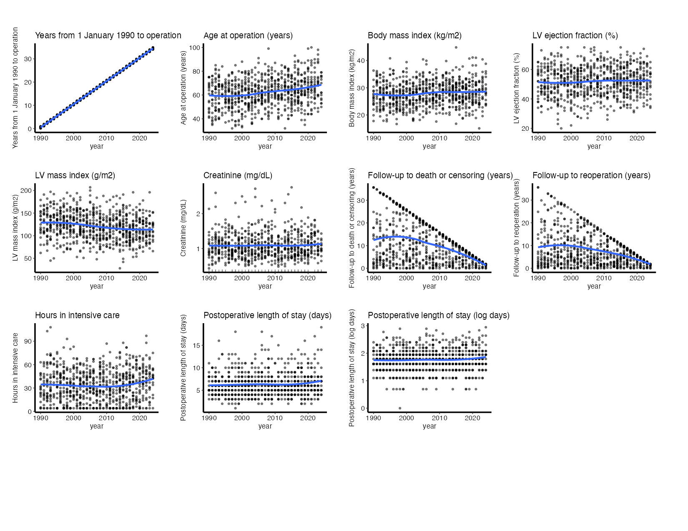
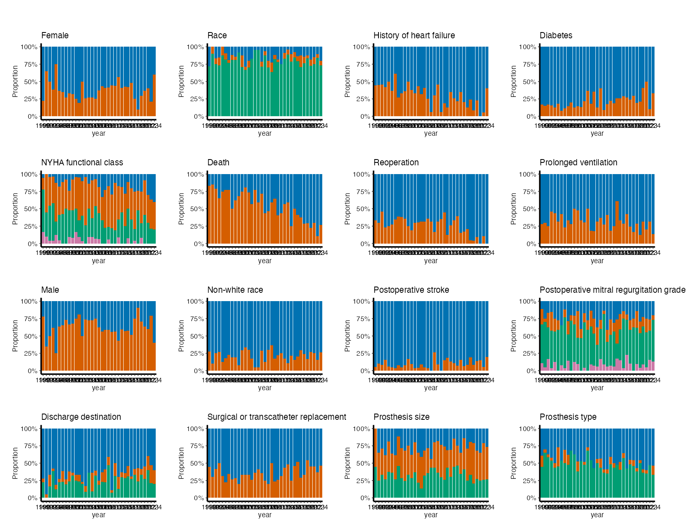
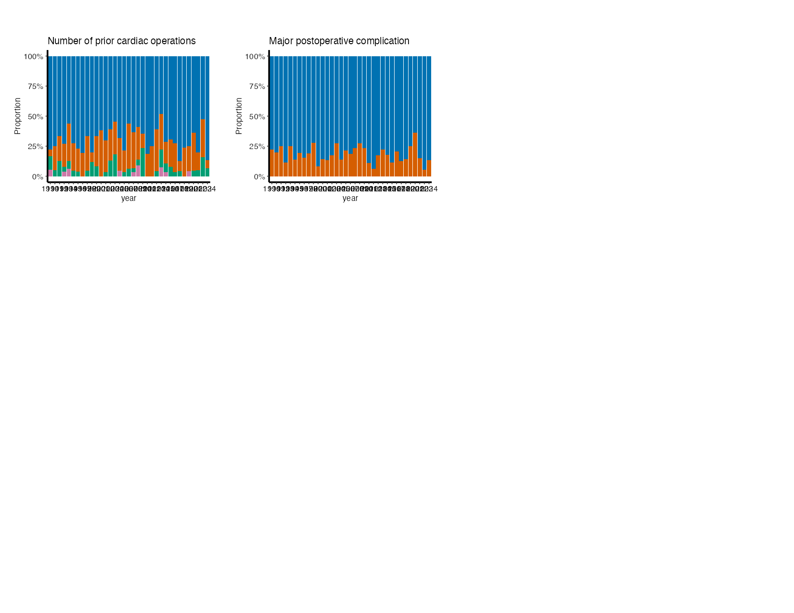
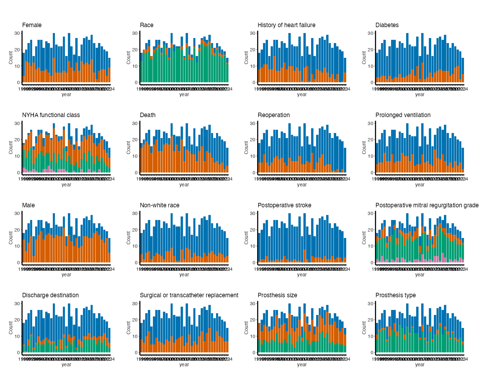
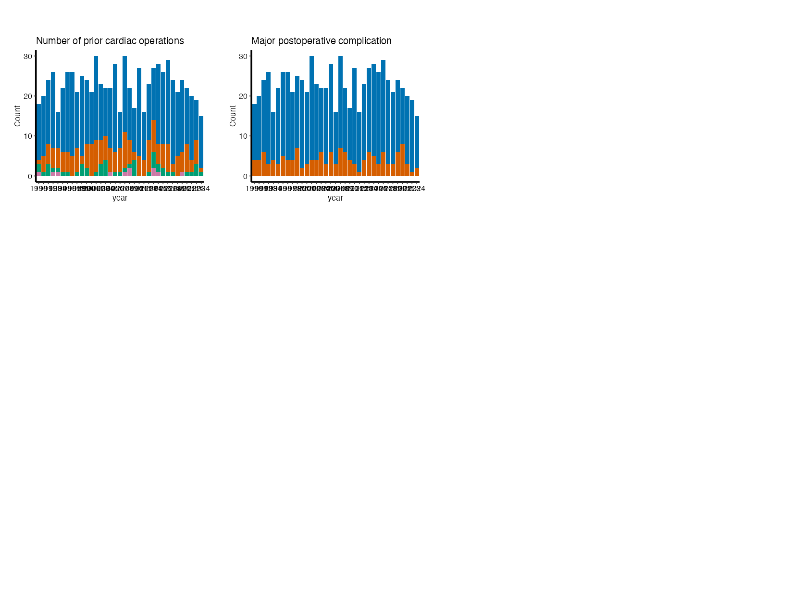

# EDA postage stamps

# EDA postage stamps

Replaces the per-variable grid of the legacy EDA report,
`tp.dp.DescriptiveSummary.qmd`.

**Deprecated.** `dp-postage` is deprecated in favor of `dp-eda`, and
will be removed in the release after hvtiRtemplates 1.2.3. For the same
pages, start a `dp-eda` job with
`add_job("dp", subject, type, qualifier = "eda")` and set
`SECTIONS <- c("continuous", "percent", "count")`: its sections call
`hv_eda_pages()` with the same arguments and draw the same pages, saved
as `dp-eda-*.png` rather than `dp-postage-*.png`.

A `dp-postage` job is the data-checking sweep over a new build: one
small panel per variable against operation year, pages of them, with a
table beside each section. It is for finding coding errors, drift and
missingness before any analysis. It is not a figure for a manuscript.

The sweep has three sections, and `SECTIONS` picks which to draw:
continuous variables as points, then categorical variables as
percentages, then the same categorical variables as counts. The percent
and count pages bin the year the same way, so their bars line up. The
pages come from `hvtiPlotR::hv_eda_pages()`, the same function the EDA
report draws through, so a section here is the same figure as that
section of the report.

Code

``` r
# unnumbered: loads packages and checks versions only
# The study root is the nearest directory above this file holding _study.yml,
# so the job renders the same from the Render button, quarto render, or
# render_job(), at any depth, with no path in this document to edit.
.in <- knitr::current_input(dir = TRUE)
.root <- hvtiRtemplates:::.find_study_root(if (is.null(.in)) getwd() else dirname(.in))
.provenance_data <- list()
for (f in list.files(file.path(.root, "R"), pattern = "[.]R$", full.names = TRUE)) source(f)
suppressPackageStartupMessages({
  library(hvtiRutilities)
  library(hvtiPlotR)
  library(ggplot2)
})
if (utils::packageVersion("hvtiPlotR") < "2.7.18") {
  stop("This job needs hvtiPlotR >= 2.7.18 for hv_eda_pages() and scale_fill_hv(); ",
       utils::packageVersion("hvtiPlotR"), " is installed.", call. = FALSE)
}
if (utils::packageVersion("hvtiRutilities") < "1.4.2") {
  stop("This job needs hvtiRutilities >= 1.4.2 for study_abbreviations(); ",
       utils::packageVersion("hvtiRutilities"), " is installed.", call. = FALSE)
}
if (!requireNamespace("patchwork", quietly = TRUE)) {
  stop("This job needs the patchwork package. Install it, then re-render.", call. = FALSE)
}
```

Code

``` r
.tok <- paste0("ED", "IT", ":")
.cur <- knitr::current_input()
if (!is.null(.cur)) {
  .src <- readLines(.cur, warn = FALSE)
  .hits <- grep(.tok, .src, fixed = TRUE)
  if (length(.hits)) {
    .msg <- paste0(
      length(.hits), " unresolved ", .tok, " marker(s) remain in this job:\n",
      paste0("  - ", trimws(substr(.src[.hits], 1L, 96L)), collapse = "\n"),
      "\nA job that still contains one has not been finished. Work each ",
      "marker and delete it."
    )
    if (tolower(Sys.getenv("HVTI_TEMPLATE_STRICT")) %in% c("", "0", "false", "no")) {
      warning(.msg, "\nRendering as a draft; the banner goes when the last marker does. ",
              "Set HVTI_TEMPLATE_STRICT to 1, true or yes to make this stop.", call. = FALSE)
      cat("\n::: {.callout-important title=\"DRAFT -- this job is unfinished\"}\n")
      cat("Unresolved markers remain. **The numbers below are not",
          "a result.**\n\n```\n", .msg, "\n```\n", sep = "")
      cat(":::\n\n")
    } else {
      stop(.msg, "\nThis render stops because HVTI_TEMPLATE_STRICT is '",
           Sys.getenv("HVTI_TEMPLATE_STRICT"), "'. Unset it, or set it to 0, false ",
           "or no, to render a draft instead.", call. = FALSE)
    }
  }
}
```

Code

``` r
# unnumbered: a callout, printed only when part of the job is left out
# To render a job you have not finished, leave a chunk out with the chunk
# option skip, giving the reason in quotes, or call hvtiRtemplates::stop_here()
# in a chunk to leave out everything below it. A draft lists each one here; a
# final render refuses them, as it refuses an EDIT marker. ?stop_here has more.
hvtiRtemplates:::.guard_partial(knitr::current_input())
```

Code

``` r
SUBJECT <- "cohort"
TYPE    <- "eda"

.current <- knitr::current_input()
if (!is.null(.current)) {
  .fields <- strsplit(sub("[.][^.]+$", "", basename(.current)), "-", fixed = TRUE)[[1L]]
  .name_subject <- if (length(.fields) >= 1L) .fields[[1L]] else NA_character_
  .name_type <- if (length(.fields) >= 2L) .fields[[2L]] else NA_character_
  if (!identical(.name_subject, SUBJECT) || !identical(.name_type, TYPE)) {
    stop("This file is named '", .current, "' (subject '", .name_subject,
         "', type '", .name_type, "'), but declares SUBJECT = \"", SUBJECT,
         "\", TYPE = \"", TYPE, "\". Fix the declaration or the filename before rendering.",
         call. = FALSE)
  }
}

set_path <- function(kind, file) {
  d <- file.path(hvtiRutilities::study_dir(kind, .root),
                 paste0(SUBJECT, "-", TYPE))
  if (!dir.exists(d)) dir.create(d, recursive = TRUE)
  file.path(d, file)
}
```

## Study choices

Set the values in this chunk before rendering.

Code

``` r
# Demo: the built dataset this job reads. "study" is the file named by built:
# in _study.yml; any other name must be declared under additional_datasets:,
# such as a column subset written for R. Analysis sets are derived from
# "study" only, so another dataset needs ANALYSIS_SET <- NULL.
# Demo: the analysis set this job reads: declare its columns and excluded rows
# under analysis_sets: in _study.yml, then write it with
# hvtiRdatabuild::write_analysis_set(). Use NULL only when the whole built
# cohort is the intended population.
# VARIABLES is NULL to draw every column, or the columns to draw, in page
# order. NULL leaves out X_VAR, EXCLUDE and any column that looks like an
# identifier or a date, and the report lists what it left out; name such a
# column here to draw it anyway. A named column that is not in the data stops
# the render, and the error lists every missing name at once.
# SECTIONS is any of "continuous", "percent" and "count", in the order to
# draw them. ALPHA is point transparency for continuous panels: 0.5 lets a dense
# cohort read as a distribution rather than a blob.
# MIGRATE-BEGIN: dp-postage-config
DATASET <- "study"
ANALYSIS_SET <- NULL
X_VAR <- "year"                    # Demo: reference time or year
VARIABLES <- NULL                  # Demo: NULL draws every column, or name them
EXCLUDE <- character(0)
GRID_NCOL <- 4L
GRID_NROW <- 4L
UNIQUE_LIMIT <- 6L
SECTIONS <- c("continuous", "percent", "count")
ALPHA <- 0.5
# MIGRATE-END: dp-postage-config

# Demo: the longest label the figure pages and their captions show, in
# characters. Longer labels are shortened so that two labels that differ never
# read the same: a shared heading is abbreviated, then the label is cut and
# marked. Inf shows every label whole. Tables keep full labels, so a reader can
# look up what a shortened one stands for.
LABEL_MAX <- 40

# Demo: this job's own abbreviations, beyond the study's list, as
# c("Phrase" = "Abbrev"); NA drops one the study or group list supplies. NULL
# uses the study's list alone. The study's list is the abbreviations: block in
# _study.yml, over the group default shipped in hvtiRutilities.
ABBREVIATIONS <- NULL
```

## Data

Code

``` r
hvtiRutilities::verify_manifest(file.path(.root, "manifest.yaml"))
if (is.null(ANALYSIS_SET)) {
  if (!is.character(DATASET) || length(DATASET) != 1L || is.na(DATASET) || !nzchar(DATASET)) {
    stop("DATASET must be set to one dataset registered in _study.yml, such as \"study\". ",
         "In a migrated job, see the migration report beside this job.", call. = FALSE)
  }
  .cfg <- study_config(start = .root)
  .data_read <- hvtiRtemplates:::.provenance_read(
    DATASET, .cfg, function() read_built(cfg = .cfg, dataset = DATASET)
  )
  d <- .data_read$value
  .provenance_data <- c(if (exists(".provenance_data")) .provenance_data else list(), list(.data_read$record))
} else if (!identical(DATASET, "study")) {
  stop("An analysis set is written from the study dataset, not `", DATASET,
       "`. Set ANALYSIS_SET <- NULL to read `", DATASET, "` whole.", call. = FALSE)
} else {
  if (!requireNamespace("hvtiRdatabuild", quietly = TRUE) || utils::packageVersion("hvtiRdatabuild") < "0.2.1") {
    stop("This job needs hvtiRdatabuild >= 0.2.1 for read_analysis_set().", call. = FALSE)
  }
  .cfg <- study_config(start = .root)
  .analysis_set_path <- file.path(study_dir("datasets", .root), paste0(ANALYSIS_SET, ".parquet"))
  .data_read <- hvtiRtemplates:::.provenance_file_read(
    paste0("analysis_set:", ANALYSIS_SET), .analysis_set_path, .cfg,
    function() hvtiRdatabuild::read_analysis_set(ANALYSIS_SET, cfg = .cfg),
    role = paste0("analysis_set:", ANALYSIS_SET)
  )
  d <- .data_read$value
  .provenance_data <- c(if (exists(".provenance_data")) .provenance_data else list(), list(.data_read$record))
}
cat("Data read: ", if (is.null(ANALYSIS_SET)) {
  paste0("dataset `", DATASET, "` (",
         basename(hvtiRutilities::built_path(dataset = DATASET)), ")")
} else {
  paste0("analysis set `", ANALYSIS_SET, "` of the study dataset")
}, ", ", nrow(d), " rows, ", ncol(d), " columns.\n", sep = "")
```

    Data read: dataset `study` (built.rds), 800 rows, 32 columns.

Code

``` r
# unnumbered: its child chunk carries its own label and caption
if (!is.null(ANALYSIS_SET)) {
  .fence <- strrep("`", 3)
  cat(knitr::knit_child(text = c(
    paste0(.fence, "{r}"), "#| label: tbl-data-attrition",
    paste0("#| tbl-cap: ", encodeString(paste0("Analysis set `", ANALYSIS_SET, "`: exclusions, in order"), quote = "\"")),
    "knitr::kable(attr(d, \"attrition\"))", .fence
  ), envir = environment(), quiet = TRUE), sep = "\n")
}
```

Code

``` r
# Variable order is page order. Character and factor columns become bars.
# Numeric columns become bars only for a small set of non-negative integers;
# other numeric columns become points.
column_names <- function(x) is.character(x) && !anyNA(x) && all(nzchar(x)) && !anyDuplicated(x)
if (!column_names(X_VAR) || length(X_VAR) != 1L) stop("X_VAR must name one column.", call. = FALSE)
if (!is.null(VARIABLES) && (!column_names(VARIABLES) || !length(VARIABLES))) {
  stop("VARIABLES must be NULL or name distinct columns.", call. = FALSE)
}
if (!column_names(EXCLUDE)) stop("EXCLUDE must name distinct columns.", call. = FALSE)
positive_whole <- function(x) is.numeric(x) && length(x) == 1L && !is.na(x) && is.finite(x) && x > 0 && x == floor(x)
for (value in list(GRID_NCOL, GRID_NROW, UNIQUE_LIMIT)) {
  if (!positive_whole(value)) stop("Grid dimensions and UNIQUE_LIMIT must be positive whole numbers.", call. = FALSE)
}
if (!column_names(SECTIONS) || !length(SECTIONS) || !all(SECTIONS %in% c("continuous", "percent", "count"))) {
  stop("SECTIONS must be one or more of \"continuous\", \"percent\" and \"count\".", call. = FALSE)
}
if (!is.numeric(ALPHA) || length(ALPHA) != 1L || is.na(ALPHA) || ALPHA < 0 || ALPHA > 1) {
  stop("ALPHA must be one number from 0 to 1.", call. = FALSE)
}
if (!is.numeric(LABEL_MAX) || length(LABEL_MAX) != 1L || is.na(LABEL_MAX) || LABEL_MAX < 4) {
  stop("LABEL_MAX must be one number, at least 4, or Inf to show every label whole.", call. = FALSE)
}
if (!is.null(ABBREVIATIONS) && (!(is.character(ABBREVIATIONS) || is.list(ABBREVIATIONS)) ||
                                  (length(ABBREVIATIONS) && is.null(names(ABBREVIATIONS))))) {
  stop('ABBREVIATIONS must be NULL or name each abbreviation by its phrase, c("Phrase" = "Abbrev").', call. = FALSE)
}
unknown <- setdiff(c(X_VAR, VARIABLES, EXCLUDE), names(d))
if (length(unknown)) stop("Unknown EDA column(s): ", paste(unknown, collapse = ", "), call. = FALSE)
# A name rule and a data rule. The names catch ccfid and patientid, which have no
# "_" before "id"; a bare "id$" would also take carotid and steroid. The medical
# record number counts only as the exact names MRN and eMRN. The data rule
# catches an identifier under a name nobody listed: text in which every value
# differs, once there are ten or more of them.
looks_like_id <- function(v) {
  grepl("(^|_)(id|identifier|date|datetime)($|_)|_dt$", v, ignore.case = TRUE) |
    grepl("^(ccf|pat|patient|study|subject|record|case)_?(id|num|no)$|^e?mrn$", v, ignore.case = TRUE) |
    vapply(d[v], function(x) {
      seen <- x[!is.na(x)]
      inherits(x, c("Date", "POSIXt")) ||
        ((is.character(x) || is.factor(x)) && length(seen) >= 10L && !anyDuplicated(seen))
    }, logical(1L))
}
if (is.null(VARIABLES)) {
  candidates <- setdiff(names(d), c(X_VAR, EXCLUDE))
  left_out <- candidates[looks_like_id(candidates)]
  VARIABLES <- setdiff(candidates, left_out)
  if (length(left_out)) {
    cat("Left out as identifier or date columns (name them in VARIABLES to draw them):",
        paste(left_out, collapse = ", "), "\n")
  }
} else {
  VARIABLES <- setdiff(VARIABLES, EXCLUDE)
  suspect <- looks_like_id(VARIABLES)
  if (any(suspect)) {
    warning("Selected likely identifier or date field(s): ", paste(VARIABLES[suspect], collapse = ", "), call. = FALSE)
  }
}
```

    Left out as identifier or date columns (name them in VARIABLES to draw them): patient_id, op_date 

Code

``` r
if (!length(VARIABLES)) stop("No EDA variables remain after exclusions.", call. = FALSE)
```

## Pages

Each section opens with its table: summary statistics for the continuous
variables, and one frequency table for the categorical variables, shown
once under whichever categorical section comes first. Missing values are
counted as a level, so a percentage is out of every patient, not only
those with a value.

Code

``` r
# unnumbered: each child chunk below carries its own label and caption
# Labels come from the dataset; a variable without one is shown by its name.
# Shortened labels stay distinct, using the job's, the study's and the group's
# abbreviations, merged and checked by study_abbreviations().
.abbreviations <- hvtiRutilities::study_abbreviations(.cfg, extra = ABBREVIATIONS)
.labels <- label_map(d, label_max = LABEL_MAX, abbreviations = .abbreviations)
labels <- stats::setNames(.labels$label, .labels$key)
# The abbreviations these variables' labels show, as a key under the section.
# Only shortened labels count: a label that says "SP" in its own words is not
# using the key's SP.
abbreviation_key <- function(vars) {
  used <- attr(.labels, "abbreviations")
  row <- match(vars, .labels$key)
  shown <- .labels$label[row][.labels$label[row] != .labels$label_full[row]]
  hit <- vapply(used$abbreviation, function(a) {
    any(grepl(paste0("(?<![[:alnum:]])", gsub("([][{}()+*^$|\\\\?.])", "\\\\\\1", a), "(?![[:alnum:]])"), shown, perl = TRUE))
  }, logical(1L))
  if (any(hit)) {
    cat("\nAbbreviations: ", paste(used$abbreviation[hit], used$expansion[hit], sep = " = ", collapse = "; "), ".\n\n",
        sep = "")
  }
}
.fence <- strrep("`", 3)
.seen <- new.env()
.child <- function(label, caption, code) {
  label <- gsub("(^-+|-+$)", "", gsub("[^a-z0-9]+", "-", tolower(label)))
  if (!is.null(.seen[[label]])) stop("Two outputs would share the label ", label, ".", call. = FALSE)
  .seen[[label]] <- TRUE
  .opt <- paste0("#| ", sub("-.*$", "", label), "-cap: ", encodeString(caption, quote = "\""))
  cat(knitr::knit_child(text = c(paste0(.fence, "{r}"), paste0("#| label: ", label), .opt, code, .fence),
                        envir = parent.frame(), quiet = TRUE), sep = "\n")
  cat("\n")
}
titles <- c(continuous = "Continuous variables", percent = "Categorical variables, percent",
            count = "Categorical variables, counts")
page_files <- character(0)
freq_shown <- FALSE
for (section in SECTIONS) {
  sec <- hvtiPlotR::hv_eda_pages(d, x_col = X_VAR, section = section, vars = VARIABLES,
                                 labels = labels, unique_limit = UNIQUE_LIMIT)
  cat("\n## ", titles[[section]], " (", sec$meta$n_vars, ")\n\n", sep = "")
  if (!sec$meta$n_vars) {
    cat("No selected variable belongs to this section.\n\n")
    next
  }
  vars <- sec$data$variable
  if (section == "continuous") {
    stats <- hvtiRutilities::proc_means(d, vars = vars, stats = c("n", "nmiss", "mean", "std", "min",
                                                                  "p25", "median", "p75", "max"))
    .child(paste("tbl postage", section, "summary"), "Continuous variables",
           "knitr::kable(stats, digits = 2, row.names = FALSE)")
  } else if (!freq_shown) {
    freq <- do.call(rbind, lapply(vars, function(v) {
      f <- hvtiRutilities::proc_freq(d, v, missing = TRUE)
      level <- as.character(f[[1L]])
      data.frame(variable = v, level = ifelse(is.na(level), "(missing)", level),
                 n = f$Frequency, percent = round(f$Percent, 1))
    }))
    .child(paste("tbl postage", section, "frequencies"), "Categorical variables, missing counted",
           "knitr::kable(freq, row.names = FALSE)")
    freq_shown <- TRUE
  }
  pages <- plot(sec, ncol = GRID_NCOL, nrow = GRID_NROW, alpha = ALPHA)
  for (i in seq_along(pages)) {
    file <- set_path("graphs", sprintf("dp-postage-%s-page-%02d.png", section, i))
    ggplot2::ggsave(file, pages[[i]] & scale_fill_hv() & theme_hv_manuscript(base_size = 8),
                    width = 11, height = 8.5, units = "in", dpi = 150)
    on_page <- attr(pages[[i]], "variables")
    # Link relative to wherever this document sits. Quarto rewrites an absolute
    # path into a broken relative one and then cannot embed the image, and a
    # fixed "../graphs" would break for a job kept in a subfolder. error = FALSE
    # returns the path unchanged when no relative path exists (two Windows
    # drives), so the page is still saved rather than the render stopping.
    link <- xfun::relative_path(file, if (exists(".in") && !is.null(.in)) dirname(.in) else getwd(),
                                error = FALSE)
    cat("\n### Page ", i, "\n\n", sep = "")
    .child(paste("fig postage", section, "page", i),
           paste0(titles[[section]], ", page ", i, ": ", paste(labels[on_page], collapse = ", ")),
           "knitr::include_graphics(link, error = FALSE)")
    page_files <- c(page_files, file)
  }
  abbreviation_key(vars)
}
```

## Continuous variables (11)

Code

``` r
knitr::kable(stats, digits = 2, row.names = FALSE)
```

| variable | label | n | nmiss | mean | std | min | p25 | median | p75 | max |
|:---|:---|---:|---:|---:|---:|---:|---:|---:|---:|---:|
| iv_opyrs | Years from 1 January 1990 to operation | 800 | 0 | 17.43 | 9.83 | 0.07 | 9.05 | 17.38 | 25.96 | 34.94 |
| age | Age at operation (years) | 800 | 0 | 62.38 | 12.18 | 32.00 | 54.00 | 63.00 | 71.00 | 100.00 |
| bmi | Body mass index (kg/m2) | 800 | 0 | 27.90 | 4.46 | 15.10 | 24.80 | 27.80 | 30.85 | 44.80 |
| lvef | LV ejection fraction (%) | 800 | 0 | 51.78 | 9.79 | 20.00 | 45.00 | 52.00 | 59.00 | 75.00 |
| plvmassi | LV mass index (g/m2) | 800 | 0 | 121.03 | 29.41 | 28.00 | 100.00 | 121.00 | 141.00 | 207.00 |
| creat_pr | Creatinine (mg/dL) | 725 | 75 | 1.09 | 0.36 | 0.43 | 0.83 | 1.02 | 1.28 | 2.76 |
| iv_dead | Follow-up to death or censoring (years) | 800 | 0 | 9.96 | 8.51 | 0.00 | 3.06 | 7.61 | 14.73 | 35.70 |
| iv_reop | Follow-up to reoperation (years) | 800 | 0 | 7.57 | 7.07 | 0.00 | 2.24 | 5.25 | 10.60 | 35.61 |
| icu_hours | Hours in intensive care | 800 | 0 | 33.92 | 20.15 | 4.00 | 18.00 | 34.00 | 48.00 | 108.00 |
| los | Postoperative length of stay (days) | 800 | 0 | 6.32 | 2.62 | 1.00 | 5.00 | 6.00 | 7.00 | 19.00 |
| log_los | Postoperative length of stay (log days) | 800 | 0 | 1.76 | 0.40 | 0.00 | 1.61 | 1.79 | 1.95 | 2.94 |

Table 1: Continuous variables

### Page 1

Code

``` r
knitr::include_graphics(link, error = FALSE)
```



Figure 1: Continuous variables, page 1: Years from 1 January 1990 to
operation, Age at operation (years), Body mass index (kg/m2), LV
ejection fraction (%), LV mass index (g/m2), Creatinine (mg/dL),
Follow-up to death or censoring (years), Follow-up to reoperation
(years), Hours in intensive care, Postoperative length of stay (days),
Postoperative length of stay (log days)

## Categorical variables, percent (18)

Code

``` r
knitr::kable(freq, row.names = FALSE)
```

| variable     | level         |   n | percent |
|:-------------|:--------------|----:|--------:|
| female       | 0             | 501 |    62.6 |
| female       | 1             | 299 |    37.4 |
| race_grp     | Black         | 111 |    13.9 |
| race_grp     | Other         |  58 |     7.2 |
| race_grp     | White         | 631 |    78.9 |
| hx_chf       | 0             | 557 |    69.6 |
| hx_chf       | 1             | 243 |    30.4 |
| hx_dm        | 0             | 625 |    78.1 |
| hx_dm        | 1             | 175 |    21.9 |
| nyha_pr      | 1             | 129 |    16.1 |
| nyha_pr      | 2             | 360 |    45.0 |
| nyha_pr      | 3             | 275 |    34.4 |
| nyha_pr      | 4             |  36 |     4.5 |
| dead         | 0             | 357 |    44.6 |
| dead         | 1             | 443 |    55.4 |
| reop         | 0             | 592 |    74.0 |
| reop         | 1             | 208 |    26.0 |
| vent         | 0             | 548 |    68.5 |
| vent         | 1             | 252 |    31.5 |
| male         | 0             | 299 |    37.4 |
| male         | 1             | 501 |    62.6 |
| nonwhite     | 0             | 631 |    78.9 |
| nonwhite     | 1             | 169 |    21.1 |
| stroke       | no            | 722 |    90.2 |
| stroke       | yes           |  78 |     9.8 |
| mr_grade     | mild          | 186 |    23.2 |
| mr_grade     | moderate      | 130 |    16.2 |
| mr_grade     | none          | 417 |    52.1 |
| mr_grade     | severe        |  67 |     8.4 |
| discharge    | home          | 520 |    65.0 |
| discharge    | nursing       |  86 |    10.8 |
| discharge    | rehab         | 194 |    24.2 |
| approach     | surgical      | 514 |    64.2 |
| approach     | transcatheter | 286 |    35.8 |
| valve_size   | large         | 216 |    27.0 |
| valve_size   | medium        | 323 |    40.4 |
| valve_size   | small         | 261 |    32.6 |
| valve_type   | bioprosthetic | 361 |    45.1 |
| valve_type   | homograft     |  52 |     6.5 |
| valve_type   | mechanical    | 387 |    48.4 |
| prior_ops    | 0             | 557 |    69.6 |
| prior_ops    | 1             | 183 |    22.9 |
| prior_ops    | 2             |  49 |     6.1 |
| prior_ops    | 3             |  11 |     1.4 |
| complication | 0             | 654 |    81.8 |
| complication | 1             | 146 |    18.2 |

Table 2: Categorical variables, missing counted

### Page 1

Code

``` r
knitr::include_graphics(link, error = FALSE)
```



Figure 2: Categorical variables, percent, page 1: Female, Race, History
of heart failure, Diabetes, NYHA functional class, Death, Reoperation,
Prolonged ventilation, Male, Non-white race, Postoperative stroke,
Postoperative mitral regurgitation grade, Discharge destination,
Surgical or transcatheter replacement, Prosthesis size, Prosthesis type

### Page 2

Code

``` r
knitr::include_graphics(link, error = FALSE)
```



Figure 3: Categorical variables, percent, page 2: Number of prior
cardiac operations, Major postoperative complication

## Categorical variables, counts (18)

### Page 1

Code

``` r
knitr::include_graphics(link, error = FALSE)
```



Figure 4: Categorical variables, counts, page 1: Female, Race, History
of heart failure, Diabetes, NYHA functional class, Death, Reoperation,
Prolonged ventilation, Male, Non-white race, Postoperative stroke,
Postoperative mitral regurgitation grade, Discharge destination,
Surgical or transcatheter replacement, Prosthesis size, Prosthesis type

### Page 2

Code

``` r
knitr::include_graphics(link, error = FALSE)
```



Figure 5: Categorical variables, counts, page 2: Number of prior cardiac
operations, Major postoperative complication

Code

``` r
invisible(page_files)
```
