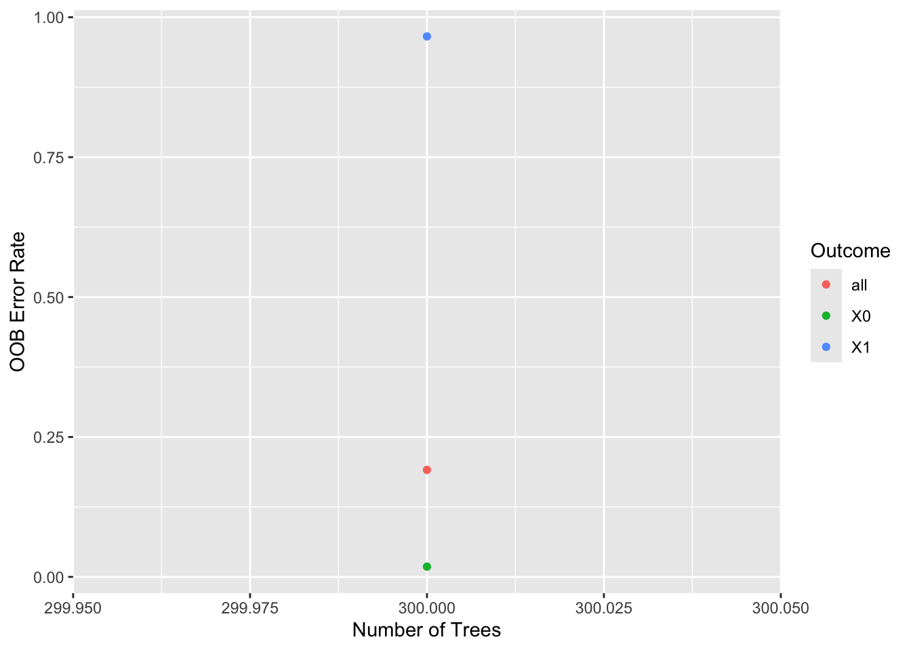
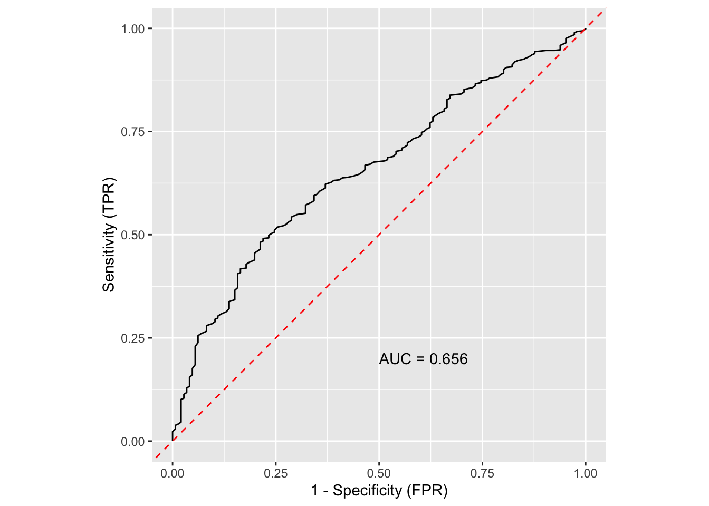

# Random forest classification: fit

# Random forest classification: fit

Gallery job on the synthetic cohort: major postoperative complication
(complication, 0/1).

An `rfc-fit` job grows a classification forest and checks that it
learned something: out-of-bag error by number of trees, and the ROC
curve with its AUC. **Importance, VarPro and dependence plots are not
here.** They are the `rfc-explain` job in this same set, which reads the
forest this job saves instead of growing its own, so the explanations
always describe this forest.

Old `rfsrc.*` and `rf.*` jobs map onto three prefixes by outcome, read
from the job’s fit call and not from its name: a survival outcome is
`rfs`, a classification or binary outcome `rfc`, a continuous outcome
`rfr`.

Code

``` r
# The study root is the nearest directory above this file holding _study.yml,
# so the job renders the same from the Render button, quarto render, or
# render_job(), at any depth, with no path in this document to edit.
.in <- knitr::current_input(dir = TRUE)
.root <- hvtiRtemplates:::.find_study_root(if (is.null(.in)) getwd() else dirname(.in))
.provenance_data <- list()
for (f in list.files(file.path(.root, "R"), pattern = "[.]R$", full.names = TRUE)) source(f)
suppressPackageStartupMessages({
  library(randomForestSRC)
  library(ggRandomForests)
  library(hvtiRutilities)
})
# One thread, so a forest reproduces from machine to machine. Left unset,
# randomForestSRC runs on every core its OpenMP build can see, and on a
# multi-core server a varPro cross-validated cutoff changed with the thread
# count with every seed held fixed. Raise it for speed on a large forest, at the
# cost of that guarantee: a cached fit records its seed, data and package
# versions, never the threads it ran on.
options(rf.cores = 1L)
# The versions this template was verified against, end to end, on 2026-09-19.
# Below them a call here can fail or change meaning, and the message would
# arrive mid-render rather than here.
if (utils::packageVersion("randomForestSRC") < "3.7.0") {
  stop("This job needs randomForestSRC >= 3.7.0; ", utils::packageVersion("randomForestSRC"),
       " is installed.\nUpdate it, then re-render.", call. = FALSE)
}
if (utils::packageVersion("ggRandomForests") < "4.0.0") {
  stop("This job needs ggRandomForests >= 4.0.0; ", utils::packageVersion("ggRandomForests"),
       " is installed.\nUpdate it, then re-render.", call. = FALSE)
}
```

Code

``` r
# The markers in this file name work a study author still has to do, and
# README.md says a job that still contains one has not been finished. This
# chunk is what makes that TRUE rather than merely stated.
#
# Without it an unedited job renders green over a meaningless analysis. Here
# that is a forest grown on the template's placeholder outcome, predictors and
# tree count, whose error curve and ROC curve look exactly like a result.
#
# knitr::current_input() is NULL outside a render -- a study author stepping
# through chunks in RStudio -- and there is no file to scan then, so this is a
# no-op in that case. Same handling as the `set` guard below, for the same
# reason.
#
# The token is BUILT, not written literally, and that is not stylistic. Quarto
# knits through an intermediate and current_input() returns THAT file, so the
# scan reads a copy of this chunk along with everything else: a literal
# grep("<token>", .src) here matches its own source line, and the guard then
# fires on every render, finished or not. Measured, not theorised -- a probe
# found three markers in a file containing two. A guard that cries wolf on a
# finished job is a guard that gets deleted, which returns us to issue #27.
.tok <- paste0("ED", "IT", ":")
.cur <- knitr::current_input()
if (!is.null(.cur)) {
  .src  <- readLines(.cur, warn = FALSE)
  .hits <- grep(.tok, .src, fixed = TRUE)
  if (length(.hits)) {
    # Report the marker TEXT. Line numbers here are the intermediate's, not
    # this .qmd's, so they need not match what the author sees in an editor.
    .msg <- paste0(
      length(.hits), " unresolved ", .tok, " marker(s) remain in this job:\n",
      paste0("  - ", trimws(substr(.src[.hits], 1L, 96L)), collapse = "\n"),
      "\nA job that still contains one has not been finished. Work each ",
      "marker and delete it."
    )
    # A job renders as a draft by default, so an author can iterate on a
    # working report and remove markers as they go. HVTI_TEMPLATE_STRICT
    # turns the draft into a stop for a final render. Only unset, 0, false
    # and no mean "not strict": an unrecognized value stops on purpose, so a
    # mistyped switch is seen rather than quietly ignored, which is the safe
    # direction to be wrong in.
    if (tolower(Sys.getenv("HVTI_TEMPLATE_STRICT")) %in% c("", "0", "false", "no")) {
      # The banner is not optional. A draft render that looks like a finished
      # one is the same defect with an extra step: the warning scrolls past in
      # a log, while the .html is the artifact that gets sent to someone.
      warning(.msg, "\nRendering as a draft; the banner goes when the last marker does. ",
              "Set HVTI_TEMPLATE_STRICT to 1, true or yes to make this stop.", call. = FALSE)
      cat("\n::: {.callout-important title=\"DRAFT -- this job is unfinished\"}\n")
      cat("Unresolved markers remain. **The numbers below are not",
          "a result.**\n\n```\n", .msg, "\n```\n", sep = "")
      cat(":::\n\n")
    } else {
      stop(.msg, "\nThis render stops because HVTI_TEMPLATE_STRICT is '",
           Sys.getenv("HVTI_TEMPLATE_STRICT"), "'. Unset it, or set it to 0, false ",
           "or no, to render a draft instead.", call. = FALSE)
    }
  }
}
```

Code

``` r
# unnumbered: a callout, printed only when part of the job is left out
# To render a job you have not finished, leave a chunk out with the chunk
# option skip, giving the reason in quotes, or call hvtiRtemplates::stop_here()
# in a chunk to leave out everything below it. A draft lists each one here; a
# final render refuses them, as it refuses an EDIT marker. ?stop_here has more.
hvtiRtemplates:::.guard_partial(knitr::current_input())
```

Code

``` r
SUBJECT <- "complication"
TYPE    <- "rf"

# `add_job()` writes SUBJECT/TYPE from the same values it put in this file's
# name, but a hand-edited declaration can drift from it afterward. set_path()
# below resolves from the declarations, not the filename, so a drifted
# declaration would silently write into ANOTHER set's artifact directory --
# exactly the collision the (subject, type) key exists to prevent, re-entered
# through the body instead of the name.
#
# knitr::current_input() is NULL outside a render (a study author running
# chunks interactively in RStudio), and there is no filename to check against
# yet, so this is a no-op in that case rather than a spurious error.
.current <- knitr::current_input()
if (!is.null(.current)) {
  # The name is template first, <prefix>[.<qualifier>].<subject>.<type>, or
  # <subject>-<type>-<prefix>[-<qualifier>] for a job scaffolded before
  # 2026-10. .job_name_fields() reads subject and type from either, whatever
  # the extension: Quarto knits through an intermediate, so
  # `knitr::current_input()` names the `.rmarkdown` file here, not the `.qmd`.
  .fields <- hvtiRtemplates:::.job_name_fields(.current)
  .name_subject <- if (length(.fields) >= 1L) .fields[[1L]] else NA_character_
  .name_type     <- if (length(.fields) >= 2L) .fields[[2L]] else NA_character_
  if (!identical(.name_subject, SUBJECT) || !identical(.name_type, TYPE)) {
    stop("This file is named '", .current, "' (subject '", .name_subject, "', type '",
         .name_type, "'), but declares SUBJECT = \"", SUBJECT, "\", TYPE = \"", TYPE,
         "\". Fix the declaration or the filename before rendering.", call. = FALSE)
  }
}

# Resolve a path inside this set's artifact directory. `kind` is the artifact
# folder -- "estimates" for serialized results, "graphs" for figures. The set
# directory sits one layer under the kind and never two, which is the whole
# layout rule.
#
# Created on first use rather than up front, so a job that writes nothing leaves
# no empty directories behind.
set_path <- function(kind, file) {
  d <- file.path(hvtiRutilities::study_dir(kind, .root),
                 paste0(SUBJECT, "-", TYPE))
  if (!dir.exists(d)) dir.create(d, recursive = TRUE)
  file.path(d, file)
}

# Saves a figure as <name>.png and <name>.pdf in this set's graphs/ folder (or `kind`'s),
# under the SAVE_FIGURES and FIGURES study choices.
save_figure <- function(plot, name, width = 6, height = 4, kind = "graphs", linked = FALSE) {
  hvtiRtemplates:::.save_figure(plot, set_path(kind, paste0(name, ".png")), width, height,
                                SAVE_FIGURES, FIGURES, linked)
}

# `rfc-fit` writes the forest through this and `rfc-explain` reads it back,
# both by set, so an explanation can never be filed against a different set
# than the forest it explains. The write is the `save` chunk at the foot of
# this file.
```

## Study choices

Edit these values for this study before rendering.

Code

``` r
# Demo: the registered dataset this job reads ("built" is the study dataset).
DATASET <- "built"

# Demo: an hvtiRdatabuild analysis set, or NULL to read the whole dataset.
ANALYSIS_SET <- NULL

# Demo: rows to keep, dplyr::filter() style, or NULL to keep every row:
#   WHERE <- quote(age >= 18)
#   WHERE <- rlang::exprs(age >= 18, hx_chf == 1)
WHERE <- NULL

# Demo: the patient identifier. Without "ccfid" the job uses MRN, then eMRN;
# name another column, such as "randid", if the study uses one.
ID <- "patient_id"

# Demo: what makes a row unique; one row per patient unless repeated measures
# add their visit time or date, for example KEY <- c(ID, "iv_echo").
KEY <- ID

# Optional, and needs no edit: NULL reads the cohort alone. To join one
# registered ancillary dataset (echoes, labs), name it in JOIN. The cohort
# above decides the patients, one row each; the joined records of other
# patients are dropped and counted in the data table.
#   JOIN_VARS: the cohort columns each joined row carries; NULL carries all,
#     and a column both datasets have stops, so list only those the job needs.
#   REDUCE: NULL keeps a row per joined record, keyed on that dataset's key;
#     list(rule = "first", by = "echo_date") keeps one row per patient ("last",
#     or "nearest" with to = a cohort date column). WHERE on a joined column
#     filters the records first, so "last" with WHERE echo_type == "TTE"
#     keeps each patient's last TTE. A tie stops: picking one record
#     silently would be a hidden choice; by = c("echo_date", "echo_seq")
#     breaks it. This job models one row per
#     patient, so a JOIN without REDUCE stops here.
#   JOIN_KEY: overrides the joined dataset's registered key.
JOIN <- NULL
JOIN_VARS <- NULL
REDUCE <- NULL
JOIN_KEY <- NULL

# Demo: the outcome to classify. Any coding works: 0/1, "yes"/"no" or a label.
# The read step makes it a factor, which is what makes this a classification
# forest rather than a regression on the codes.
RESPONSE <- "complication"

# Demo: the class whose one-versus-rest ROC curve and AUC this report should
# show. Use its label after RESPONSE becomes a factor: "1" for a 0/1 outcome,
# "yes" for no/yes, or the clinical category of interest for multiclass data.
ROC_CLASS <- "1"

# Demo: the candidate predictors. Name them rather than taking every column: a
# built dataset carries identifiers, dates and derived outcomes, and a forest
# will split on a date that quietly encodes follow-up.
PREDICTORS <- c("age", "female", "bmi", "hx_chf", "hx_dm", "nyha_pr", "lvef", "plvmassi", "creat_pr")

# Demo: forest size and seed. The error-by-trees plot below says whether NTREE
# was enough: a curve still falling at its right edge was not. SEED makes the
# forest reproducible and is part of its cache key. It is used twice, on
# purpose: cache_fit() seeds R's generator with it, and rfsrc() is handed it
# as `seed =`, negated as randomForestSRC documents. Without that
# argument rfsrc() draws a seed from R's generator, so the forest would depend
# on whatever ran before it.
NTREE <- 300
SEED  <- 2026

# Demo: "na.omit" drops a patient missing any predictor; "na.impute" keeps them
# and imputes inside the forest. The classification and regression exemplars
# imputed. Dropping is simpler to report and can shrink the cohort a great deal.
NA_ACTION <- "na.impute"

# Set TRUE after changing a choice above. A cache whose inputs changed stops the
# render instead of returning the old forest; TRUE recomputes only the caches
# that are out of date, so it is safe to leave on while iterating.
REFIT <- FALSE

# Each figure is saved to graphs/ as a PNG (for Word) and a PDF (for the publisher).
# SAVE_FIGURES <- FALSE saves neither; FIGURES keeps only the figures whose names
# start with one of its entries, e.g. FIGURES <- c("hp-survival"). The names are the
# file names, listed for each template in the templates README.
SAVE_FIGURES <- TRUE
FIGURES <- NULL
```

## Cohort

Code

``` r
# The checksum of every dataset in manifest.yaml is checked before anything is
# read, so a result can name the data that produced it. It stops on a mismatch.
hvtiRutilities::verify_manifest(file.path(.root, "manifest.yaml"))
.cfg <- study_config(start = .root)
job_data <- hvtiRtemplates::read_job_data(.cfg, dataset = DATASET, analysis_set = ANALYSIS_SET,
                                          where = WHERE, id = ID, key = KEY, join = JOIN, join_vars = JOIN_VARS,
                                          reduce = REDUCE, join_key = JOIN_KEY, one_row_per_patient = TRUE)
d <- job_data$data
.provenance_data <- c(if (exists(".provenance_data")) .provenance_data else list(), list(job_data$provenance),
                      if (!is.null(job_data$provenance_join)) list(job_data$provenance_join))
knitr::kable(job_data$record, col.names = c("Data", ""))
.outcomes <- intersect(RESPONSE, PREDICTORS)
if (length(.outcomes)) {
  stop("Do not include the outcome variable in PREDICTORS: ", .outcomes, ".", call. = FALSE)
}
.duplicated <- unique(PREDICTORS[duplicated(PREDICTORS)])
if (length(.duplicated)) {
  stop("PREDICTORS names a variable more than once: ", paste(.duplicated, collapse = ", "), ".", call. = FALSE)
}
# A forest must not be trained on an identifier. It would split on who a
# patient is, not on what is true of them, and the saved forest keeps its
# training columns, so the identifier would be written into rfc.rds.
.selection <- attr(job_data$record, "selection")
.identifiers <- PREDICTORS[tolower(PREDICTORS) %in% tolower(c(.selection$id, .selection$key))]
if (length(.identifiers)) {
  stop("Do not include the patient identifier or a KEY column in PREDICTORS: ",
       paste(.identifiers, collapse = ", "), ".", call. = FALSE)
}
# Nor may the identifier be the outcome: the forest keeps its outcome column
# too. A KEY column that is not the ID, a visit time say, may be one.
if (any(tolower(RESPONSE) == tolower(.selection$id))) {
  stop("The patient identifier (", .selection$id, ") cannot be an outcome of this job.", call. = FALSE)
}
.missing <- setdiff(c(RESPONSE, PREDICTORS), names(d))
if (length(.missing)) {
  stop("Not in the data this job read: ", paste(.missing, collapse = ", "), call. = FALSE)
}
d <- d[, c(RESPONSE, PREDICTORS), drop = FALSE]

# A forest cannot learn from a patient with no outcome, and na.impute would
# impute one. So the outcome is required whatever NA_ACTION says.
.no_outcome <- is.na(d[[RESPONSE]])
if (any(.no_outcome)) {
  stop(sum(.no_outcome), " patient(s) have no ", RESPONSE, ". Resolve them in the ",
       "dataset build; the forest will not.", call. = FALSE)
}

# A numeric 0/1 outcome grows a REGRESSION forest, whose "probabilities" can
# fall outside 0 and 1 and whose error is a mean squared error. Nothing warns.
d[[RESPONSE]] <- factor(d[[RESPONSE]])
if (!is.character(ROC_CLASS) || length(ROC_CLASS) != 1L || is.na(ROC_CLASS) || !nzchar(ROC_CLASS) ||
      !ROC_CLASS %in% levels(d[[RESPONSE]])) {
  stop("ROC_CLASS must name one observed level of ", RESPONSE, "; ", deparse(ROC_CLASS),
       " is not an observed level. Choose one of: ", paste(levels(d[[RESPONSE]]), collapse = ", "), ".", call. = FALSE)
}
ROC_OUTCOME <- match(ROC_CLASS, levels(d[[RESPONSE]]))

# A forest splits a text column only as a factor, so text predictors are
# converted here, and named, rather than left for the fit to refuse or coerce.
.chr <- PREDICTORS[vapply(d[PREDICTORS], is.character, logical(1L))]
if (length(.chr)) {
  d[.chr] <- lapply(d[.chr], factor)
  cat("Text predictors converted to factors: ", paste(.chr, collapse = ", "), "\n", sep = "")
}
```

| Data                |                                          |
|:--------------------|:-----------------------------------------|
| Source              | dataset `built` (built_20261009.parquet) |
| Rows read           | 800                                      |
| ID                  | `patient_id`                             |
| Identifiers dropped | none                                     |
| Rows kept           | 800 rows on 800 patients                 |

Table 1: The data this job read

Code

``` r
# unnumbered: its child chunk carries its own label and caption
if (!is.null(job_data$attrition)) {
  .fence <- strrep("`", 3)
  cat(knitr::knit_child(text = c(
    paste0(.fence, "{r}"), "#| label: tbl-data-attrition",
    paste0("#| tbl-cap: ", encodeString(paste0("Analysis set `", ANALYSIS_SET, "`: exclusions, in order"), quote = "\"")),
    "knitr::kable(job_data$attrition)", .fence
  ), envir = environment(), quiet = TRUE), sep = "\n")
}
```

## Forest

Code

``` r
# cache_fit() writes <dir>/<name>.rds and its default dir is the study's
# estimates folder, not this set's, so every call here names the set's.
CACHE_DIR <- dirname(set_path("estimates", "rfc.rds"))
model <- stats::reformulate(".", response = RESPONSE)
# The saved forest keeps this formula, and a formula keeps the environment it
# was made in. That is the global environment in a render, which a saved file
# only refers to; set it, so a job run anywhere else does not write every
# object beside the formula, `job_data` and its patient IDs included, into
# the forest.
environment(model) <- globalenv()
forest <- cache_fit(
  "rfc-forest",
  rfsrc(model, data = d, ntree = NTREE, na.action = NA_ACTION, importance = "none", seed = -abs(SEED)),
  seed = SEED, dir = CACHE_DIR, refit = REFIT
)
forest
```

                             Sample size: 800
               Frequency of class labels: 0=654, 1=146
                        Was data imputed: yes
                         Number of trees: 300
               Forest terminal node size: 1
           Average no. of terminal nodes: 127.9967
    No. of variables tried at each split: 3
                  Total no. of variables: 9
           Resampling used to grow trees: swor
        Resample size used to grow trees: 506
                                Analysis: RF-C
                                  Family: class
                          Splitting rule: gini *random*
           Number of random split points: 10
                        Imbalanced ratio: 4.4795
                       (OOB) Brier score: 0.1468128
            (OOB) Normalized Brier score: 0.5872512
                               (OOB) AUC: 0.65655502
                          (OOB) Log-loss: 0.46106724
                            (OOB) PR-AUC: 0.26419626
                            (OOB) G-mean: 0.18335266
       (OOB) Requested performance error: 0.19125, 0.01834862, 0.96575342

    Confusion matrix:

              predicted
      observed   0  1 class.error class.freq
             0 642 12      0.0183        654
             1 141  5      0.9658        146

          (OOB) Misclassification rate: 0.19125

    Random-classifier baselines (uniform):
       Brier: 0.25   Normalized Brier: 1   Log-loss: 0.69314718

`importance = "none"` is deliberate. Importance is the explain job’s
work, and cached there on its own, so it can be recomputed without
regrowing the forest.

## Does the forest work?

Code

``` r
# Out-of-bag error by number of trees, overall and per class.
err <- gg_error(forest)
.fig <- plot(err)
save_figure(.fig, "rfc-fit-diagnostics-error")
.fig
```



Figure 1: Out-of-bag error by number of trees, overall and per class

Code

``` r
# Out-of-bag one-versus-rest ROC curve, and the area under it, for the class
# named explicitly above. ggRandomForests selects by factor-level position,
# so ROC_OUTCOME maps the study's label to its position instead of letting
# factor ordering decide what this report means.
roc <- gg_roc(forest, which_outcome = ROC_OUTCOME)
.fig <- plot(roc)
save_figure(.fig, "rfc-fit-diagnostics-roc")
.fig
```



Figure 2: Out-of-bag ROC curve for the chosen class against the rest

Code

``` r
auc <- calc_auc(roc)
auc
```

    [1] 0.656356

`gg_brier()` is not here: it supports survival forests only.

Code

``` r
# The product of this job, and what rfc-explain reads. It is separate from the
# cache on purpose: cache_fit() stores a keyed record rather than the bare
# forest, so the cache is this job's internals and this file is its interface.
# The price is the forest on disk twice.
forest <- hvtiRtemplates:::.attach_handoff_lineage(
  forest,
  data = .provenance_data,
  analysis = list(
    outcome = list(
      variable = RESPONSE,
      kind = "classification",
      observed_levels = levels(forest$yvar),
      target_level = ROC_CLASS
    )
  ),
  cohort = list(n = as.integer(length(forest$yvar))),
  # rfc-explain takes the rows, ID and KEY of this fit from this record.
  selection = attr(job_data$record, "selection")
)
saveRDS(forest, set_path("estimates", "rfc.rds"))
```
