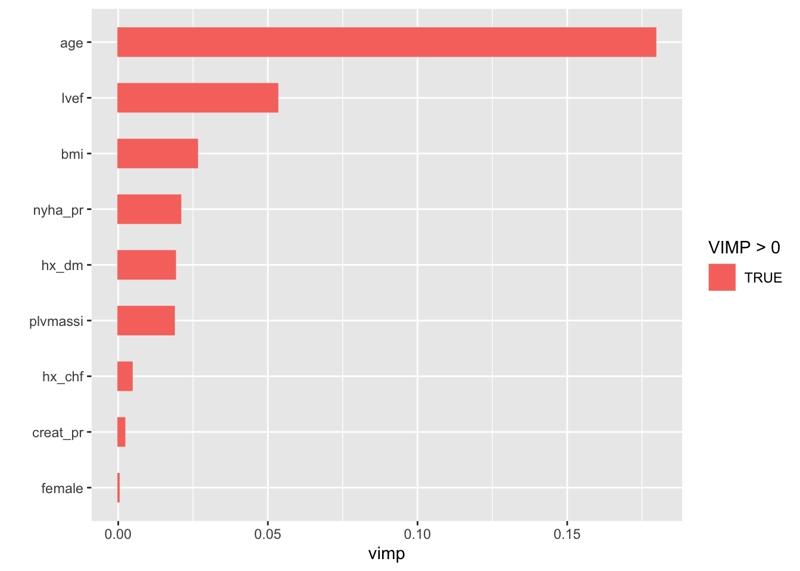
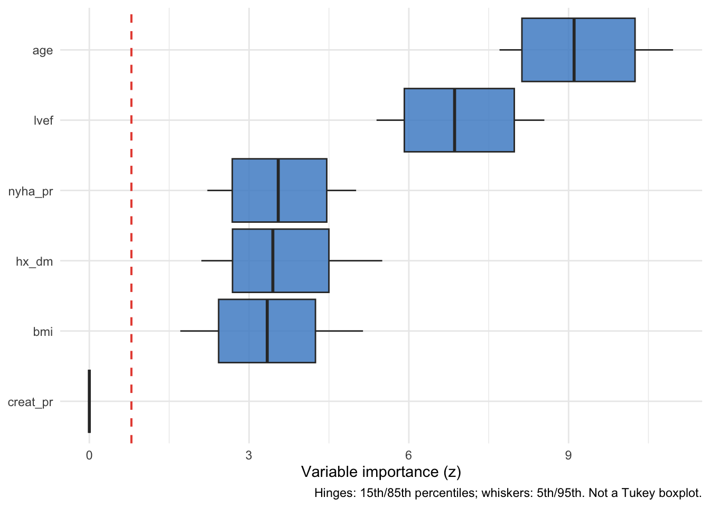
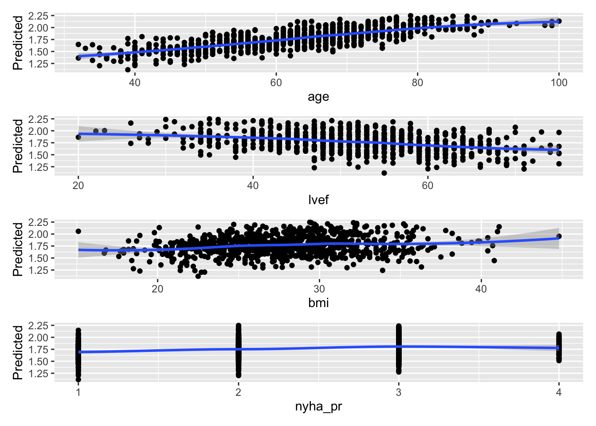
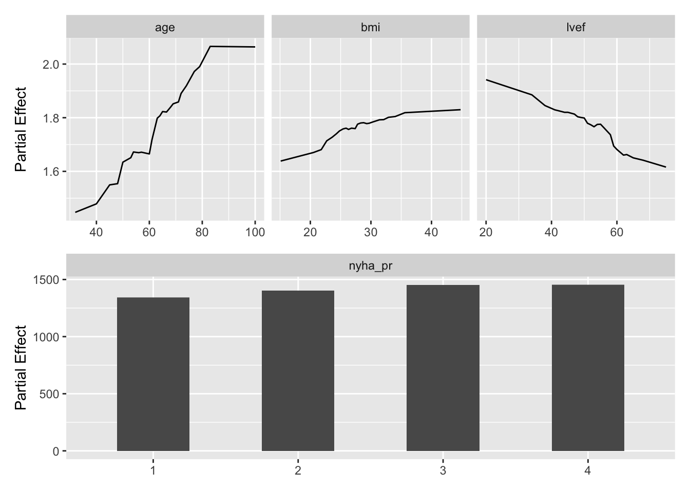
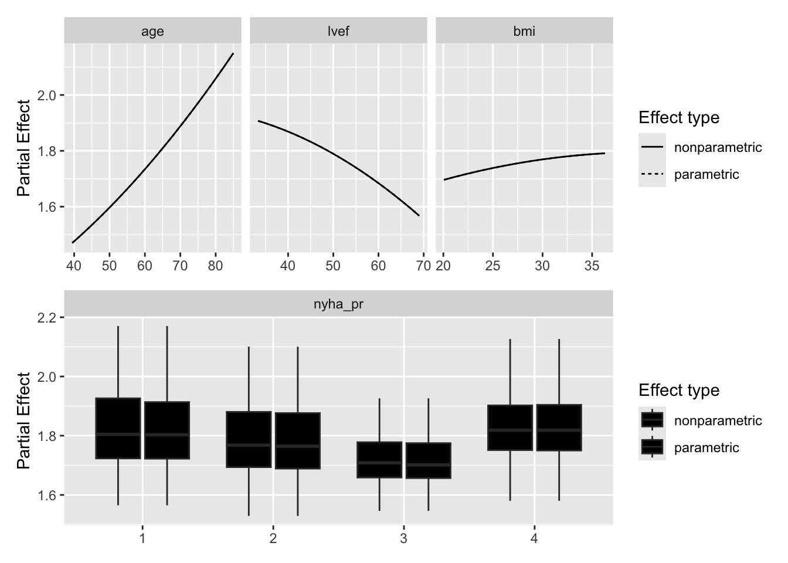

# Random forest regression: explain

# Random forest regression: explain

Explains the forest the `rfr-fit` job in this set saved: which
predictors drive it, and how.

An `rfr-explain` job never grows a forest. It reads `rfr.rds`, which the
fit job writes, and rebuilds the training data and the model from the
forest itself. VIMP, minimal depth and the partial-dependence plots all
describe that saved forest and no other; VarPro grows its own forests on
the same training data, so its panel and partial describe forests VarPro
grew, not the saved one. Each expensive step is cached on its own:
changing how many variables get dependence plots recomputes the partials
and nothing else.

Code

``` r
# The study root is the nearest directory above this file holding _study.yml,
# so the job renders the same from the Render button, quarto render, or
# render_job(), at any depth, with no path in this document to edit.
.in <- knitr::current_input(dir = TRUE)
.root <- hvtiRtemplates:::.find_study_root(if (is.null(.in)) getwd() else dirname(.in))
.provenance_data <- list()
for (f in list.files(file.path(.root, "R"), pattern = "[.]R$", full.names = TRUE)) source(f)
suppressPackageStartupMessages({
  library(randomForestSRC)
  library(varPro)
  library(ggRandomForests)
  library(hvtiRutilities)
})
# One thread, so a forest reproduces from machine to machine. Left unset,
# randomForestSRC runs on every core its OpenMP build can see, and on a
# multi-core server a varPro cross-validated cutoff changed with the thread
# count with every seed held fixed. Raise it for speed on a large forest, at the
# cost of that guarantee: a cached fit records its seed, data and package
# versions, never the threads it ran on.
options(rf.cores = 1L)
# The versions this template was verified against, end to end, on 2026-09-19.
# Below them a call here can fail or change meaning, and the message would
# arrive mid-render rather than here.
if (utils::packageVersion("randomForestSRC") < "3.7.0") {
  stop("This job needs randomForestSRC >= 3.7.0; ", utils::packageVersion("randomForestSRC"),
       " is installed.\nUpdate it, then re-render.", call. = FALSE)
}
if (utils::packageVersion("ggRandomForests") < "4.0.0") {
  stop("This job needs ggRandomForests >= 4.0.0; ", utils::packageVersion("ggRandomForests"),
       " is installed.\nUpdate it, then re-render.", call. = FALSE)
}
if (utils::packageVersion("varPro") < "3.2.0") {
  stop("This job needs varPro >= 3.2.0; ", utils::packageVersion("varPro"),
       " is installed.\nUpdate it, then re-render.", call. = FALSE)
}
```

Code

``` r
# The markers in this file name work a study author still has to do, and
# README.md says a job that still contains one has not been finished. This
# chunk is what makes that TRUE rather than merely stated.
#
# Without it an unedited job renders green over a meaningless analysis. Here
# that is dependence plots for a placeholder number of variables, which look
# exactly like a result.
#
# knitr::current_input() is NULL outside a render -- a study author stepping
# through chunks in RStudio -- and there is no file to scan then, so this is a
# no-op in that case. Same handling as the `set` guard below, for the same
# reason.
#
# The token is BUILT, not written literally, and that is not stylistic. Quarto
# knits through an intermediate and current_input() returns THAT file, so the
# scan reads a copy of this chunk along with everything else: a literal
# grep("<token>", .src) here matches its own source line, and the guard then
# fires on every render, finished or not. Measured, not theorised -- a probe
# found three markers in a file containing two. A guard that cries wolf on a
# finished job is a guard that gets deleted, which returns us to issue #27.
.tok <- paste0("ED", "IT", ":")
.cur <- knitr::current_input()
if (!is.null(.cur)) {
  .src  <- readLines(.cur, warn = FALSE)
  .hits <- grep(.tok, .src, fixed = TRUE)
  if (length(.hits)) {
    # Report the marker TEXT. Line numbers here are the intermediate's, not
    # this .qmd's, so they need not match what the author sees in an editor.
    .msg <- paste0(
      length(.hits), " unresolved ", .tok, " marker(s) remain in this job:\n",
      paste0("  - ", trimws(substr(.src[.hits], 1L, 96L)), collapse = "\n"),
      "\nA job that still contains one has not been finished. Work each ",
      "marker and delete it."
    )
    # A job renders as a draft by default, so an author can iterate on a
    # working report and remove markers as they go. HVTI_TEMPLATE_STRICT
    # turns the draft into a stop for a final render. Only unset, 0, false
    # and no mean "not strict": an unrecognized value stops on purpose, so a
    # mistyped switch is seen rather than quietly ignored, which is the safe
    # direction to be wrong in.
    if (tolower(Sys.getenv("HVTI_TEMPLATE_STRICT")) %in% c("", "0", "false", "no")) {
      # The banner is not optional. A draft render that looks like a finished
      # one is the same defect with an extra step: the warning scrolls past in
      # a log, while the .html is the artifact that gets sent to someone.
      warning(.msg, "\nRendering as a draft; the banner goes when the last marker does. ",
              "Set HVTI_TEMPLATE_STRICT to 1, true or yes to make this stop.", call. = FALSE)
      cat("\n::: {.callout-important title=\"DRAFT -- this job is unfinished\"}\n")
      cat("Unresolved markers remain. **The numbers below are not",
          "a result.**\n\n```\n", .msg, "\n```\n", sep = "")
      cat(":::\n\n")
    } else {
      stop(.msg, "\nThis render stops because HVTI_TEMPLATE_STRICT is '",
           Sys.getenv("HVTI_TEMPLATE_STRICT"), "'. Unset it, or set it to 0, false ",
           "or no, to render a draft instead.", call. = FALSE)
    }
  }
}
```

Code

``` r
# unnumbered: a callout, printed only when part of the job is left out
# To render a job you have not finished, leave a chunk out with the chunk
# option skip, giving the reason in quotes, or call hvtiRtemplates::stop_here()
# in a chunk to leave out everything below it. A draft lists each one here; a
# final render refuses them, as it refuses an EDIT marker. ?stop_here has more.
hvtiRtemplates:::.guard_partial(knitr::current_input())
```

Code

``` r
SUBJECT <- "los"
TYPE    <- "rf"

# `add_job()` writes SUBJECT/TYPE from the same values it put in this file's
# name, but a hand-edited declaration can drift from it afterward. set_path()
# below resolves from the declarations, not the filename, so a drifted
# declaration would silently write into ANOTHER set's artifact directory --
# exactly the collision the (subject, type) key exists to prevent, re-entered
# through the body instead of the name.
#
# knitr::current_input() is NULL outside a render (a study author running
# chunks interactively in RStudio), and there is no filename to check against
# yet, so this is a no-op in that case rather than a spurious error.
.current <- knitr::current_input()
if (!is.null(.current)) {
  # The name is template first, <prefix>[.<qualifier>].<subject>.<type>, or
  # <subject>-<type>-<prefix>[-<qualifier>] for a job scaffolded before
  # 2026-10. .job_name_fields() reads subject and type from either, whatever
  # the extension: Quarto knits through an intermediate, so
  # `knitr::current_input()` names the `.rmarkdown` file here, not the `.qmd`.
  .fields <- hvtiRtemplates:::.job_name_fields(.current)
  .name_subject <- if (length(.fields) >= 1L) .fields[[1L]] else NA_character_
  .name_type     <- if (length(.fields) >= 2L) .fields[[2L]] else NA_character_
  if (!identical(.name_subject, SUBJECT) || !identical(.name_type, TYPE)) {
    stop("This file is named '", .current, "' (subject '", .name_subject, "', type '",
         .name_type, "'), but declares SUBJECT = \"", SUBJECT, "\", TYPE = \"", TYPE,
         "\". Fix the declaration or the filename before rendering.", call. = FALSE)
  }
}

# Resolve a path inside this set's artifact directory. `kind` is the artifact
# folder -- "estimates" for serialized results, "graphs" for figures. The set
# directory sits one layer under the kind and never two, which is the whole
# layout rule.
#
# Created on first use rather than up front, so a job that writes nothing leaves
# no empty directories behind.
set_path <- function(kind, file) {
  d <- file.path(hvtiRutilities::study_dir(kind, .root),
                 paste0(SUBJECT, "-", TYPE))
  if (!dir.exists(d)) dir.create(d, recursive = TRUE)
  file.path(d, file)
}

# Saves a figure as <name>.png and <name>.pdf in this set's graphs/ folder (or `kind`'s),
# under the SAVE_FIGURES and FIGURES study choices.
save_figure <- function(plot, name, width = 6, height = 4, kind = "graphs", linked = FALSE) {
  hvtiRtemplates:::.save_figure(plot, set_path(kind, paste0(name, ".png")), width, height,
                                SAVE_FIGURES, FIGURES, linked)
}

# `rfr-explain` reads the forest `rfr-fit` wrote in this same set, and caches
# its own work beside it.
```

## Study choices

Edit these values for this study before rendering. The outcome and
predictors are not here: they come from the forest.

Code

``` r
# Demo: the fit's selection is used; set any of these only to confirm it.
# NULL takes the value the fit job used.
WHERE <- NULL
ID <- NULL
KEY <- NULL

# Demo: how many variables get dependence plots, ranked by VIMP. The partials
# are the expensive step, so keep this small.
TOP_K <- 4

# Demo: or name the variables yourself. NULL takes the top TOP_K by VIMP.
PARTIAL_VARS <- NULL

# Demo: seed for VIMP, VarPro and the partials. It is part of every cache key.
# cache_fit() seeds R's generator with it before each call, and vimp() and
# varpro() are also handed it as `seed =`, negated as randomForestSRC
# documents. Both halves matter: varpro() draws from R's generator as well as
# from its own seed, so the same seed after a different chunk gave different
# importances.
SEED <- 2026

# Set TRUE after changing a choice above. A cache whose inputs changed stops the
# render instead of returning the old result; TRUE recomputes only the caches
# that are out of date.
REFIT <- FALSE

# Each figure is saved to graphs/ as a PNG (for Word) and a PDF (for the publisher).
# SAVE_FIGURES <- FALSE saves neither; FIGURES keeps only the figures whose names
# start with one of its entries, e.g. FIGURES <- c("hp-survival"). The names are the
# file names, listed for each template in the templates README.
SAVE_FIGURES <- TRUE
FIGURES <- NULL
```

## The forest

Code

``` r
.handoff <- set_path("estimates", "rfr.rds")
if (!file.exists(.handoff)) {
  stop("No forest at ", .handoff, ". Render the rfr-fit job in this set first; ",
       "this job explains that forest and never grows its own.", call. = FALSE)
}
.cfg <- study_config(start = .root)
.forest_read <- hvtiRtemplates:::.read_handoff(.handoff, "forest", .cfg, "the rfr-fit job")
forest <- .forest_read$value
.provenance_data <- .forest_read$lineage$data
.provenance_artifacts <- c(.forest_read$lineage$artifacts, list(.forest_read$record))
if (!identical(forest$family, "regr")) {
  stop("rfr.rds holds a '", forest$family, "' forest, not a regression forest.", call. = FALSE)
}
CACHE_DIR <- dirname(.handoff)

# The training data and the model, from the forest rather than re-read. A
# VarPro or partial call on a frame that differs from the fitted one explains a
# model nobody fit. The forest keeps no usable formula (`$formula` is NULL and
# `$call` holds whatever expression the fit job wrote), so the model is rebuilt
# from the outcome names. `xvar` keeps any missing values under na.impute, and
# varpro() handles them; the forest's `imputed.data` makes varpro() fail.
frame <- cbind(stats::setNames(data.frame(forest$yvar), forest$yvar.names), forest$xvar)
model <- stats::reformulate(".", response = forest$yvar.names)
```

Code

``` r
# This job reads no data: the forest carries its training rows. The fit job
# recorded how it chose them, and a setting above that differs from the fit's
# stops here rather than describe rows the forest was not grown on.
.sel <- hvtiRtemplates:::.read_upstream_job_data(
  .cfg, .forest_read$lineage, list(where = WHERE, id = ID, key = KEY), read = FALSE, source = "rfr.rds"
)$selection
knitr::kable(data.frame(step = c("ID", "KEY", "WHERE", "Rows"),
                        value = c(.sel$id, paste(.sel$key, collapse = ", "),
                                  if (length(.sel$where_shown)) paste(.sel$where_shown, collapse = "; ") else "none",
                                  .sel$rows)),
             col.names = c("Data", ""))
```

| Data  |            |
|:------|:-----------|
| ID    | patient_id |
| KEY   | patient_id |
| WHERE | none       |
| Rows  | 800        |

Table 1: The data the fit job read

## Importance

Code

``` r
vi <- cache_fit("rfr-vimp", vimp(forest, seed = -abs(SEED)), seed = SEED, dir = CACHE_DIR, refit = REFIT)
.fig <- plot(gg_vimp(vi))
save_figure(.fig, "rfr-explain-importance")
.fig
```



Figure 1: Permutation importance of each predictor

Code

``` r
# Minimal depth ranks by how near the root a variable first splits, a second
# opinion that needs no permutation. Cheap, so not cached.
ranked <- names(sort(vi$importance, decreasing = TRUE))
depth <- max.subtree(forest)$order[, 1]
data.frame(variable = ranked,
           vimp = round(vi$importance[ranked], 4),
           min_depth = round(depth[ranked], 2),
           row.names = NULL)
```

      variable   vimp min_depth
    1      age 0.1795      0.94
    2     lvef 0.0532      1.51
    3      bmi 0.0264      2.14
    4  nyha_pr 0.0208      2.00
    5    hx_dm 0.0190      2.00
    6 plvmassi 0.0186      2.75
    7   hx_chf 0.0045      3.39
    8 creat_pr 0.0021      6.60
    9   female 0.0002      4.37

Table 2: Permutation importance and minimal depth of each predictor, in
order of importance

Code

``` r
if (is.null(PARTIAL_VARS)) {
  sel <- head(ranked, TOP_K)
} else {
  # A misspelt name would otherwise fail deep inside the partial call, or be
  # dropped from a plot without a word.
  .unknown <- setdiff(PARTIAL_VARS, forest$xvar.names)
  if (length(.unknown)) {
    stop("PARTIAL_VARS names variable(s) the forest was not grown on: ",
         paste(.unknown, collapse = ", "), call. = FALSE)
  }
  sel <- PARTIAL_VARS
}
```

## VarPro

Code

``` r
vp <- cache_fit("rfr-varpro", varpro(model, frame, verbose = FALSE, seed = -abs(SEED)),
                seed = SEED, dir = CACHE_DIR, refit = REFIT)
```

    Warning: varpro(): omitted 75 of 800 observations with missing values (725
    retained)

Code

``` r
.fig <- plot(gg_varpro(vp))
save_figure(.fig, "rfr-explain-varpro")
.fig
```



Figure 2: VarPro importance of each predictor

## Dependence

Code

``` r
# Marginal: predicted outcome against each variable, as observed.
.fig <- plot(gg_variable(forest), xvar = sel)
save_figure(.fig, "rfr-explain-dependence-marginal")
```

    `geom_smooth()` using method = 'loess' and formula = 'y ~ x'
    `geom_smooth()` using method = 'loess' and formula = 'y ~ x'
    `geom_smooth()` using method = 'loess' and formula = 'y ~ x'
    `geom_smooth()` using method = 'loess' and formula = 'y ~ x'

    Warning in simpleLoess(y, x, w, span, degree = degree, parametric = parametric,
    : pseudoinverse used at 0.985

    Warning in simpleLoess(y, x, w, span, degree = degree, parametric = parametric,
    : neighborhood radius 2.015

    Warning in simpleLoess(y, x, w, span, degree = degree, parametric = parametric,
    : reciprocal condition number 1.4829e-15

    Warning in simpleLoess(y, x, w, span, degree = degree, parametric = parametric,
    : There are other near singularities as well. 4.0602

    Warning in predLoess(object$y, object$x, newx = if (is.null(newdata)) object$x
    else if (is.data.frame(newdata))
    as.matrix(model.frame(delete.response(terms(object)), : pseudoinverse used at
    0.985

    Warning in predLoess(object$y, object$x, newx = if (is.null(newdata)) object$x
    else if (is.data.frame(newdata))
    as.matrix(model.frame(delete.response(terms(object)), : neighborhood radius
    2.015

    Warning in predLoess(object$y, object$x, newx = if (is.null(newdata)) object$x
    else if (is.data.frame(newdata))
    as.matrix(model.frame(delete.response(terms(object)), : reciprocal condition
    number 1.4829e-15

    Warning in predLoess(object$y, object$x, newx = if (is.null(newdata)) object$x
    else if (is.data.frame(newdata))
    as.matrix(model.frame(delete.response(terms(object)), : There are other near
    singularities as well. 4.0602

    `geom_smooth()` using method = 'loess' and formula = 'y ~ x'
    `geom_smooth()` using method = 'loess' and formula = 'y ~ x'
    `geom_smooth()` using method = 'loess' and formula = 'y ~ x'
    `geom_smooth()` using method = 'loess' and formula = 'y ~ x'

    Warning in simpleLoess(y, x, w, span, degree = degree, parametric = parametric,
    : pseudoinverse used at 0.985

    Warning in simpleLoess(y, x, w, span, degree = degree, parametric = parametric,
    : neighborhood radius 2.015

    Warning in simpleLoess(y, x, w, span, degree = degree, parametric = parametric,
    : reciprocal condition number 1.4829e-15

    Warning in simpleLoess(y, x, w, span, degree = degree, parametric = parametric,
    : There are other near singularities as well. 4.0602

    Warning in predLoess(object$y, object$x, newx = if (is.null(newdata)) object$x
    else if (is.data.frame(newdata))
    as.matrix(model.frame(delete.response(terms(object)), : pseudoinverse used at
    0.985

    Warning in predLoess(object$y, object$x, newx = if (is.null(newdata)) object$x
    else if (is.data.frame(newdata))
    as.matrix(model.frame(delete.response(terms(object)), : neighborhood radius
    2.015

    Warning in predLoess(object$y, object$x, newx = if (is.null(newdata)) object$x
    else if (is.data.frame(newdata))
    as.matrix(model.frame(delete.response(terms(object)), : reciprocal condition
    number 1.4829e-15

    Warning in predLoess(object$y, object$x, newx = if (is.null(newdata)) object$x
    else if (is.data.frame(newdata))
    as.matrix(model.frame(delete.response(terms(object)), : There are other near
    singularities as well. 4.0602

Code

``` r
.fig
```

    `geom_smooth()` using method = 'loess' and formula = 'y ~ x'
    `geom_smooth()` using method = 'loess' and formula = 'y ~ x'
    `geom_smooth()` using method = 'loess' and formula = 'y ~ x'
    `geom_smooth()` using method = 'loess' and formula = 'y ~ x'

    Warning in simpleLoess(y, x, w, span, degree = degree, parametric = parametric,
    : pseudoinverse used at 0.985

    Warning in simpleLoess(y, x, w, span, degree = degree, parametric = parametric,
    : neighborhood radius 2.015

    Warning in simpleLoess(y, x, w, span, degree = degree, parametric = parametric,
    : reciprocal condition number 1.4829e-15

    Warning in simpleLoess(y, x, w, span, degree = degree, parametric = parametric,
    : There are other near singularities as well. 4.0602

    Warning in predLoess(object$y, object$x, newx = if (is.null(newdata)) object$x
    else if (is.data.frame(newdata))
    as.matrix(model.frame(delete.response(terms(object)), : pseudoinverse used at
    0.985

    Warning in predLoess(object$y, object$x, newx = if (is.null(newdata)) object$x
    else if (is.data.frame(newdata))
    as.matrix(model.frame(delete.response(terms(object)), : neighborhood radius
    2.015

    Warning in predLoess(object$y, object$x, newx = if (is.null(newdata)) object$x
    else if (is.data.frame(newdata))
    as.matrix(model.frame(delete.response(terms(object)), : reciprocal condition
    number 1.4829e-15

    Warning in predLoess(object$y, object$x, newx = if (is.null(newdata)) object$x
    else if (is.data.frame(newdata))
    as.matrix(model.frame(delete.response(terms(object)), : There are other near
    singularities as well. 4.0602



Figure 3: Predicted outcome against each selected predictor, as observed

Code

``` r
# Partial: the forest's prediction with every other variable held at its
# observed values.
pd <- cache_fit("rfr-partial", gg_partial_rfsrc(forest, xvar.names = sel),
                seed = SEED, dir = CACHE_DIR, refit = REFIT,
                packages = "randomForestSRC")
.fig <- plot(pd)
save_figure(.fig, "rfr-explain-dependence-partial")
.fig
```



Figure 4: Partial dependence of the forest’s prediction on each selected
predictor

Code

``` r
# The VarPro partial, computed from the varpro fit.
pv <- cache_fit("rfr-partial-varpro", gg_partial_varpro(object = vp, xvar.names = sel),
                seed = SEED, dir = CACHE_DIR, refit = REFIT)
.fig <- plot(pv)
save_figure(.fig, "rfr-explain-dependence-varpro")
```

    Warning: Removed 40 rows containing non-finite outside the scale range
    (`stat_boxplot()`).
    Removed 40 rows containing non-finite outside the scale range
    (`stat_boxplot()`).

Code

``` r
.fig
```

    Warning: Removed 40 rows containing non-finite outside the scale range
    (`stat_boxplot()`).



Figure 5: VarPro partial dependence on each selected predictor
